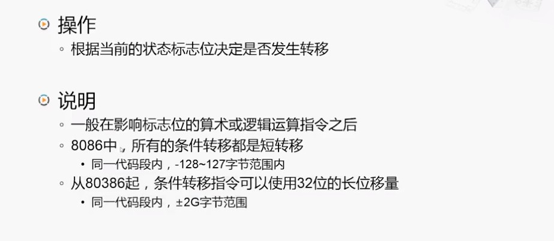

# 第二章 指令系统体系结构

[TOC]

## 第一节 设计自己的计算机

### 从一个小故事开始

> 怎么保证你设计的软件能在我设计的硬件上工作起来呢？

### 一个简单的计算机指令系统

> 如何转换为计算机所能识别的二进制代码？

### 指令的格式

### 运算任务示例

### 在存储器中的机器语言程序

### 模型机的CPU和存储器

## 第二节 x86体系结构

### X86-16

#### Intel 8086（1978年）

##### IBM PC

#### Intel 80286（1982年）

##### 实模式（Real Mode）

> 现在的个人计算机在启动后，CPU首先会通过主板上的芯片组从BIOS芯片中取出指令进行执行，这段程序就是运行在**实模式**下的。

### IA-32

#### Intel 80386（1985年）

##### 保护模式（Protected Mode）

##### 三种工作模式之间的转换

> - 在系统启动后，会首先进入**实模式**。
>
> - 在初始化完成后，通过设置CPU中的控制寄存器，进入**保护模式**。
>   - 操作系统和应用程序都运行在保护模式下。
> - 如果需要运行兼容8086的程序可以在保护模式下切换到**虚拟8086模式**。
>   - 在这种模式下如果发生中断或者异常，是会回到保护模式进行处理的，处理完成后再返回虚拟8086模式。
> - 不管在哪种模式下，经过**复位**以后，都会重新从实模式开始启动。

### x86-64

#### AMD Opteron（2003年）

#### x86-64的运行模式

### 从16位到64位：x86体系结构的演变

#### 寄存器模型

##### 8086的寄存器模型

###### 通用寄存器（多功能寄存器2）

###### 标志寄存器

##### IA-32的寄存器模型

##### x86-64的寄存器模型

#### 存储器寻址

##### 8086的存储器寻址

###### 指令指针寄存器

###### 段寄存器

###### 物理地址生成

###### 逻辑段在物理存储器中的位置

###### “段加偏移”的编程实例

##### IA-32的存储器寻址

> CPU中CS寄存器，不再保存段基址，而是指向这个描述符的地址。
>
> 但CS只有16位，它无法在4G空间中寻址，所以CPU当中还增加了一个寄存器GDTR。
>
> GDTR中则保存了这个全局描述符图表的起始地址。
>
> 而CS段寄存器中则保存了相对于这个起始地址的偏移量。
>
> 所以我们可以这么理解，CPU在取指令时，先将GDTR中保存的地址取出，并与CS寄存器当中的内容相加，得到一个内存地址，用这个地址去访问存储器，获得了这个描述符对应的8个字节，再将其中的基地址部分提取出来，与EIP中保存的偏移地址相加，就得到了真正要访问的地址。
>
> 当然，在这个描述符中还描述了这个段有多长，也就是段界限，以及对这个段的内容是否能读写，即权限，还有一些其他的信息。CPU读取这些信息，可以由硬件来判断当前要执行的这条指令是否符合这个段的要求，从而起到了保护的作用。

> 我们可以看到分段的方式变得越来越复杂，虽然它提供了很好的保护机制，但是代价也是不小的。
>
> 而且在分段的基础上还可以通过分页等技术进行更细腻的管理，所以在有些系统上就对分段进行了简化的处理，让所有的程序都运行在一个段上，也就是不改变段寄存器的内容。
>
> 而在x86-64上得到了进一步的简化。

##### x86-64的描述符

## 第三节 x86指令简介

### 指令的主要类别

### 指令的运行结果

### 指令分类举例

#### 1. 传送指令

##### （1）MOV指令

##### （2）栈操作之类

###### PUSH指令（压栈）

###### POP指令（出栈）

#### 2. 算术运算指令

##### （1）加法类指令

##### （2）减法类指令

#### 3. 逻辑运算和移位指令

##### （1）逻辑运算指令

##### （2）移位指令

#### 4. 转移指令

##### （1）无条件转移指令 —— 直接转移

##### （2）无条件转移指令 —— 间接转移

##### （3）条件转移指令

#### 5. 处理器控制指令

## 第四节 复杂的x86指令举例

#### 1. 串操作指令

##### （1）MOVSB指令（字节串传送）

#### 2. 循环控制指令

#### 3. 查表指令

#### 4. 十进制调整指令

## 第五节 MIPS体系结构

### MIPS的设计者和RISC的先驱

### MIPS公司的商业兴衰

### MIPS指令的发展

### MIPS的设计指导思想

- MIPS的全称
  - Microprocessor without Interlocked Piped Stages（无内部互锁流水级的微处理器）
- 主要关注点
  - 减少指令的类型
  - 降低指令复杂度
- 基本原则
  - A simple CPU is a faster CPU.

> CPU越简单就可以运行得越快。
>
> 假设要编写程序完成同样的任务，用MIPS指令编写其指令数量是x86指令的五倍，但MIPS的CPU能够做到比x86的CPU快十倍，那它仍然获得了明显的性能优势。
>
> 这就是MIPS，同时也是RISC的设计思想。

### MIPS指令的主要特点

### MIPS指令示例

#### 加法指令

#### 访存指令

### MIPS的通用寄存器

>  32个，每个都是32位宽。

#### 通用寄存器使用示例

## 第六节 MIPS指令简介

