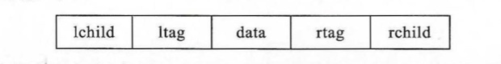
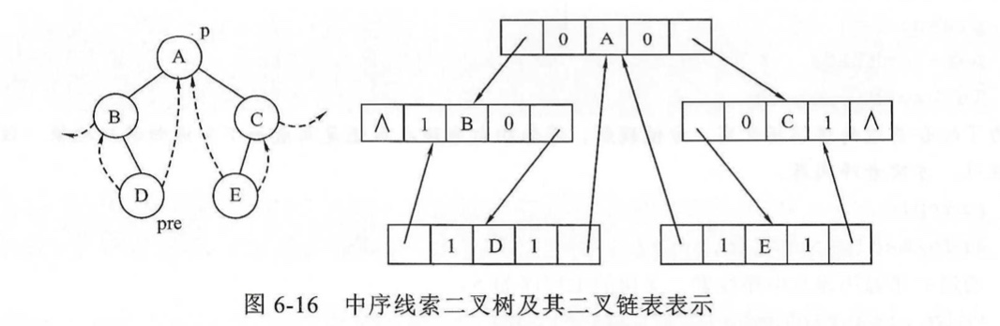
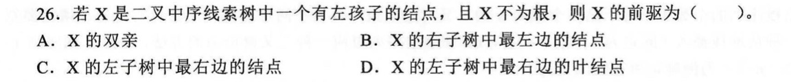
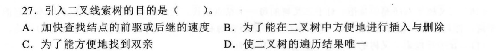
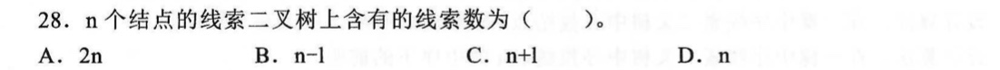
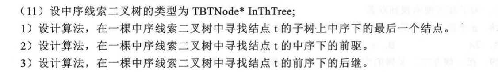
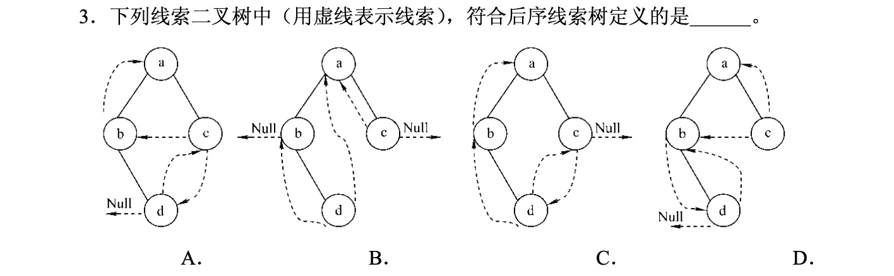
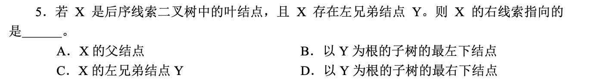
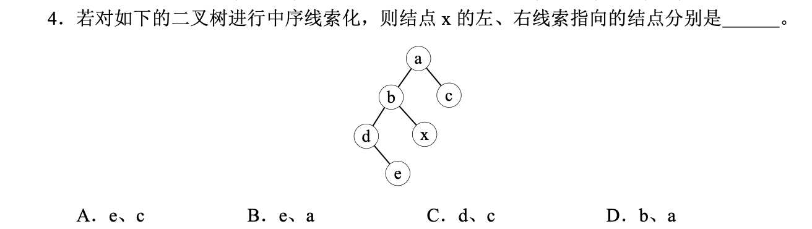

# 几种树形结构的辨析 之 线索二叉树

## 一、线索二叉树的概念

> 对于二叉链表存储结构，n 个结点的二叉树有 n+1 个空链域。为了把这些空链域有效地利用起来，以使二叉树的遍历更加高效，提出了线索二叉树。
>
> **二叉树的线索化**即是将二叉链表中的空指针改为指向前驱或后继的线索。


## 二、实现（结点类型）

> 为了区分二叉链表中的指针是指向左右孩子还是前驱后继，在结点结构中增加了两个标志。



> - ltag
>   - 0 —— lchild 指向左孩子
>   - 1 —— lchild 指向前驱
> - rtag
>   - 0 —— rchild 指向右孩子
>   - 1 —— rchild 指向后继


```c
typedef struct TBTNode {
  char data;
  int ltag;
  int rtag;
  struct TBTNode * lchild;
  struct TBTNode * rchild;
}TBTNode;
```


## 三、三类线索二叉树

### （一）中序线索二叉树



#### 1. 先写出中序遍历序列

> B - D - A - E - C


#### 2. 算法框架

>  使用中序遍历的算法框架，在遍历的过程中加上线索化操作即可。

```c++
typedef struct BTNode {
  char data;
  struct BTNode * lchild;
  struct BTNode * rchild;
} BTNode;

// 递归算法
void InOrder(BTNode *T) {
  if(T != NULL) {
    InOrder(T->lchild);
    visit(T);
    InOrder(T->rchild);
  }
}

// 非递归算法
void InOrder(BTNode *T) {
  BTNode *p;
  InitStack(S);
  if(T!=NULL) {
    p = T;
    while(p||!IsEmpty(S)) {
      if(p){
        Push(S,p);
        p = p->lchild;
      } else {
        Pop(S,p);
        Visit(p);
        p = p->rchild;
      }
    }
  }
}
```


#### 3. 中序线索化

**中序线索化的规则**

>  左线索指针指向当前结点在中序遍历序列中的前驱结点，右线索指针指向后继结点。

**算法思想**

> 设置一个指针 p 指向当前正在访问的结点，另一个指针 pre 指向 p 的前驱结点。
>
> - p 的左线索如果存在，则让其指向 pre；
>
> - pre 的右线索如果存在，则让其指向 p。
>
> 即完成了一对线索的连接，再继续遍历，直到整棵二叉树遍历完成，线索化也就完成。

```c++
typedef struct TBTNode {
  char data;
  int ltag;
  int rtag;
  struct TBTNode * lchild;
  struct TBTNode * rchild;
}TBTNode;

void InThread(TBTNode *p, TBTNode *&pre) {
  if(p != NULL) {
    // InOrder(p->lchild);
    InThread(p->lchild, pre);
    
    // visit(p);
    if (p->lchild == NULL){
      p->lchild = pre;
      p->ltag = 1;
    }
    if(pre != NULL && pre->rchild == NULL) {
      pre->rchild = p;
      pre->rtag=1;
    }
    
    // InOrder(p->rchild);
    pre = p;
    p = p->rchild;
    InThread(p, pre);
  }
}
```


#### 4. 通过中序遍历建立中序线索二叉树的主程序

```c++
void createInTread(TBTNode *T) {
  TBTNode *pre = NULL;
  if(T != NULL) {
    InThread(T, pre);
    pre->rchild = NULL;
    pre->rtag = 1;
  }
}
```


#### 5. 遍历中序线索二叉树

> 线索化后的二叉树的遍历，不再需要栈，因为线索二叉树中包含了结点间的前驱和后继信息。

```c++
TBTNode *First(TBTNode *p) {
  while(p->ltag == 0)
    p = p->lchild;
  return p;
}

TBTNode *Next(TBTNode *p) {
  if(p->rtag == 0)
    return First(p->rchild);
  else return p->rchild;
}

void InOrder_LNR(TBTNode *T) {
  for (TBTNode *p = First(T); p != NULL; p = Next(p))
    visit(p);
}
```


### （二）先序线索二叉树


#### 1. 先写出先序遍历序列

> A - B - D - C - E


#### 2. 算法框架

> 使用先序遍历的算法框架，在遍历的过程中加上线索化操作即可。

```c++
typedef struct BTNode {
  char data;
  struct BTNode * lchild;
  struct BTNode * rchild;
}

// 递归算法
void PreOrder(BTNode *T) {
  if(T != NULL) {
    visit(T);
    PreOrder(T->lchild);
    PreOrder(T->rchild);
  }
}

// 非递归算法
void PreOrder(BTNode *T) {
  BTNode *p;
  InitStack(S);
  if (T!=NULL) {
    p = T;
    while(p||!IsEmpty(S)){
      if(p!=NULL){
        Visit(p);
        Push(S, p);
        p = p->lchild;
      } else {
        Pop(s, p);
        p = p->rchild;
      }
    }
  }
}
```


#### 3. 先序线索化

**先序线索化的规则**

> 左线索指针指向当前结点在先序遍历序列中的前驱结点，右线索指针指向后继结点。

**算法思想**

> 设置一个指针 p 指向当前正在访问的结点，另一个指针 pre 指向 p 的前驱结点。
>
> - p 的左线索如果存在，则让其指向 pre；
>
> - pre 的右线索如果存在，则让其指向 p。
>
> 即完成了一对线索的连接，再继续遍历，直到整棵二叉树遍历完成，线索化也就完成。

```c++
void PreThread(TBTNode *p, TBTNode *&pre) {
  if(p != NULL) {
    // visit(T);
    if(p->lchild == NULL){
      p->lchild = pre;
      p->ltag = 1;
    }
    if(pre != NULL && pre->rchild == NULL) {
      pre->rchild = p;
      pre->rtag = 1;
    }
    pre = p;
    
    // PreOrder(T->lchild);
    if(p->ltag == 0)
      preThread(p->lchild, pre);
    
    // PreOrder(T->rchild);
    if(p->rtag == 0) 
      preThread(p->rchild, pre);
  }
}
```


### （三）后序线索二叉树

#### 1. 写出后序遍历序列


> D - B - E - C - A 


#### 2. 算法框架

> 使用后序遍历的算法框架，在遍历的过程中加上线索化操作即可。

```c++
typedef struct BTNode {
  char data;
  struct BTNode * lchild;
  struct BTNode * rchild;
}

// 递归算法
void PostOrder(BTNode *T) {
  if(T != NULL) {
    PostOrder(T->lchild);
    PostOrder(T->rchild);
    visit(T);
  }
}

// 非递归算法
void PostOrder(BTNode *T) {
  BTNode *p;
  InitStack(S);
  int tag[MaxSize] = {0};
  if(T!=NULL) {
    p = T;
    while(p||!IsEmpty(S)) {
      if(p) {
        Push(S,p);
        //tag[top] = 0;
      }
    }
  }
}
```


#### 3. 后序线索化

> 设置一个指针 p 指向当前正在访问的结点，另一个指针 pre 指向 p 的前驱结点。
>
> - p 的左线索如果存在，则让其指向 pre；
>
> - pre 的右线索如果存在，则让其指向 p。
>
> 即完成了一对线索的连接，再继续遍历，直到整棵二叉树遍历完成，线索化也就完成。

```c++
void PostThread(TBTNode *p, TBTNode *&pre) {
  if(p != NULL) {
    
    // PostOrder(p->lchild);
    PostThread(p->lchild, pre);
    
    // PostOrder(p->rchild);
    PostThread(p->rchild, pre);
    
    // visit(p);
    if(p->lchild == NULL) {
      p->lchild = pre;
      p->ltag = 1;
    }
    if(pre != NULL && pre->rchild == NULL) {
      pre->rchild = p;
      pre->rtag = 1;
    }
    pre = p;
  }
}
```


## 四、课后习题













## 五、408真题

【2010】




【2013】




【2014】




