# 几种树形结构的辨析 之 大根堆和小根堆

## 一、堆的概念

**定义**

> 堆是一个**完全二叉树**，且满足：任何一个非叶结点的值都不大于（或不小于）其左右孩子结点的值。

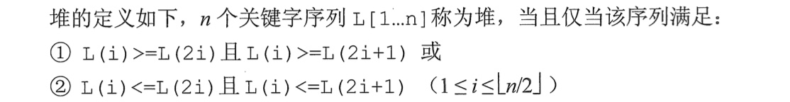


**举例**

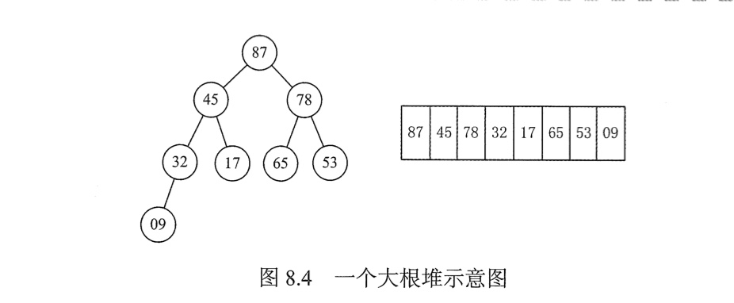


**堆排序**

> 根据堆的定义知道，代表堆的这棵完全二叉树的根结点的值是最大（或最小）的，因此，将一个无序序列调整为一个堆，就可以找到这个序列的最大（或最小）值。
>
> 然后将找出的这个值交换到序列的最后，这样，无序序列关键字减少1个，有序序列关键字增加1个。
>
> 对新的无序序列重复这样的操作，就实现了排序。


## 二、堆的初始化

### （一）算法思想

> （以大根堆为例）
>
> 对所有非叶结点，由在树中的编号从大到小的顺序进行如下调整：
>
> 1. 若孩子结点皆小于该结点，则该结点的调整结束；
> 2. 若存在孩子结点大于该结点，则将最大的孩子结点与该结点交换，并对孩子结点进行1、2的操作，直到出现1的情况或到叶结点为止。


### （二）流程示例

初始序列：{ 14、9、6、13、21、10、16、17、2、12 }


### （三）代码实现

```c++
void AdjustDown(int A[], int k, int len) {
	A[0] = A[k];
  for (i = 2*k; i <= len; i*=2) {
    if(i < len && A[i] < A[i+1])
      i++;
    if(A[0] >= A[i])
      break;
    else {
      A[k] = A[i];
      k = i;
    }
  }
  A[k] = A[0];
}

void BuildMaxHeap(int A[], int len) {
  for(int i = len/2; i>0; i--)
    AdjustDown(A, i, len);
}
```


## 三、插入结点

### （一）算法思想

> 将新结点放置在序列末端，然后向上调整。


### （二）流程示例

初始序列：{ 21、17、16、14、12、10、6、13、2、9 } 

插入：18


### （三）代码实现

```c++
void AdjustUp(int A[], int len) {
  A[0] = A[k];
  int i = k/2;
  while(i > 0 && A[i] < A[0]) {
    A[k] = A[i];
    k = i;
    i = k/2;
  }
  A[k] = A[0];
}
```


## 四、删除结点

### （一）算法思想

> 用序列最末一个结点覆盖要删除的结点的值，删除最末一个结点，再将被覆盖的结点向下调整到合适的位置。


### （二）流程示例

初始序列：{ 21、18、16、14、17、10、6、13、2、9、12 }

删除：16


### （三）代码实现

```c++
void AdjustDown(int A[], int k, int len) {
	A[0] = A[k];
  for (i = 2*k; i <= len; i*=2) {
    if(i < len && A[i] < A[i+1])
      i++;
    if(A[0] >= A[i])
      break;
    else {
      A[k] = A[i];
      k = i;
    }
  }
  A[k] = A[0];
}
```


## 五、堆排序

### （一）算法思想

> （以大根堆为例）
>
> - 从无序序列所确定的完全二叉树的最后一个非叶子结点开始，从右至左，从下至上，对每个结点进行调整，得到一个大根堆。
> - 将当前无序序列中的第一个关键字，反映在树中是根结点（假设为a）与无序序列中最后一个关键字交换（假设为b）。
>   - a 进入有序序列，到达最终位置。无序序列中关键字减少1个，有序序列中关键字增加1个。
>   - 此时只有 b 结点可能不满足堆的定义，对其进行调整。
> - 重复第二步，直到无序序列中只剩下一个关键字时排序结束。


### （二）流程示例


### （三）代码实现

```c++
void AdjustDown(int A[], int k, int len) {
	A[0] = A[k];
  for (i = 2*k; i <= len; i*=2) {
    if(i < len && A[i] < A[i+1])
      i++;
    if(A[0] >= A[i])
      break;
    else {
      A[k] = A[i];
      k = i;
    }
  }
  A[k] = A[0];
}

void BuildMaxHeap(int A[], int len) {
  for(int i = len/2; i>0; i--)
    AdjustDown(A, i, len);
}


void HeapSort(int A[], int len) {
  BuildMaxHeap(A, len);
  for (int i = len; i > 1; i--) {
    // Swap(A[i], A[1]);
    int temp = A[i];
    A[i] = A[1];
    A[1] = temp;
    AdjustDown(A, 1, i-1);
  }
}
```


### （四）性能分析

- 时间复杂度 $O(nlog_2n)$
- 空间复杂度 $O(1)$
- 不稳定


## 六、课后习题

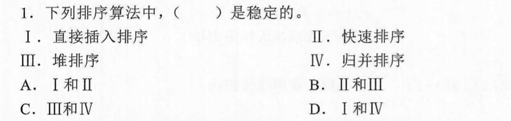


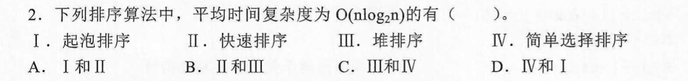


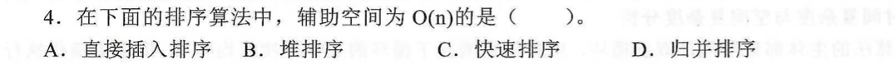


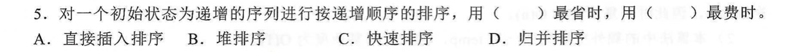


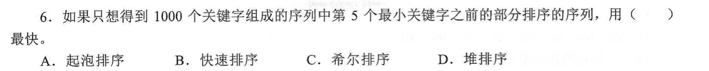


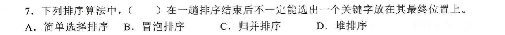


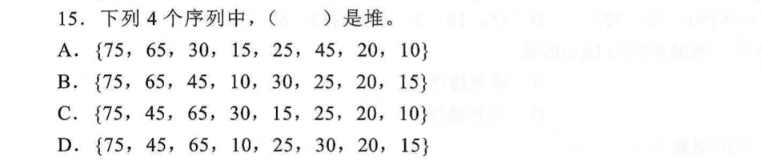


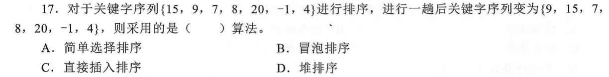


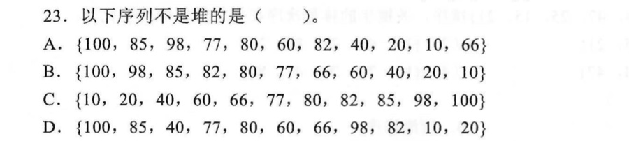


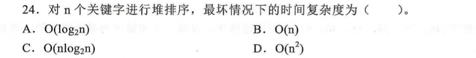


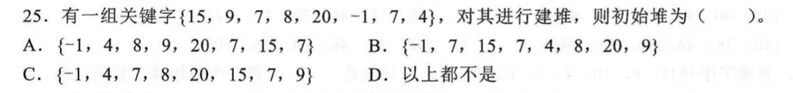


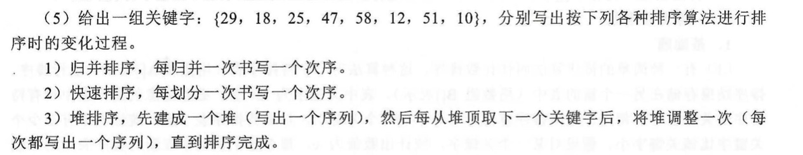


## 六、408真题


【2018】

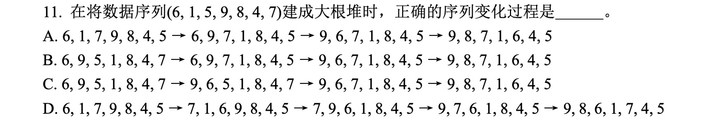


【2015】

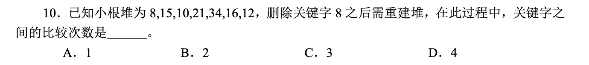


【2012】

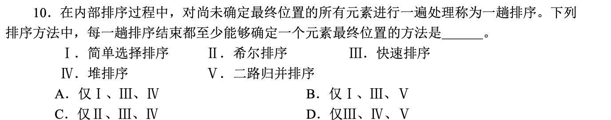


【2011】

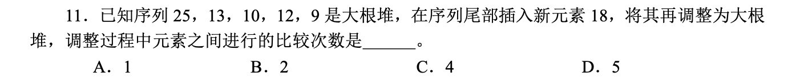


【2009】

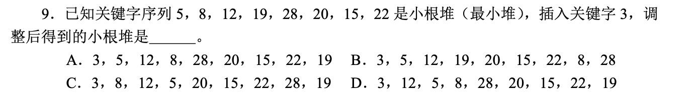


