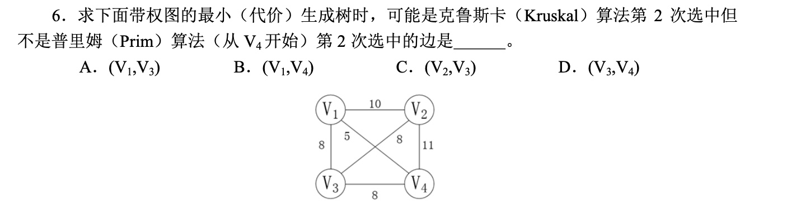

# 几种树形结构的辨析 之 生成树

## 一、生成树的概念

**生成树**

> 连通图的生成树是包含图中全部顶点的一个极小连通子图。
>
> 若图中顶点数为 n，则它的生成树含有 n-1 条边。
>
> 对生成树而言，若砍去它的一条边，则会变成非连通图，若加上一条边，则会形成一个回路。


**最小生成树**

> 生成树中权值和最小。


**什么样的图的最小生成树是唯一的？**

> 在构造最小生成树的过程中，要从剩余边中选择权值最小的并入当前生成树中，如果有多条边权值相同且同为最小值，则可任选其中一条边并入，这样就会产生多种最小生成树。
>
> 因此，要产生唯一一棵最小生成树的条件是所有边的权值均不相等。


## 二、普里姆算法（Prim）

### （一）算法思想

> - 从图中任意取出一个顶点，把它当成一棵树。
> - 然后从与这棵树相接的**边**中选取一条权值最小的边，并将这条边及其所连接的顶点也并入这棵树中。
> - 以此类推，直到图中所有顶点都被并入这棵树为止。


### （二）流程示例


### （三）算法实现

> - 数组 vset[] 
>   - vset[i] = 1 表示顶点 i 已经被并入生成树中。
>   - vset[i] = 0 表示顶点 i 还未被并入生成树中。
> - 数组 lowcost[]
>   - 存放各结点到当前生成树的最小权值。

> 从树中某一个顶点 v0 开始，构造生成树的算法执行过程如下：
>
> 1. 将 v0 到其他顶点的所有边当做候选边；
> 2. 重复以下步骤 n-1 次，使得其他 n-1 个顶点被并入到生成树中；
>
> - 从候选边中挑选出权值最小的边输出，并将与该边另一端相接的顶点 v 并入生成树中。
> - 考查所有剩余顶点 vi，如果（v，vi）的权值比 lowcost[vi] 小，则要更新。


### （四）代码描述

```c++
void Prim(MGraph g, int v0, int &sum) {
  int vset[maxSize];
  int lowcost[maxSize];
  int v;
  
  v = v0;
  for (int i = 0; i < g.n; i++) {
    lowcost[i] = g.edges[v0][i];
    vset[i] = 0;
  }
  
  vset[v0] = 1;
  sum = 0;
  
  for (int i = 0; i < g.n-1; i++) {
    min = INF;
    for (int j = 0; j < g.n; j++) {
      if (vset[j] == 0 && lowcost[j] < min) {
        min = lowcost[j];
        k = j;
      }
    }
    vset[k] = 1;
    v = k;
    sum += min;
    
    for (j = 0; j < g.n; j++) {
      if (vset[j] == 0 && g.edges[v][j] < lowcost[j])
        lowcost[j] = g.edges[v][j];
    }
  }
}
```


### （四）性能分析

- 时间复杂度 $O(n^2)$


## 三、克鲁斯卡尔算法（Kruskal）

### （一）算法思想

> - 每次找出候选边中权值最小的边，就将该边并入生成树中。
> - 重复此过程直到所有边都被检测完为止。


### （二）流程示例


### （三）算法实现

> 将图中的边按照权值从小到大排序，然后从最小边开始扫描，并检测当前边是否为候选边，即该边的并入是否会构成回路。
>
> 若不构成回路，则将该边并入当前生成树中，直到所有边都被检测完为止。

**并查集**

> 判断是否产生回路要用到并查集。
>
> 并查集中保存了一棵或者几棵树，这些树有这样的特点：
>
> - 通过树中一个结点，可以找到其双亲结点，进而找到根结点。（即**树的双亲存储结构**）
>
> 这种特性有两个好处：
>
> - 可以快速地将两个含有很多元素的集合并为一个：
>   - 两个集合就是并查集中的两棵树，只需找到其中一棵树的根，然后将其作为另一棵树中任何一个结点的孩子结点即可。
>
> - 可以方便地判断两个元素是否属于同一个集合：
>   - 通过这两个元素所在的结点找到它们的根结点，如果它们有相同的根，则说明它们属于同一个集合，否则属于不同集合。


### （四）代码实现

```c++
typedef struct {
  int a;
  int b;
  int w;
} Road;

Road road[maxSize];
int v[maxSize];

int getRoot(int a) {
  while(a != v[a])
    a = v[a];
  return a;
}

void kruskal(MGraph g, int &sum, Road road[]) {
  int i;
  int a, b;
  sum = 0;
  
  for (i = 0; i < g.n; i++)
    v[i] = i;
  
  sort(road, g.e);
  
  for (i = 0; i < g.e; i++) {
    a = getRoot(road[i].a);
    b = getRoot(road[i].b);
    if (a != b) {
      v[a] = b;
      sum += road[i].w;
    }
  }
}
```


### （五）性能分析

- 时间复杂度：由选取的排序算法决定。
  - 排序算法所处理数据的规模由**图的边数e**决定，与顶点无关。
- 克鲁斯卡尔算法适用于**稀疏图**。


## 四、课后习题


## 五、408真题

【2018】


【2015】




【2012】


【2010】


