# 几种树形结构的辨析之折半查找判定树


## 一、查找

### （一）查找的定义

> 给定一个值 k ，在含有 n 个记录的表中找出关键字等于 k 的记录。
>
> - 若找到，则查找成功，返回该记录的信息或者该记录在表中的位置；
> - 否则查找失败，返回相关的指示信息。


### （二）查找的性能

1. **使用哪种数据结构来表示查找表**

> 即查找表中的记录是按照何种方式组织的。

2. **查找表中关键字的次序**

> 即对无序集合查找还是对有序集合查找。

3. **平均查找长度 ASL**


### （三）查找的分类

- 线性结构
  - 顺序查找
  - 折半查找
  - 分块查找
- 树形结构
  - 二叉排序树
  - 平衡二叉树
  - B 树、B+树
- 散列结构
  - 散列表


## 二、折半查找

### （一）适用范围

> 仅适用于**有序**的**顺序表**。


### （二）算法思想

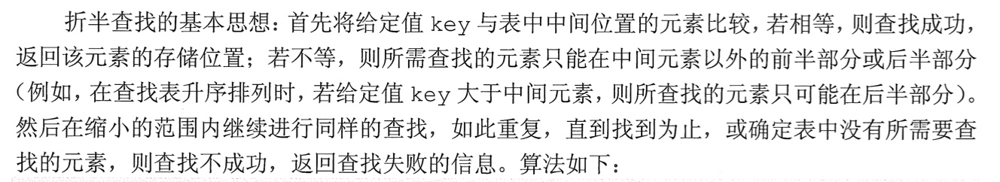


### （三）代码描述

```c++
int Binary_Search(SeqList L, int key) {
  int low = 0;
  int high = L.length - 1;
  int mid;
  
  while (low <= high) {
    mid = (low + high) / 2;
    
    if (L.data[mid] == key)
      return mid;
    else if (L.data[mid] > key)
      high = mid - 1;
    else low = mid + 1;
  }
  
  return -1;
}
```


### （四）流程示例

有序表 {7, 10, 13, 16, 19, 29, 32, 33, 37, 41, 43}

查找11。


查找32。


### （五）折半查找判定树

> 树中每个圆形结点表示一个记录，结点中的值为该记录的关键字值；
>
> 树中最下面的叶结点都是方形的，它表示查找不成功的情况。

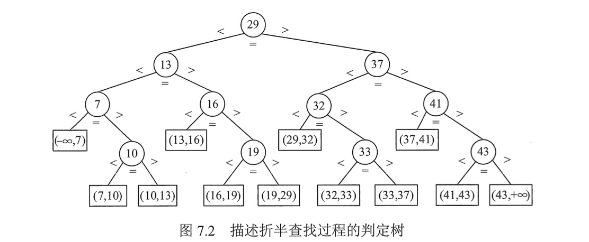

> 查找成功时的查找长度为从根结点到目的结点的路径上的结点树；
>
> 查找不成功时的查找长度为从根结点到对应失败结点的父结点的路径上的结点数。
>
> 若有序序列有 n 个元素，则对应的判定树有 n 个圆形的非叶结点和 n + 1 个方形的叶结点。
>
> 判定树是一棵**平衡二叉树**。


### （六）平均查找长度

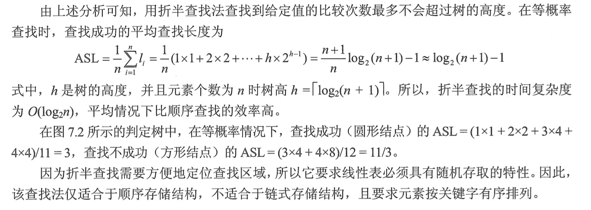


## 三、课后习题

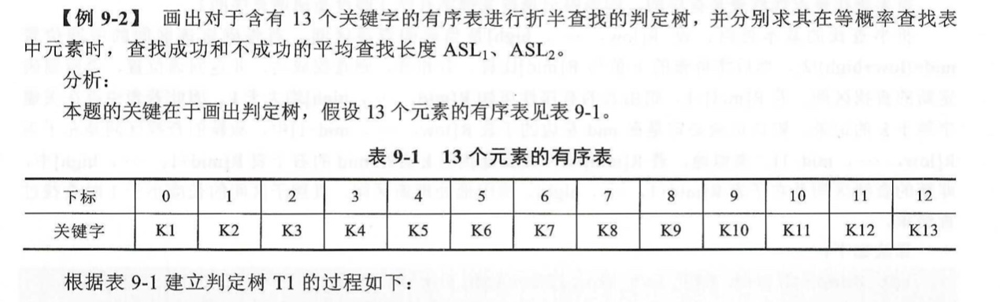


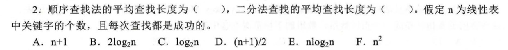


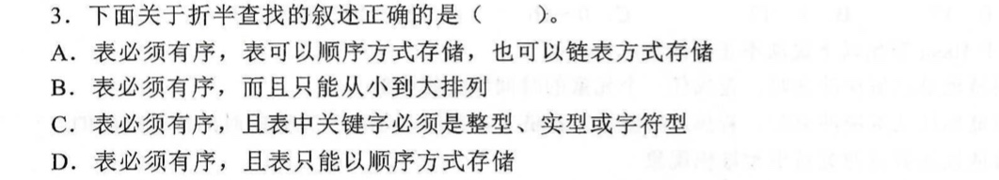


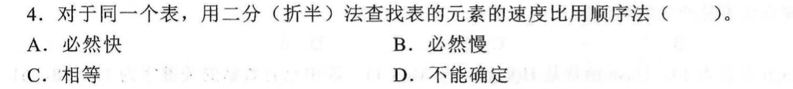


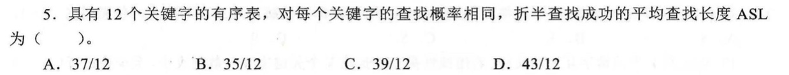


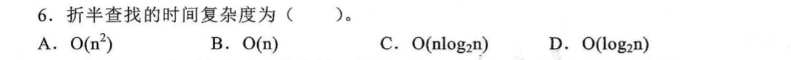


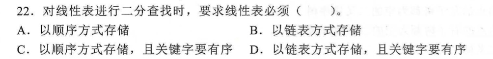


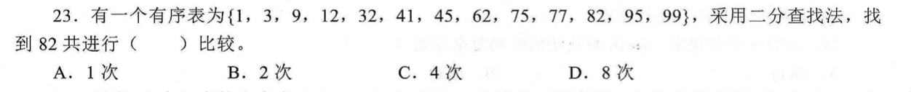


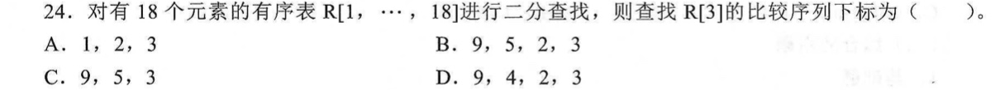


## 四、408真题

【2017】


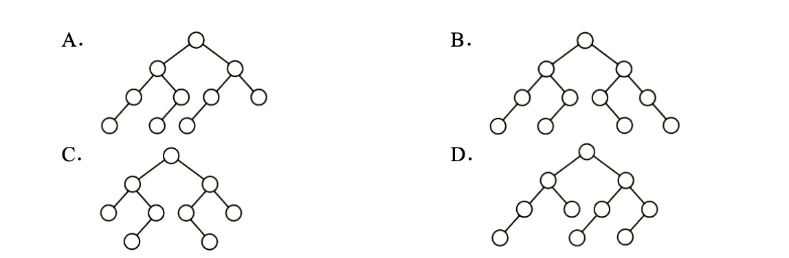


【2015】

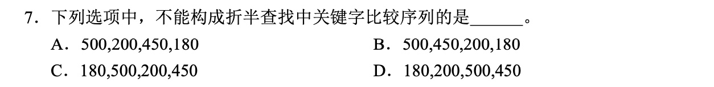


【2012】

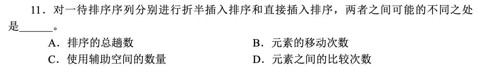


【2010】

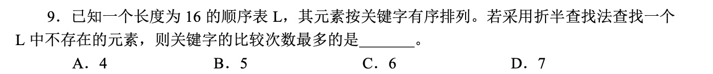


