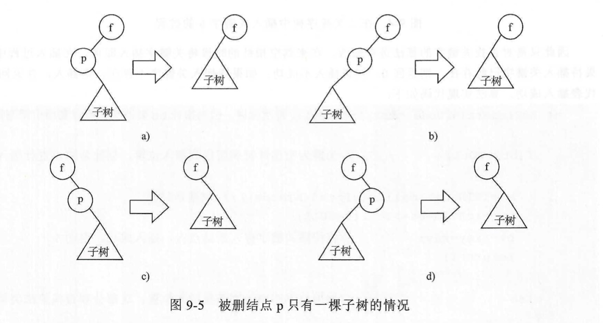
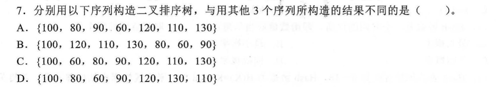
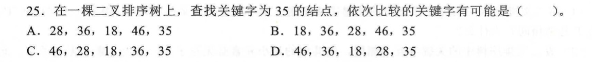
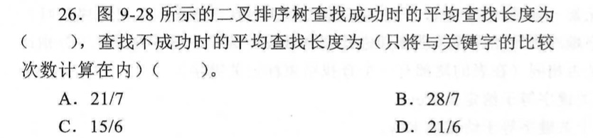
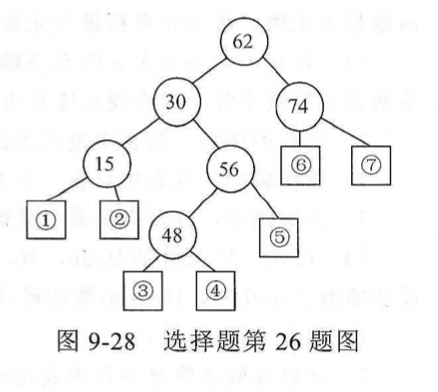
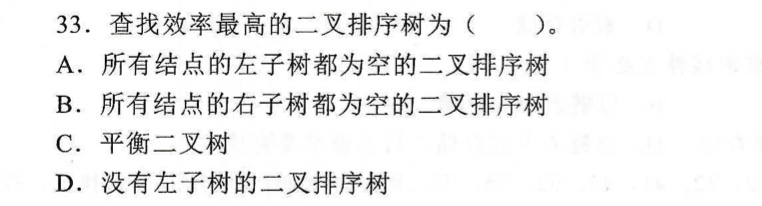
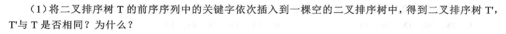
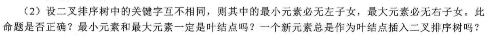
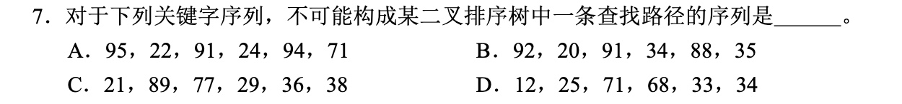

# 几种树形结构的辨析之二叉排序树

## 一、查找

### （一）查找的定义

> 给定一个值 k ，在含有 n 个记录的表中找出关键字等于 k 的记录。
>
> - 若找到，则查找成功，返回该记录的信息或者该记录在表中的位置；
> - 否则查找失败，返回相关的指示信息。


### （二）查找的性能

1. **使用哪种数据结构来表示查找表**

> 即查找表中的记录是按照何种方式组织的。

2. **查找表中关键字的次序**

> 即对无序集合查找还是对有序集合查找。

3. **平均查找长度 ASL**


### （三）查找的分类

- 线性结构
  - 顺序查找
  - 折半查找
  - 分块查找
- 树形结构
  - 二叉排序树
  - 平衡二叉树
  - B 树、B+树
- 散列结构
  - 散列表


## 二、二叉排序树（bst）

### （一）二叉排序树的定义

> 二叉排序树或者是空树，或者是满足以下性质的二叉树：
>
> - 若它的左子树不空，则左子树上所有关键字的值均不大于（不小于）根关键字的值。
> - 若它的右子树不空，则右子树上所有关键字的值均不小于（不大于）根关键字的值。
> - 左右子树又各是一棵二叉排序树。

> 【注】如果输出二叉排序树的**中序遍历序列**，则这个序列是非递减（非递增）有序的。


### （二）二叉排序树的存储结构

```c++
typedef struct BTNode {
  int key;
  struct BTNode *lchild;
  struct BTNode *rchild;
} BTNode;
```


### （三）二叉排序树的基本算法

#### 1. 查找关键字

> 将待查关键字先和根结点中的关键字比较：
>
> - 如果相等则查找成功；
> - 如果小于则到左子树中去查找，无须考虑右子树中的关键字；
> - 如果大于则到右子树中去查找，无须考虑左子树中的关键字。
>
> 重复上述过程。如果来到了结点的空指针域，则说明查找失败。

```c++
BTNode* BSTSearch(BTNode* bt, int key) {
  if(bt == NULL) 
    return NULL;
  else {
    if(bt->key == key)
      return bt;
    else if(key < bt->key)
      return BSTSearch(bt->lchild, key);
    else
      return BSTSearch(bt->rchild, key);
  }
}
```


#### 2. 插入关键字

> 对于一个不存在于二叉排序树中的关键字，其查找不成功的位置即为该关键字的插入位置。
>
> 因此只需对查找关键字的算法进行修改，在来到空指针的时候将关键字插入即可。
>
> - 在插入过程中如果待插入关键字已经存在，则返回0，代表插入不成功；
> - 如果待插入关键字不存在，则插入，并返回1，代表插入成功。

```c++
int BSTInsert(BTNode *&bt, int key) {
  if (bt == NULL) {
    bt = (BTNode*)malloc(sizeof(BTNode));
    bt->lchild = bt->rchild = NULL;
    bt->key = key;
    return 1;
  } else {
    if(key == bt->key)
      return 0;
    else if(key < bt->key)
      return BSTInsert(bt->lchild, key);
    else
      return BSTInsert(bt->rchild, key);
  }
}
```


#### 3. 构造二叉排序树

> 建立一棵空树，然后将关键字逐个插入到空树中即可构造一棵二叉排序树。

```c++
void CreateBST(BTNode *&bt, int key[], int n) {
  int i;
  bt = NULL;
  for (i = 0; i < n; i++)
    BSTInsert(bt, key[i]);
}
```


#### 4. 删除关键字

> 当在二叉排序树中删除一个关键字时，不能把以该关键字所在的结点为根的子树都删除，而是只删除这一个结点，并保持二叉排序树的特性。

> 假设在二叉排序树上被删除结点为 p，f 为其双亲结点，则删除结点 p 的过程分为以下 3 种情况：
>
> - p 结点为叶子结点
>   - 直接删除即可，不会破坏二叉排序树的特性
> - p 结点只有右子树而无左子树，或者只有左子树而无右子树
>   - 此时只需将 p 删掉，然后将 p 的子树直接连接在原来 p 与其双亲结点 f 相连的指针上即可
> - p 结点既有左子树又有右子树
>   - 先沿着 p 的左子树根结点的右指针一直往右走，直到来到其右子树的最右边的一个结点 r
>   - 然后将 p 中的关键字用 r 中的关键字代替
>     - 如果 r 是叶子结点，则删除 r
>     - 如果 r 是非叶子结点，则按照 2 的方法删除 r




## 三、课后习题





















## 四、408真题

【2011】




