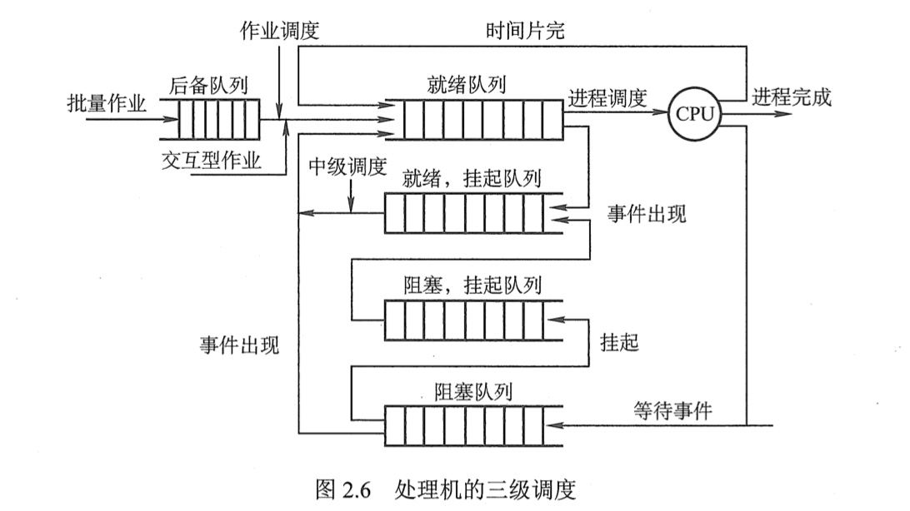

# 2.2 处理器的三级调度

[TOC]

调度是操作系统的一个基本功能，几乎所有资源在使用前都需要调度。

由于CPU是计算机的首要资源，因此调度设计均围绕如何能够高效利用CPU展开。

在多道程序环境下，一个作业从提交到执行，通常都要经历**多级调度**，如**高级调度**、**中级调度**和**低级调度**。

## 一、高级调度（作业调度）

> 又称为宏观调度、作业调度或者长程调度。

### （一）主要任务

> 按照一定的原则从外存上处于后备状态的作业中选择一个或者多个，给它们分配内存、输入/输出设备等必要资源，并建立相应的进程，以使该作业具有获得竞争处理器的权利。

### （二）运行频率

> 运行频率较低，一般为**几分钟一次**。

### （三）需要解决两个问题

1. 调度程序必须决定操作系统可以接纳多少个作业。

> 作业调度每次要接纳多少个作业进入内存取决于多道程序的并发程度，即允许有多少个作业同时在内存中运行。
>
> - 当内存中可以同时运行的作业太多时，可能会影响到系统的服务质量，如导致周转时间太长。
> - 当内存中可以同时运行的作业太少时，又会导致系统资源利用率和吞吐量下降。
>
> 因此，多道程序的并发程度应根据**系统的规模**和**运行速度**来确定。

2. 调度程序必须决定接纳哪些作业。

> 应将哪些作业从外存调入内存取决于所采取的调度算法。
>
> - 最简单的调度算法是**先来先服务调度算法**，它将最早进入外存的作业最先调入内存。
> - 较常用的一种调度算法是**短作业优先调度算法**，它将外存上执行时间最短的作业最先调入内存。

## 二、中级调度

> 中级调度又称为中程调度或者交换调度。

### （一）任务

> 引入中级调度是为了**提高内存利用率**和**系统吞吐量**。
>
> 其主要任务是
>
> - 按照给定的原则和策略，将处于外存对换区中的具备运行条件的进程调入内存，并将其状态修改为就绪状态，挂在就绪队列上等待；
> - 或者将处于内存中的暂时不能运行的进程交换到外存对换区，将此时的进程状态称为挂起状态。

## 三、低级调度（进程调度）

> 低级调度又称为微观调度、进程调度或者短程调度。

### （一）任务

> 按照某种策略和方法从就绪列队中选取一个进程，将处理器分配给它。

### （二）运行频率

> 进程调度的运行频率很高，一般隔几十毫秒就要运行一次。

## 四、三级调度的联系

- **作业调度**从外存的后备队列中选择一批作业进入内存，为它们建立进程，这些进程被送入就绪队列。
- **进程调度**从就绪队列中选出一个进程，并将其状态改为运行态，把CPU分配给它。
- **中级调度**是为了提高内存的利用率，系统将那些暂时不能运行的进程挂起来；当内存空间宽松时，通过中级调度选择具备运行条件的进程，将其唤醒。

> - **作业调度**为进程活动做准备，**进程调度**使进程正常活动起来，**中级调度**将暂时不能运行的进程挂起。
> - **作业调度**次数少，**中级调度**次数略多，**进程调度**频率最高。
> - **进程调度**是最基本的，不可或缺。