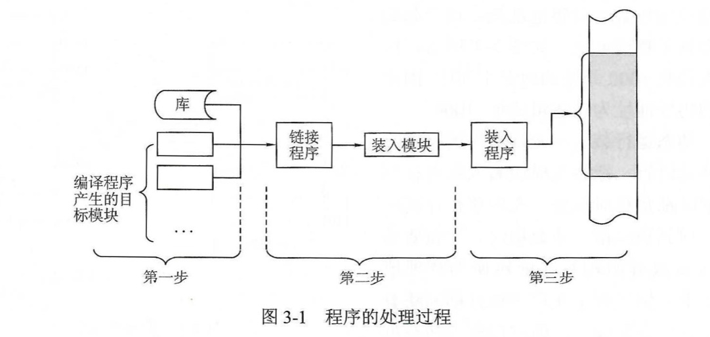
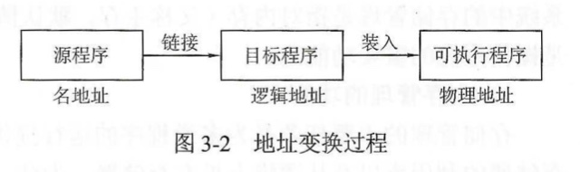
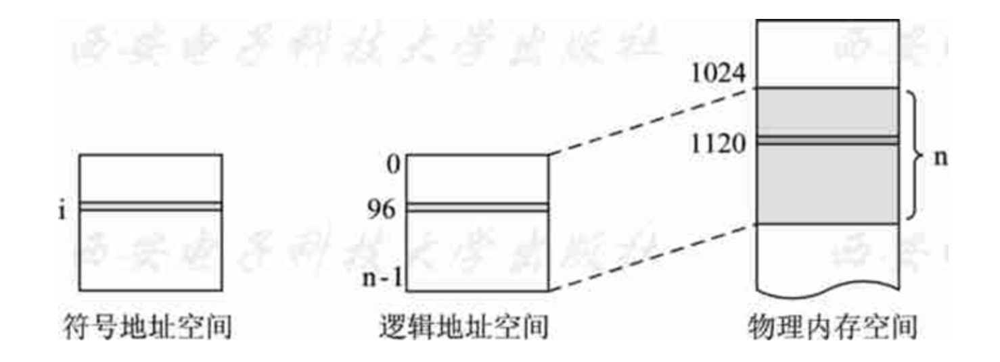
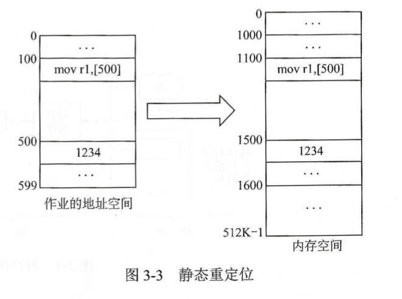
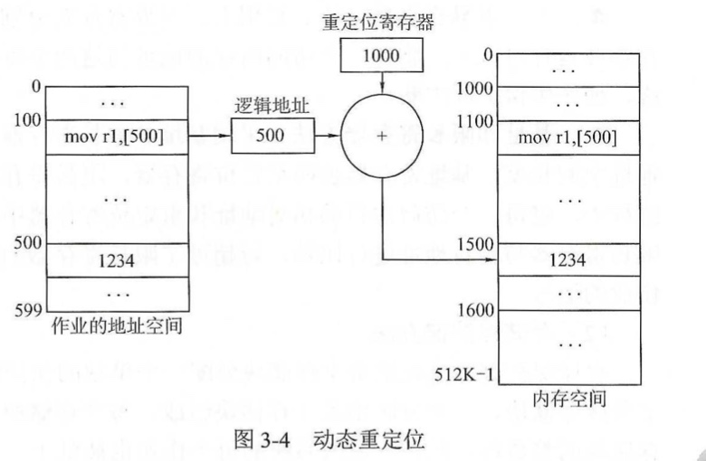

# 3.1 应用程序的处理过程

[TOC]

## 一、应用程序处理的三个步骤

应用程序从用户编写的源文件，到内存中执行的进程，需要经过哪些步骤？

- **第一步：编译（ Compile）**
  - 经过**编译程序（Compiler）**将源代码编译为若干个**目标模块（Object Module）**
- **第二步：链接（Link）**
  - 通过**链接程序（Linker）**将编译好的目标模块以及所需的库函数链接在一起，形成完整的**装入模块（Load Module）**。
- **第三步：装入（Load）**
  - 通过**装入程序（Loader）**将这些装入模块装入内存并执行。

## 二、地址变换过程

什么是地址转换？逻辑地址和物理地址分别是指什么？

### （一）地址的概念

#### 1. 符号名地址

>  在用高级语言编写的源程序中，我们使用符号名(变量名、函数名、语句标号等)来表示操作对象或控制的转移地址。比如用变量名代表一个存储单元、用函数名代表函数的入口地址、用语句标号代表跳转地址等。这些符号名的集合称为**符号名空间**。编程者不需考虑程序代码和数据的具体存放地址。

#### 2. 逻辑地址

> 编译程序将源代码中的语句逐条地翻译为机器指令，为每个变量分配存储单元，并用存储单元的地址替换变量名。这些指令和数据顺序存放在一起，从0开始编排地址，形成目标代码。目标代码所占有的地址范围就称为**逻辑地址空间**，是从0开始的。逻辑地址空间中的地址称为**逻辑地址**，或称相对地址。

#### 3. 物理地址

> 物理内存由一系列的内存单元组成，这些存储单元从0开始按字节编址，称为**内存地址**。当目标程序加载到内存中时，它所占据的实际内存空间就是它的**物理存储空间**，物理空间中的地址称为**物理地址**，或称为绝对地址。

### （二）地址转换

> 用户编程时只能使用逻辑地址，而CPU执行指令时必须指定物理地址，因此必须在指令执行前进行地址变换，将指令中的逻辑地址转换为CPU可直接寻址的物理地址，这样才能保证CPU访问到正确的存储单元。

> 当装入程序将可执行代码装入内存时，通过地址转换将逻辑地址转换为物理地址，这个过程也叫做**重定位**。

## 三、程序链接的三种方式

#### 1. 静态链接

> 在程序运行之前，先把各个目标模块及所需库链接为一个完整的可执行程序，以后不再拆开。

#### 2. 装入时动态链接

> 将应用程序编译后所得到的的一组目标模块装入内存时采用边装入边链接的动态链接方式。

#### 3. 运行时动态链接

> 直到程序运行过程中需要一些模块时，才对这些模块进行链接。在执行过程中，当发现一个被调用模块尚未装入内存时，立即去找到该模块并将之装入内存，并链接到调用模块上。凡是在执行过程中未被用到的目标模块，都不会被调入内存和被链接到装入模块上。

## 四、程序装入的三种方式

#### 1. 绝对装入

> 在编译时就知道程序将要驻留在内存的物理地址，编译程序产生含有物理地址的目标代码。

#### 2. 静态重定位

> 根据内存当前情况，将装入模块装入到内存的适当位置，地址变换通常在装入时一次完成，之后不再改变。

> 当操作系统为程序分配了一个以某地址为起始地址的连续存储区域后，重定位时将程序中指令或操作数的逻辑地址加上这个起始地址就得到了物理地址。
>
> **物理地址 = 起始地址 + 起始地址**

#### 3. 动态重定位

> 允许程序运行时在内存中移动位置。
>
> 把装入模块装入到内存后的所有地址都是相对地址，在程序执行过程中每当访问到相应指令或数据时，才将要访问的程序或数据的相对地址转换为物理地址。

> 动态重定位要依靠**硬件地址变换机构**。
>
> 最简单的实现方法是利用一个**重定位寄存器**。
>
> 当某个作业开始开始执行时，操作系统负责把该作业在主存中的起始地址送入重定位寄存器中，之后在作业的整个执行过程中，每当访问内存时，系统就会自动将重定位寄存器的内容加到逻辑地址中去，从而得到与该逻辑地址对应的物理地址。
>
> **物理地址 = 重定位寄存器中的值 + 逻辑地址**

## 五、内存保护

内存中可能会同时存在多个进程，为了防止进程间的互相干扰，需要进行内存保护。

### （一）界限寄存器方法

#### 1. 上、下界寄存器

> 采用上、下界寄存器分别存放作业的**结束地址**和**开始地址**。
>
> 在作业运行过程中，将每一个访问内存的地址与这两个寄存器中的内容进行比较，如超出范围，便产生保护性中断。

#### 2. 基址和限长寄存器

> 采用基址和限长寄存器分别存放作业的起始地址及作业的地址空间长度。
>
> 基址寄存器也叫**重定位寄存器**，限长寄存器也叫**界地址寄存器**。
>
> 在作业运行过程中：
>
> - 将每一个访问的相对地址和重定位寄存器中的值相加，形成作业的物理地址；
> - 限长寄存器与相对地址进行比较，若超过了限长寄存器的值，则发出越界中断信号，并停止作业的运行。

### （二）存储保护键方法

> 给每个存储块分配一个单独的保护键，其作用相当于一把 “锁”。
>
> 进入系统的每个作业也被赋予了一个**保护键**，它相当于一把 “钥匙”。
>
> 当作业运行时，检查 “钥匙” 和 “锁” 是否匹配，若不匹配，则系统发出保护性中断信号，并停止作业的运行。

## 六、课后习题

## 七、408真题

