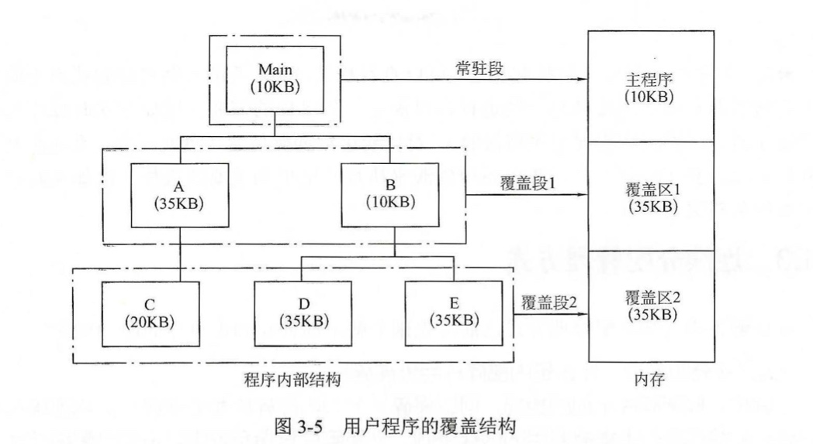

# 3.2 内存管理

[TOC]

存储器是计算机系统的重要组成部分，是计算机系统中的一种宝贵资源。

存储管理是操作系统的重要功能之一，一般是指对内存的管理。

## 一、内存管理的功能

> 存储管理的主要任务是为多道程序的运行提供良好的环境，方便用户使用存储器，提高存储器的利用率以及从逻辑上扩充存储器。

#### 1. 内存的分配和回收

> 以前的程序员在编程的过程中，需要对内存的使用进行严格地计算。但现在由操作系统完成内存空间的分配和管理，使编程人员摆脱了存储空间分配的麻烦，我们不用再去管自己编写的代码会在哪一块物理地址上运行，提高了编程效率。
>
> 为此，系统要记住内存空间的使用情况：
>
> - 实施内存的分配
> - 回收系统或用户释放的内存空间

#### 2. 地址变换

> 程序的逻辑地址与内存中的物理地址通常不一致，操作系统必须提供地址变换功能。

#### 3. 扩充内存

> 借助于虚拟存储技术或其他自动覆盖技术，为用户提供比内存空间大的地址空间，从而实现从逻辑上扩充内存容量的目的。

#### 4. 存储保护

> 保证进入内存的各道作业都在自己的存储空间内运行，互不干扰。
>
> 既要防止一道作业因发生错误而破坏其他作业，也要防止其破坏系统程序。

下面介绍三种为扩充内存而产生的技术：古老的覆盖技术、早期的交换技术和常用的虚拟存储技术。

## 二、覆盖技术（Overlay）

### （一）引入

> 早期的单用户系统中，内存的容量一般很小，可用的存储空间受到限制，某些大的作业不能一次全部装入内存。由此，产生了**大作业与小内存的矛盾**。

### （二）基本思想

> 将程序分为若干段，常用的段常驻内存，不常用的段在需要时调入内存。
>
> 内存中分为一个 **固定区** 和若干个 **覆盖区**。
>
> 把程序执行时并不要求同时装入内存的覆盖组成一组，称为**覆盖段**；将这个覆盖段分配到同一个存储区域，这个存储区域称为**覆盖区**，它与覆盖段一一对应。覆盖区的大小由覆盖段中最大的覆盖来确定。

### （三）优点

> 打破了必须将一个进程全部装入主存后才能运行的限制。

### （四）缺点

> - 对程序员的要求较高，程序员必须把一个程序划分为不同的程序段，并规定好执行和覆盖顺序，操作系统根据程序员提供的覆盖结构来完成程序段之间的覆盖。
> - 当同时执行程序的代码量超过主存时，程序仍然不能运行。

## 三、交换技术（Swapping）

### （一）引入

> 交换技术最早出现是在麻省理工大学的兼容分时系统（CTSS）中。
>
> 任何时刻在该系统的内存中都只有一个完整的用户作业，当其运行一段时间后，或由于分配给它的时间片用完，或由于需要其他资源而等待，系统就把它换到外存上，同时把另一个作业调入内存运行。
>
> 这样，可以在存储容量不大的小型机上实现分时运行。早期的一些小型分时系统大多采用这种交换技术。

### （二）基本思想

> 内存空间紧张时，系统将内存中某些进程暂时换出外存，把外存中某些已具备运行条件的进程换入内存。
>
> PS：处理器三级调度中的**中级调度**就是采用了交换技术。

### （三）需要解决的问题

#### 1. 应该在外存的什么位置保存被换出的进程？

> - 磁盘空间
>   - **文件区**：主要用于存放文件，追求存储空间的利用率，采用离散分配方式。
>   - **对换区**：只占一小部分，存放被换出的进程数据，追求换入换出速度，采用连续分配方式。

#### 2. 什么时候应该交换？

> 通常在许多进程运行且内存吃紧时。
>
> 例如：
>
> - 在发现许多进程运行时经常发生缺页，说明内存吃紧，此时可换出进程；
> - 当缺页率明显下降时，可暂停换出。

#### 3. 应该换出哪些进程？

> - 阻塞进程
> - 优先级低的进程
> - 为防止优先级低的进程饥饿，还会考虑进程在内存中的驻留时间。

#### 4. 进程的PCB会被换出吗？

> 不会。PCB常驻内存，不会被换出。

### （四）注意以下几点

> 1. 交换需要备份存储，通常是使用快速磁盘。它必须足够大，并且提供对这些内存映像的直接访问。
> 2. 为了有效使用 CPU，需要每个进程的执行时间比交换时间长，而影响交换时间的因素主要是转移时间。
> 3. 如果换出进程，必须确保该进程完全空闲。
> 4. 交换空间通常作为磁盘的一整块，且独立于文件系统。
> 5. 交换通常在有许多进程运行且内存空间紧张时开始启动，而在系统负荷减轻时暂停。
> 6. 普通的交换使用不多，但交换技术的某些变种在许多系统中仍发挥着作用。

### （五）优点

> - 打破了一个程序一旦进入主存便一直运行到结束的限制。
> - 与覆盖技术相比，交换技术不要求程序员给出程序段之间的覆盖关系，且交换主要是在进程或作业之间进行。

### （六）缺点

> 运行的进程大小仍然受实际主存的限制。

## 四、虚拟存储技术

虚拟存储技术是一种内存扩充的手段。

内存的分配管理方式分为**连续分配管理方式**和**非连续分配管理方式**。

> 连续分配管理方式存在两个特点：
>
> - **一次性**：作业必须一次性全部装入内存后才能开始运行
>   - 作业很大时，不能全部装入内存，导致大作业无法运行
>   - 当大量作业要求运行时，由于内存无法容纳所有作业，因此只能有少量作业能运行，导致多道程序并发度下降
> - **驻留性**：一旦作业被装入内存，就会一直驻留在内存中，直至作业运行结束

而**非连续分配管理方式**，就是采用了虚拟存储技术，实现了作业部分装入就可运行。

### （一）引入

### （二）局部性原理

大多数程序执行时，在一个较短的时间内仅使用程序代码的一部分，相应地，程序所访问的存储空间也局限于某个区域，这就是程序执行的局部性原理。

#### 1. 时间局部性

> 一条指令的一次执行和下次执行，一个数据的一次访问和下次访问，都集中在一个较短的时期间。

#### 2. 空间局部性

> 当前指令和邻近的几条指令，当前访问的数据和邻近的数据，都集中在一个较小的区域内。

### （三）虚拟内存的定义

#### 1. 部分装入

> 基于局部性原理，在程序装入时，一方面可以将程序的一部分放入内存，而将其余部分放在外存，然后启动程序。

#### 2. 请求调入

> 在程序执行过程中，当所访问的信息不在内存中时，再由操作系统将所需的部分调入内存。

#### 3. 置换功能

> 另一方面，操作系统将内存中暂时不使用的内容置换到外存上，从而腾出空间存放将要调入内存的信息。

从效果上看，计算机系统好像为用户提供了一个存储容量比实际内存大得多的存储器，这种从逻辑上扩充内存容量的存储器系统就称为**虚拟存储器**。

### （四）虚拟内存的意义

> 将其称为虚拟存储器是因为这种存储器实际上并不存在，系统只是提供了**部分装入**、**请求调入**和**置换功能**，给用户的感觉是好像存在一个能满足作业地址空间要求的内存。

> 让程序存在的地址空间与运行时的存储空间分开，程序员可以完全不考虑实际内存的大小，而在地址空间内编写程序。

### （五）虚拟内存的容量

### （六）虚拟内存的特征

- **离散性**
  - 程序在内存中离散存储。
- **多次性**
  - 一个作业可以分成多次调入内存。
- **对换性**
  - 作业在运行过程中可以换入、换出。
- **虚拟性**
  - 从逻辑上扩充内存容量，用户可以使用的空间可以远大于实际内存容量。。

### （七）实现虚拟存储技术的软硬件支持

- 要有相当数量的外存
- 要有一定容量的内存
- 中断机构
- 地址变换机构
- 相关数据结构，如页表或段表

## 五、课后习题

## 六、408真题

