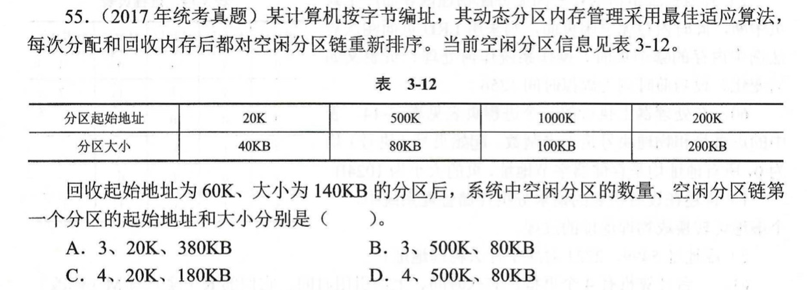

# 3.3 内存分配管理 之 连续分配管理方式

[TOC]

## 内部碎片与外部碎片

### （一）内部碎片

> 是指已经分配给作业但不能被利用的内存空间。

### （二）外部碎片

> 是指还系统中还没有分配给作业，但由于碎片太小而无法分配给申请内存空间的新进程的存储块。

## 一、单一连续分配

### （一）基本思想

> 内存被分为**系统区** 和 **用户区**。
>
> - **系统区**：通常位于内存的低地址部分，用于存放操作系统相关数据。
> - **用户区**：用于存放用户进程相关数据。
>
> 内存中只能有一道用户程序，用户程序独占整个用户区空间。

### （二）优点

> （1）实现简单
>
> （2）无外部碎片
>
> （3）可以采用覆盖技术扩充内存
>
> （4）不一定需要内存保护

### （三）缺点

> （1）只能用于单用户、单任务的操作系统中
>
> （2）有内部碎片
>
> （3）存储器利用率极低

## 二、固定分区分配

### （一）基本思想

> 将用户空间划分为若干个固定大小的分区，每个分区中可以装入一道程序。
>
> **分区的大小可以不等**，但事先必须确定，在运行时不能改变。
>
> 当有空闲分区时，便从后备队列中选择一个适当大小的作业装入运行，采用**静态重定位**方式装入。

### （二）数据结构 —— 分区说明表

> 系统需要建立一张分区说明表，用以记录可用于分配的分区。

| 分区号 | 大小 | 起始地址 | 状态 |
| ------ | ---- | -------- | ---- |
|        |      |          |      |

> 当某个用户程序要装入内存时，由操作系统内核程序根据用户程序大小检索该表，从中找到一个能满足大小、未分配的分区，将其分配给程序，并修改表内状态为已分配。

### （三）优点

> （1）实现简单
>
> （2）无外部碎片
>
> （3）可用于多道程序系统

### （四）缺点

> （1）当用户程序太大时，可能所有的分区都不能满足需求，此时不得不采用覆盖技术，但又会降低性能
>
> （2）会产生内部碎片

## 三、动态分区分配

### （一）基本思想

> 不事先将主存划分成一块块的分区，而是在作业进入主存时，根据作业的大小动态地建立分区，并使分区的大小正好满足作业的需要。

### （二）数据结构

#### 1. 空闲分区表

| 分区号 | 大小 | 起始地址 | 状态 |
| ------ | ---- | -------- | ---- |
|        |      |          |      |

#### 2. 空闲分区链

### （三）动态分区分配算法

#### 1. 首次适应算法（First Fit，FF)

##### （1）算法思想

> 每次都从低地址开始查找，找到第一个能满足大小的空闲分区。

##### （2）如何实现

> 空闲分区以地址递增的次序排列。
>
> 每次分配内存时顺序查找**空闲分区链**（或**空闲分区表**），找到大小能满足要求的第一个空闲分区。

##### （3）优点

> - 优先利用内存低地址部分的空闲分区，从而保留了高地址部分的大的空闲分区。
> - 无内部碎片

##### （4）缺点

> - 有外部碎片（由于低地址部分不断被划分，致使低地址端留下许多难以利用的很小的空闲分区）

#### 2. 下次适应算法（Next Fit，FF)

##### （1）算法思想

> 在首次适应算法的基础上，每次都从上次查找结束的位置开始检索，找到第一个能满足大小的空闲分区。

##### （2）如何实现

> 把空闲分区按照地址递增的次序用链表串成一个循环队列，每次需要为一个进程分配内存时都从上一次查找结束的位置开始找，顺着空闲分区链直到找到大小能满足要求的第一个空闲分区。

##### （3）优点

> - 使得空闲分区的分布更加均匀，减少了查找空闲分区的开销。

##### （4）缺点

> - 和首次适应算法相比，该算法可能导致无论低地址、高地址部分的空闲分区都有相同的概率被使用，也就导致了高地址部分的大分区更可能被划分为小分区。

#### 3. 最佳适应算法（Best Fit，BF）

##### （1）算法思想

> 由于动态分区分配是一种连续分配方式，为各进程分配的空间必须是连续的一整片区域，因此，为了保证当 “大进程” 到来时能有连续的大片空间，可以尽可能多地留下大片空闲区，优先使用更小的空闲区。

##### （2）如何实现

> 空闲分区按容量递增的次序链接，每次分配内存时顺序查找空闲分区链，找到大小满足要求的第一个空闲分区。

##### （3）优点

> - 总能分配给作业最恰当的分区。
> - 保留大的分区。

##### （4）缺点

> - 每次都选最小的分区进行分配，会留下越来越多的、很小的、难以利用的内存块，会产生大量外部碎片。

#### 4. 最差适应算法（Worst Fit，WF）

##### （1）算法思想

> 为了解决最佳适应算法过多外部碎片的问题，可以在每次分配时优先使用最大的连续空闲区，这样分配后剩余的空闲区就不会太小，更方便使用。

##### （2）如何实现

> 空闲分区按容量递减次序链接，每次分配内存时顺序查找空闲分区链，找到大小能满足的第一个空闲分区。

##### （3）优点

> - 使分给作业后剩下的空闲分区比较大，足以装入后续作业。

##### （4）缺点

> - 由于最大的空闲分区总是被优先分配，当有大作业到来时，其存储空间的申请会得不到满足。

### （四）分区的回收

当作业执行结束时，系统应回收已使用完毕的分区。

系统根据回收分区的大小及首地址，在空闲分区表（或空闲分区链）中检查是否有相邻的空闲分区，如有相邻空闲分区，则合并成一个大的空闲区，并修改有关的分区状态信息。

#### 1. 回收区上邻接一个空闲分区

> 将回收区与上邻接分区 F1 合并成一个连续的空闲分区。
>
> 合并分区的首地址为空闲分区 F1 的首地址，其大小为二者之和。

#### 2. 回收区下邻接一个空闲分区

> 将回收区与下邻接分区 F1 合并成一个连续的空闲分区。
>
> 合并分区的首地址为回收区的首地址，其大小为二者之和。

#### 3. 回收区上、下各邻接一个空闲分区

> 将回收区与 F1、F2 合并为一个连续的空闲分区。
>
> 合并分区的首地址为 F1 的首地址，其大小为三者之和，且应当把 F2 从空闲分区表（或空闲分区链）中删除。

#### 4. 回收区不与任何空闲分区相邻接

> 单独建立表项，填写分区大小及地址等信息，加入空闲分区表（或空闲分区链）的适当位置。

### （五）分区分配的动态管理

在连续分配管理方式中，必须把作业装入到一片连续的内存空间。如果系统中有若干小的分区，其总容量大于要装入的作业，但由于它们不相邻接，致使作业不能装入内存，则需要对分区分配进行动态管理。

#### 1. 拼接技术

> 将存储器中所有已分配分区移动到主存的一端，使本来分散的多个小空闲区连成一个大的空闲区。
>
> 这种通过移动把多个分散的小分区拼接成一个大分区的方法称为**拼接**或**紧凑**。

#### 2. 动态重定位分区分配技术

> 即在**动态分区分配算法**中增加拼接功能，在找不到足够大的空闲分区来满足作业要求，而系统中空闲分区容量总和大于作业要求时进行拼接。

### （六）优点

> （1）实现了多道程序共用主存（共用是指多进程同时存在于主存中的不同位置）
>
> （2）管理方式相对简单、不需要更多开销
>
> （3）实现存储保护的手段比较简单

### （七）缺点

> （1）主存利用不够充分，存在**外部碎片**
>
> （2）无法实现多进程共享存储器信息（共享是指多进程都使用同一个主存段）
>
> （3）无法实现主存的扩充，进程地址空间受实际存储空间的限制

## 四、课后习题

## 五、408真题