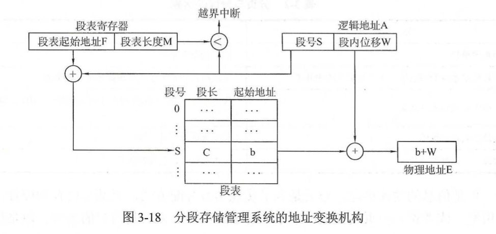
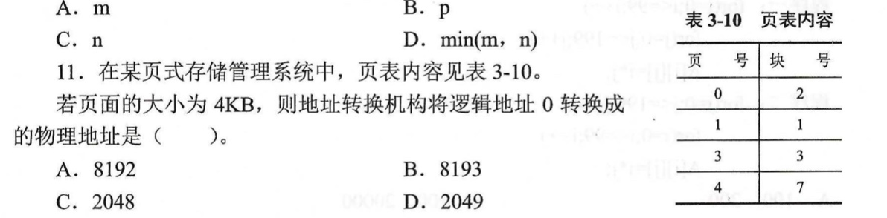

# 3.4 内存分配管理 之 非连续分配管理方式

[TOC]

在分区存储管理（连续分配管理方式）中，要求把作业放在一个连续的存储区中，因而会产生碎片问题。尽管通过拼接技术可以解决碎片问题，但代价较大。

如果允许将一个作业放到许多不相邻接的分区中，那么就可以避免拼接，从而有效地解决外部碎片问题。

## 一、基本分页存储管理方式

### （一）分页原理

#### 页框

> 将内存空间分为一个个大小相等的分区，每个分区就是一个**页框**（或**页帧**、**内存块**、**物理块**）。
>
> 每个页框有一个编号，从0开始。

#### 页

> 将用户进程的地址空间也分为与页框大小相等的一个个区域，称为**页**（或**页面**）。
>
> 每个页面也有一个编号，即**页号**，也是从0开始。
>
> PS：进程的最后一个页面可能没有一个页框的大小。

操作系统以页框为单位为各个进程分配内存空间。进程的每个页面分别放入一个页框中。

各个页面不必连续存放，也不必按先后顺序。

### （二）地址结构

| 页号P | 页内位移W |
| ----- | --------- |
| (M位) | （K位）   |

#### 逻辑地址 → 物理地址

1. 算出逻辑地址对应的页号（页号 = 逻辑地址 / 页面长度）

2. 该页号在内存中的起始地址（操作系统通过页表和地址变换机构得出）

3. 算出逻辑地址在页面内的偏移量（页内偏移量 = 逻辑地址 % 页面长度）

4. 得出物理地址（物理地址 = 页面起始地址 + 页内偏移量）

### （三）数据结构 —— 页表

#### 1. 页表的引入

为了将逻辑地址上连续的页号映射到物理内存中后成为离散分布的多个物理块，需要将每个页面和每个物理块一一对应，这种映射关系就体现在页表上。

为了知道进程的每个页面在内存中存放的位置，操作系统为每个进程建立一张页表。

PS：页表通常存放在内存中。

#### 2. 页表项

页表中每个页表项都由页号和块号组成，根据页表项就可以找到每个页号所对应物理内存中物理块的块号。

【总结】

> - 一个进程对应一张页表。
> - 进程每一页对应一个页表项。
> - 每个页表项由 “页号” 和 “块号” 组成。
> - 页表记录进程页面和实际存放的内存块之间的对应关系。

### （四）地址变换机构

整个地址变换过程都是由硬件自动完成的。

#### 页表寄存器（PTR）

> 用来存放**页表在内存中的起始地址**和**页表的长度**。
>
> PS：页表的长度是指页表中页表项的个数，不是页表所占存储单元的总长度。

#### 1. 普通的地址变换机构

- 根据 逻辑地址A 计算 页号P 和 页内偏移量W
  - 页号 = 逻辑地址A / 页面大小L
  - 页内偏移量 = 逻辑地址A % 页面大小L
- 比较 页号P 和 页表长度M，若 P ≥ M，则产生越界中断
- 页表起始地址F 与页号P 和 页表项长度的乘积相加，用得到的地址值到内存中取出该内存单元存放的数b，这个数b就是物理块号
- 计算 物理地址E = 物理块号b x 物理块大小 + 页内偏移 W
- 用得到的物理地址E 去访问内存

> 【总结】**访存次数**：2次
>
> （1）第一次通过访问页表以确定所存取的数据或指令的物理地址
>
> （2）第二次才根据所得到的物理地址存取数据或指令

#### 快表（TLB）

> 又称联想存储器。
>
> 为了提高地址变换的速度，在地址变换机构中增设一个具有并行查找功能的高速缓存存储器，将部分页表项放在这个高速缓存存储器中。
>
> 快表一般是由半导体存储器实现的，其工作周期与CPU的周期大致相同，但造价较高。

#### 2. 具有快表的地址变换机构

- 根据逻辑地址A 计算页号P 与 页内偏移W
  - 页号P = 逻辑地址A / 页面大小L
  - 页内偏移W = 逻辑地址A % 页面大小L
- 先将页号与快表中的所有页号进行对比
  - 若有匹配的页号，则直接读出对应块号，与页内位移拼接得到物理地址；
  - 若没有匹配的页号，则还需访问内存中的页表，从页表中取出物理块号，与页内位移拼接得到物理地址，并将此次的页表项存入快表中
- 用得到的物理地址访问内存

> 【总结】访存次数：
>
> 快表命中：1次
>
> 快表未命中：2次

### （五）多级页表

#### 1. 单级页表存在什么问题？

（1）页表必须连续存放，因此页表很大时，需要占用很多个连续的页框，这与离散存储的思想相悖。

> 解决方法：可将长的页表进行分组，使每个内存块刚好可以放入一个分组。要为离散分配的页表再建立一张页表，称为**页目录表**，或**外层页表**，或**顶层页表**。

（2）没有必要让整个页表常驻内存，因为进程在一段时间内可能只需要访问某几个特点页面。

> 解决方法：利用虚拟存储技术，在需要访问页面时才把页面调入内存，在页表项中增设一个标志位，用于表示该页面是否已经调入内存，若想访问的页面不在内存中，则产生**缺页中断**，然后将目标页面从外存调入内存。

#### 2. 两级页表的原理和逻辑地址结构

- 先用外层页号 P1 在外部页表上查找，找出的单元内容是二级页表的首地址
- 页表的首地址加上外层页内地址 P2 就是页表项的地址，取出里面的数值（即物理块号）
- 物理块号与页内地址d 相拼接就得到了物理地址

#### 3. 需要注意的几个细节

（1）若采用多级页表机制，则各级页表的大小不超过一个页面。

（2）两级页表的访存次数（没有快表的情况下）：3次

- 第1次访存：访问内存中的页目录表
- 第2次访存：访问内存中的二级页表
- 第3次访存：访问目标内存单元

#### 4. 多级页表

> 随着位数的增加，两级页表也可能显得不够，所以通过继续增加页表的级数来减小页表的大小，不过这会使得页表的数量大大增加。
>
> 多级页表的主要缺点是要多次访问内存，每次地址变换很浪费时间。

### （六）页的共享与保护

#### 1. 实现共享

> 在分页存储管理系统中，实现共享的方法是使共享用户地址空间中的页指向相同的物理块。
>
> 但是在分页管理系统中实现共享比较困难。因为，分页管理系统中将作业的地址空间划分成页面的做法对用户是透明的，同时作业的地址空间是线性连续的，当系统将作业的地址空间分成大小相同的页面时，被共享的部分不一定被包含在一个完整的页面中，这样不应共享的数据也被共享了，不利于保密。

#### 2. 实现保护

- 地址越界保护

> 即通过比较地址变换机构中的页表长度和所要访问的逻辑地址中的页号来完成。

- 通过页表中的访问控制信息对内存信息提供保护

> 例如，在页表中设置一个存取控制字段，根据页面使用情况将该字段定义为读、写、执行等操作，在进行地址变换时，不仅要从页表的相应表目中得到该页对应的块号，同时还要检查本次操作与存取控制字段允许的操作是否相符，若不相符，由硬件捕获并发出保护性中断。

### （七）优缺点

#### 1. 优点

- 内存利用率高
- 实现了离散分配
- 便于存储访问控制
- 无外部碎片

#### 2. 缺点

- 需要硬件支持（尤其是快表）
- 内存访问效率下降
- 共享困难
- 存在内部碎片

## 二、基本分段存储管理方式

### （一）分段原理

#### 进程的地址空间

> 按逻辑功能模块划分，由若干个逻辑分段组成，每个分段是一组逻辑意义上相对完整的信息集合，每个分段都有自己的名字，每段从0开始编址。

#### 内存的地址空间

> 以段位单位分配内存，每个段在内存中占据连续空间，但各段之间可以不相邻。

### （二）地址结构

- 段号的位数 决定了每个进程最多可以分几个段
- 段内位移的位数 决定了每个段的最大长度是多少

### （三）数据结构 —— 段表

#### 1. 段表的引入

为了实现从逻辑地址到物理地址的变化，系统为每个进程建立一个段表，其中每个表项描述一个分段的信息。

#### 2. 段表项

### （四）地址变换机构

- 从 逻辑地址A  中取出前几位作为 段号S，后几位作为 段内位移W
- 比较 段号S 和 段表长度M，若 S ≥ M，则产生越界中断
- 取出 段表起始地址F 和 段号S，使其相加，用得到的地址值到内存中取出该内存单元存放的数。
  - 前几位是 段长C
  - 后几位是 段的起始地址b
- 若 段内位移W≥C，则产生越界中断
- 段的起始地址b 和 段内位移W 相加得到 物理地址E
- 用得到的 物理地址E 去访问内存

### （五）段的共享与保护

#### 1. 实现共享

> 分段的共享是通过使多个作业的段表中相应表项都指向被共享段的同一个物理副本来实现的。

#### 2. 实现保护

- 越界地址保护

> 利用段表寄存器中的段表长度与逻辑地址中的段号进行比较。
>
> 再利用段表项中的段长与逻辑地址中的段内位移进行比较。

- 访问控制保护

> 同页的保护。

### （六）优缺点

#### 1. 优点

- 便于程序模块化处理和处理变换的数据结构
- 便于动态链接和共享
- 无内部碎片

#### 2. 缺点

- 需要硬件支持
- 为满足分段的动态增长和减少外部碎片，要采用拼接技术
- 分段的最大尺寸受到主存可用空间的限制
- 有外部碎片

## 三、基本段页式存储管理方式

### （一）段页式原理

#### 进程的地址空间

> 首先被分成若干个逻辑分段，每段都有自己的段号
>
> 然后再将每一段分成若干个大小固定的页。

#### 内存的地址空间

> 和分页管理一样，将其分成若干个和页面大小相同的物理块，对主存的分配以物理块为单位。

### （二）地址结构

### （三）数据结构 —— 段表 + 页表

段页式存储管理系统中需要同时设立段表和页表。

- 系统为每个进程建立一张段表
- 每个分段有一张页表
- 配置一个段表寄存器，用来存放段表的起始地址和段表长度

### （四）地址变换机构

- 从 逻辑地址A 中取出前几位为 段号S，中间几位为 页号P，后几位为 页内位移W
- 比较段号S和段表长度M，若S ＞ M，则产生越界中断
- 取出 段表起始地址F 与 段号S 相加，用得到的地址值到内存中取出该内存单元存放的数
  - 取出来的数的前几位是页表长度C，若页号P ＞ C，则产生越界中断
  - 后几位是页表起始地址d
- 得到物理地址 = 页表起始地址d + 页号P x 页表项长度，查找到该地址存放的数值为物理块号b
- 用 物理块号b 与 页内位移W 组合成 物理地址E
- 用得到的 物理地址E 去访问内存

> 【总结】访存次数：3次
>
> （1）访问内存中的段表
>
> （2）访问内存中的页表
>
> （3）访问目标内存单元

### （五）优缺点

#### 1. 优点

- 结合了段式和页式的优点
- 克服了段式的外部碎片问题

#### 2. 缺点

- 内部碎片并没有做到和页式一样少

## 四、请求分页存储管理方式

前述分页存储管理方式虽然解决了内存中的外部碎片问题，但它要求将作业的所有页面一次性调入内存。当主存可用空间不足或作业太大时，就会限制一些作业进入主存运行。

为此，引入了请求分页存储管理方式，先将程序部分载入内存执行，当需要其他部分时再调入内存。

### （一）请求分页原理

> 在基本分页存储管理方式的基础上，增加了**请求调页功能**、**页面置换功能**所形成的一种虚拟存储系统。

**请求分页 = 基本分页 + 请求调页功能 + 页面置换功能**

> 在作业运行过程中，若所要访问的页面不在主页中，则通过调页功能将其调入，同时还可以通过置换功能将暂时不用的页面置换到外存上，以便腾出内存空间。

### （二）数据结构 —— 请求页表

- **页号**
- **物理块号**
- **状态位**：用户判断页面是否在内存中，若不在，则发生缺页中断
- **访问字段**：用于记录页面在一段时间内被访问的次数，或最近已有多久未被访问，以供置换算法在选择换出页面时参考
- **修改位**：用于表示页面调入内存后是否被修改过
- **外存地址**：用于指出页面在外存上的存放地址

### （三）缺页中断

#### 1. 缺页中断

> 缺页中断是因为当前执行的指令想要访问的目标页面未调入内存而产生的，属于内中断。

#### 2. 缺页中断处理流程

### （四）页面置换算法

#### 1. 最佳置换算法（OPT）

##### （1）算法思想

> 每次选择淘汰的页面是以后永不使用，或者在最长时间内不再被访问的页面。

##### （2）实现方法

> 往后寻找，最后一个出现的页号就是要淘汰的页面。

##### （3）缺点

> 可以保证最低的缺页率。但实际上，只有在进程执行的过程中才能知道接下会会访问到哪个页面，操作系统无法提前预判页面访问序列。
>
> 因此，最佳置换算法是无法实现的。

#### 2. 先进先出置换算法（FIFO）

##### （1）算法思想

> 每次选择淘汰的页面是最早进入内存的页面。

##### （2）实现方法

> 把调入内存的页面根据调入的先后顺序排成一个队列，需要换出页面时选择队头页面即可。
>
> 队列的最大长度取决于系统为进程分配了多少个内存块。

##### （3）缺点

> 会产生**Belady异常**！（当为进程分配的物理块数增大时，缺页次数不减反增的异常现象。
>
> 虽然实现简单，但是该算法与进程实际运行时的规律不适应，因此先进入的页面也有可能最精彩被访问，因此，算法性能差。

#### 3. 最近最久未使用置换算法（LRU）

##### （1）算法思想

> 每次淘汰的页面是最近最久未使用的页面。

##### （2）实现方法

> 赋予每个页面对应的页表项中，用访问字段记录该页面自上次被访问以来所经历的时间t，当需要淘汰一个页面时，选择现有页面中t值最大的。

##### （3）缺点

> 需要专门的硬件支持。
>
> 虽然算法性能好（是最接近最佳置换算法的），但是实现困难，开销大。

#### 4. 时钟置换算法（CLOCK，最近未使用算法NRU）

##### （1）算法思想

> 是LRU和FIFO的折中，是一种性能较为均衡的算法。

##### （2）实现方法

> 为每个页面设置一个访问位，再将内存中的页面都通过链接指针链接成一个循环队列。
>
> - 访问位 = 0，最近未访问过
> - 访问位 = 1，最近访问过
>
> 当需要淘汰一个页面时，只需检查页的访问位，若是0，则将该页换出；若是1，则将该页访问位置为0，继续检查下一页面。
>
> 若遍历了一遍链表仍没找到可以淘汰的页面，就继续遍历下去。最多进行两轮遍历。

##### （3）缺点

> CLOCK算法比LRU算法少了很多硬件的支持，实现比较简单。但比FIFO算法所需硬件要多。

#### 5. 改进型的时钟置换算法

##### （1）算法思想

> 在其他条件都相同时，应优先考虑没有修改过的页面进行淘汰，避免I/O操作。

##### （2）实现方法

> 用**（访问位，修改位）**的形式表示各页面状态。
>
> - 访问位 = 0，修改位 = 0，最近未被访问过，也未被修改过
> - 访问位 = 0，修改位 = 1，最近未被访问过，但被修改过
> - 访问位 = 1，修改位 = 0，最近被访问过，但未被修改过
> - 访问位 = 1，修改位 = 1，最近被访问过，也被修改过
>
> 将所有可能被置换的页面排成一个循环队列。
>
> 第1轮：从当前位置开始扫描到第一个（访问位 = 0，修改位 = 0）的页面，将其置换。本轮扫描不修改任何标志位。
>
> 第2轮：若第1轮扫描失败，则重新扫描，查找第一个（访问位 = 0，修改位 = 1）的页面，将其置换。本轮将所有扫描过的页面访问位都置为0。
>
> 第3轮：若第2轮扫描失败，则重新扫描，查找第一个（访问位 = 0， 修改位 = 0）的页面，将其置换。本轮扫描不修改任何标志位。
>
> 第4轮：若第3轮扫描失败，则重新扫描，查找第一个（访问位 = 0，修改位 = 1）的页面，将其置换。

### （五）优缺点

#### 1. 优点

- 可以离散存储程序，降低了碎片数量
- 提供虚拟存储器，提高了主存利用率，有利于多道程序运行，方便用户

#### 2. 缺点

- 必须有硬件支持
- 有些情况下系统会产生抖动现象
- 程序最后一页仍然存在未被利用的部分空间

## 五、请求分段存储管理方式

### （一）请求分段原理

> 作业运行之前，只要将当前需要的若干段装入主存，便可启动作业运行。在作业运行过程中，若要访问的分段不在主存中，则通过调段功能将其调入，同时还可以通过置换功能将暂时不用的分段置换到外存上，以便腾出内存空间。

### （二）数据结构 —— 请求段表

### （三）缺段中断

> 当被访问的段不在主存中时，将产生一个缺段中断信号。
>
> 操作系统处理该中断时，在主存中查找是否有足够大的分区存放该段。若没有这样的分区，则检查空闲分区容量总和，确定是否需要对分区进行拼接，或者调出一个或几个段后再装入所需段。

## 六、几种内存管理方式的比较

## 七、课后习题

