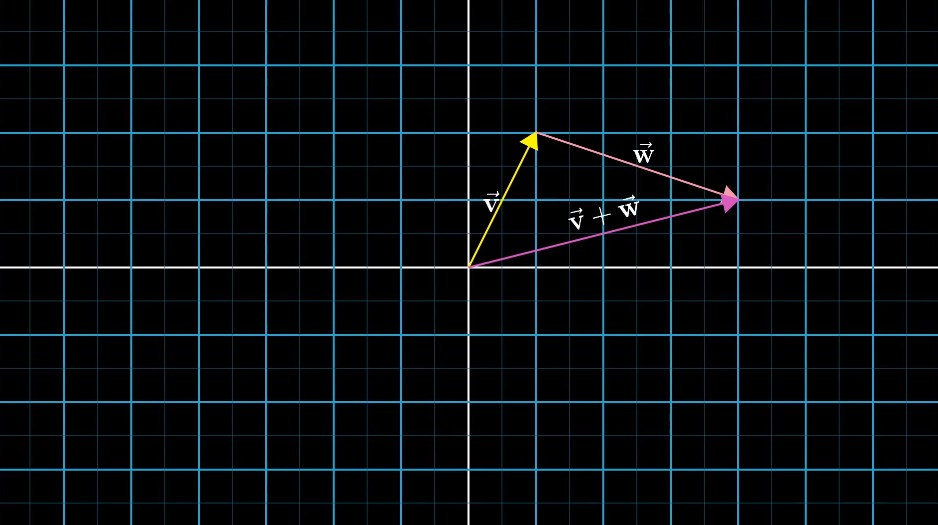
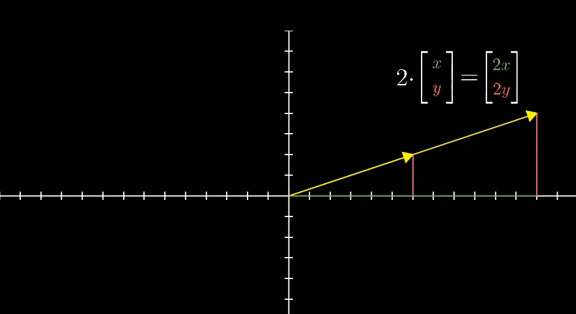

# Chapter 1: Vectors, what even are they?

> "The introduction of numbers as coordinates is an act of violence. "
>
> —— Hermann Weyl
>
> “引入一些数作为坐标是一种鲁莽的行为。”
>
> —— 赫尔曼·外尔

[TOC]

### Three distinct but related ideas about vectors

#### 1. Physics student

> Vectors are arrows pointing in space. 
>
> What defines a given vector is its length, and the direction it's pointing. 
>
> As long as those two factors are the same, you can move it all around and it's still the same vector. 
>
> Vectors are free. 

#### 2. CS student

> Vectors are ordered lists of numbers. 
>
> In this context, "vector" is pretty much just a fancy word for "list". 

#### 3. Mathematician

> The mathematician seeks to generalize both of these views, basically saying that a vector can be anything where there's a sensible notion of adding two vectors and multiplying a vector by a number. 
>
> The ideas of **vector addition and multiplication** by numbers will play an important role throughout linear algebra. 

##### Physics perspective vs. CS perspective

> Every pair of numbers gives you one and only one vector, and every vector is associated with one and only one pair of numbers. 

### Vector Operations

#### 1. Vector addition

> To add these two vectors, move the second one so that its tail sits at the tip of the first one. 
>
> Then, if you draw a new vector from the tail of the first one to where the tip of the second one now sits. 
>
> That new vector is their sum. 

> The way I like to think about it is that each vector represents a certain movement, a step with a certain distance and direction in space. 

#### 2. Vector Multiplication

##### Example

> If you take the number 2, and multiply it by a given vector, it means you stretch out that vector so that it's 2 times as long as when you started. 

##### Scaling（缩放）

> This process of stretching or squishing or sometimes reversing the direction of a vector is called "scaling". 

##### Scalars（标量）

> Whenever you catch a number like 2 or 1/3 or -1.8 acting like this, scaling some vector, you call it a **"scalar"**. 
>
> In fact, throughout linear algebra, one of the main things that numbers do is scale vectors. 

