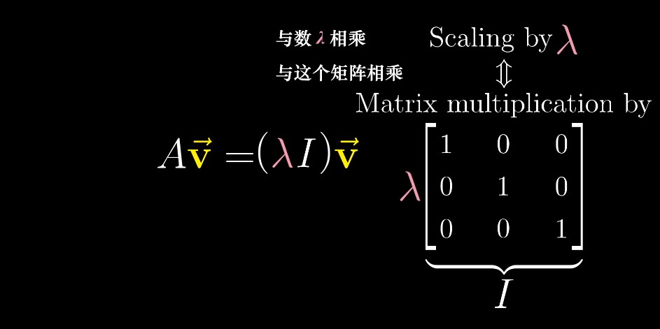

# Chapter10: Eigenvectors and Eigenvalues

> "Last time, I asked: 'What does mathematics mean to you?', and some people answered: 'The manipulation of numbers, the manipulation of structures.' And if I had asked what music means to you, would you have answered: 'The manipulation of notes? ' "
>
> —— Serge Lang
>
> “上一次演讲中我问道：‘数学对你来说意味着什么？’有些人回答：‘处理数字，处理结构。’ 那么如果我问音乐对你来说意味着什么，你会回答 ‘处理音符’ 吗？”
>
> —— 塞尔日·兰

[TOC]

> "Eigenvectors and eigenvalues" is one of those topics that a lot of students find particularly unintuitive.
>
> Questions like "why are we doing this" and "what does this actually mean" are too often left just floating away in an unanswered sea of computations. 
>
> I suspect that the reason for this is not so much that eigen-things are particularly complicated or poorly explained. In fact, it's comparatively straightforward and I think most books do a fine job explaining it. 
>
> The issue is that it only really make sense if you have a solid visual understanding for many of the topics that precede it. 

#### Two dimensional

> Focus in on what it does to one particular vector and think about the span of that vector, the line passing through its origin and its tip. 

> Most vectors are going to get knocked off their span during the transformation. I mean, it would seem pretty coincidental if the place where the vector landed also happens to be somewhere on that line. 

> But some special vectors do remain on their own span, meaning the effect that the matrix has on such a vector is just to stretch it or squish it, like a scalar. 

> And for this transformation, those are all the vectors with this special property of staying on their span. 
>
> Any other vector is going to get rotated somewhat during the transformation, knocked off the line that it spans. 

> these special vectors are called the "**eigenvectors**" of the transformation, 
>
> and each eigenvector has associated with it, what's called an "**eigenvalue**", which is just the factor by which it stretched or squashed during the transformation. 

#### 3-D Rotation

> For a glimpse of why this might be a useful thing to think about, consider some three-dimensional rotation. 

> If you can find an eigenvector for that rotation, a vector that remains on its own span, what you found is the axis of rotation. 

> And it's much easier to think about a 3-D rotation in terms of some axis of rotation and an angle by which is rotating, rather than thinking about the full 3-by-3 matrix associated with that transformation. 

> In this case, by the way, the corresponding eigenvalue would have to be 1, since rotations never stretch or squish anything, so the length of the vector would remain the same. 

> This pattern shows up a lot in linear algebra. 
>
> With any linear transformation described by a matrix, you could understand what it's doing by reading off the columns of this matrix as the landing spots for basis vectors. 
>
> But often a better way to get at the heart of what the linear transformation actually does, less dependent on your particular coordinate system, is to find the **eigenvectors** and **eigenvalues**. 

#### Overview of the computational ideas

> - **A** is the matrix representing some transformation, 
> - **v** as the **eigenvector**, 
> - **λ** is a number, namely the corresponding **eigenvalue**. 
>
> What this expression is saying is that the matrix-vector product - A times v - gives the same result as just scaling the eigenvector v by some value λ. 

> So finding the eigenvectors and their eigenvalues of a matrix A comes down to finding the values of v and λ that make this expression true. 

> It seems like a little difficult because you need to fix different multiplication types. 

> So let's start by rewriting that right hand side as some kind of matrix-vector multiplication, using a matrix, which has the effect of scaling any vector by a factor of λ. 

> The columns of such a matrix will represent what happens to each basis vector, and each basis vector is simply times λ, so this matrix will have the number λ down the diagonal with 0's everywhere else. 

> The common way to write this guy is to factor that λ out and write it as λ times I, where I is the identity matrix with 1's down the diagonal. 

> With both sides looking like matrix-vector multiplication,  we can subtract off that right hand side and factor out the v. 
>
> So what we now have is a new matrix - A minus λ times the identity, 
>
> and we're looking for a vector v, such that this new matrix times v gives the zero vector. 

> Now this will always be true if v itself is the zero vector, but that's boring. What we want is a non-zero eigenvector. 

> The only way it's possible for the product of a matrix with a non-zero vector to become zero is if the transformation associated with that matrix squishes space into a lower dimension. 
>
> And that `squishification` corresponds to a zero determinant for the matrix. 

> When λ equals 1, the matrix A minus λ times the identity squishes space onto a line. 
>
> That means there's a non-zero vector v, such that A minus λ times the identity times v equals the zero vector. 

> And remember, the reason we care about that is because it means A times v equals λ times v, which you can read off as saying that the vector v is an eigenvector of A, staying on its own span during the transformation A.

