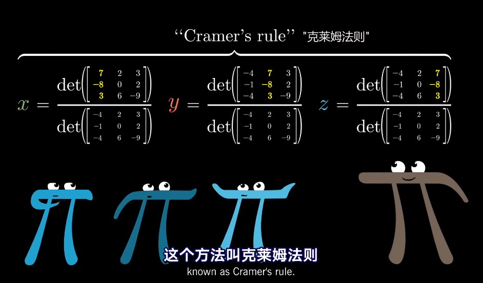
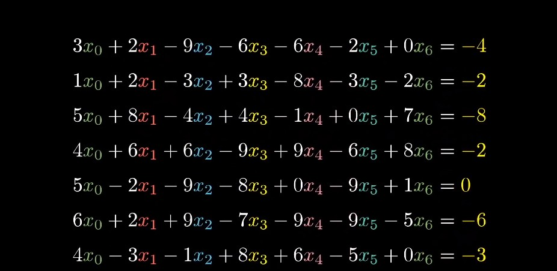
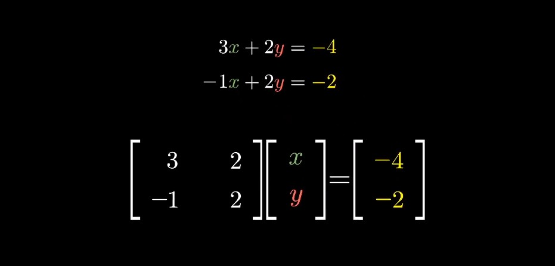
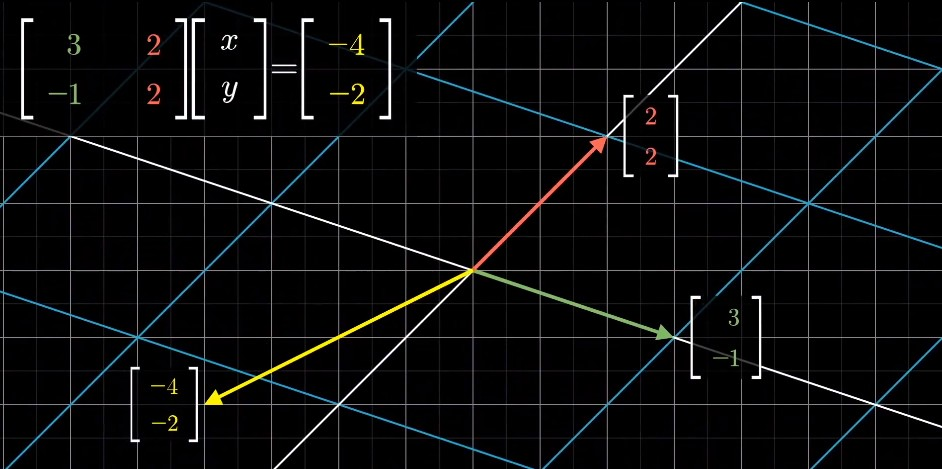
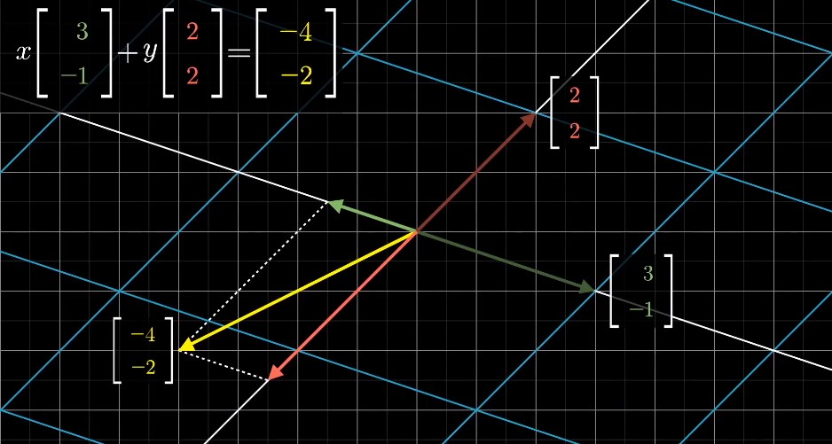
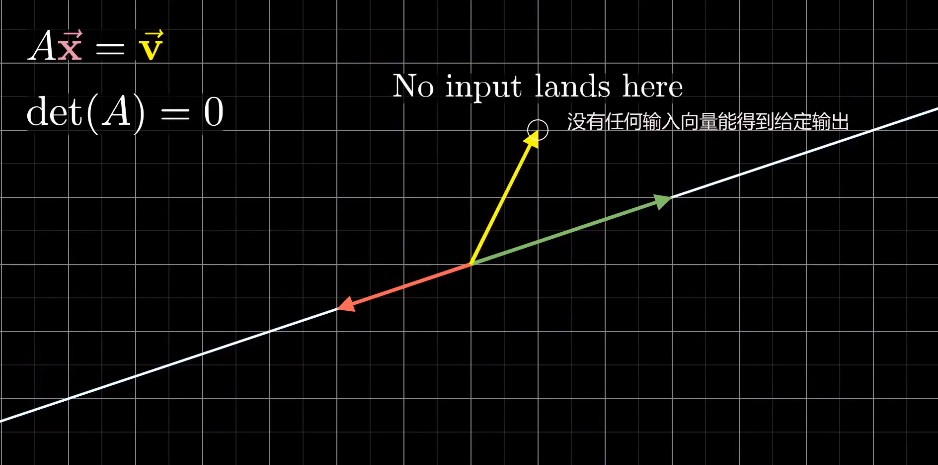
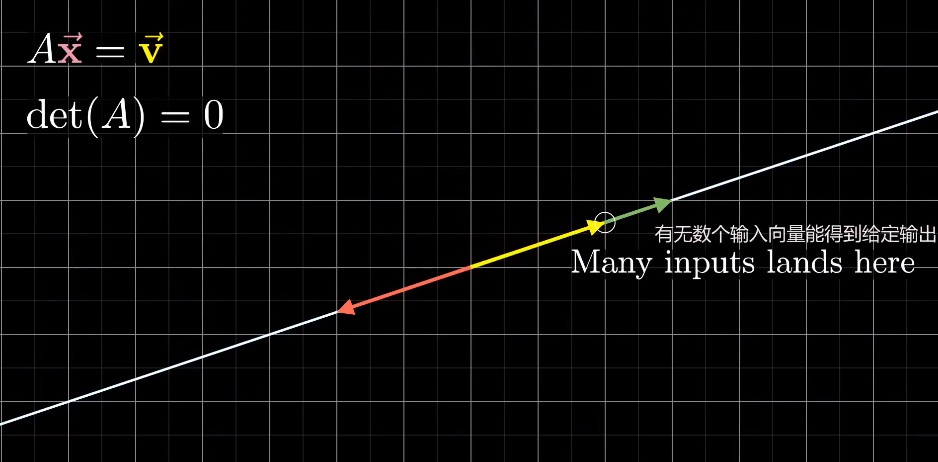

# Chapter12: Cramer's rule

> Jerry: Ah, you're crazy! 
>
> Kramer: Am I? Or am I so sane that you just blew your mind? 
>
> Jerry: It's impossible!
>
> Kramer: Is it?! Or is it so possible your head is spinning like a top? 
>
> Jerry: 天哪，你真是疯了！
>
> Kramer：真的吗？或者也许，我是理智的，而你的脑子已经乱得快爆炸了？
>
> Jerry：这不可能！
>
> Kramer：哦真的吗？或者也许是你晕乎乎得正像陀螺一样旋转呢？

> In the previous video, I've talked about linear systems of equations, and I sort of brushed aside the discussion of actually computing solutions to these systems. 
>
> And while it's true that number-crunching is typically something we leave to the computers, digging into some of these computational methods is a good litmus test  for whether or note you actually understand what's going on, since that's really where the rubber meets the road. 
>
> Here I want to describe the geometry behind a certain method for computing solutions to these systems, known as Cramer's rule. 

#### Prerequisites

> - Determinant
> - Dot products Duality
> - Inverse matrices, rank and null space

> This **Cramer's rule** is not actually the best way for computing solutions to linear systems of equations. 
>
> **Gaussian elimination（高斯消元法）**, for example, will always be faster. 

###### Why learn it? 

> Think of this as a sort of cultural excursion. 
>
> It's a helpful exercise in deepening your knowledge of the theory behind these systems. 
>
> Wrapping your mind around this concept is gonna help consolidate ideas from linear algebra, like the determinant and linear systems, by seeing how they relate to each other. 
>
> Also, from a purely artistic standpoint, the ultimate result is just really pretty to think about, way more so that Gaussian elimination. 

#### Cramer's rule

> So the setup here will be some linear system of equations, say with two unknowns, x and y, and two equations. 
>
> In principle, everything we're talking about will also **work for systems with a larger number of unknowns, and the same number of equations.**

> But for simplicity, a smaller example is just nicer to hold in our heads. 

> You can think of this setup geometrically as a certain known matrix transforming an unknown vector, [x, y], where you know what the output is going to be, in this case [-4, -2]. 

> So what we have is a sort of puzzle, which input vector [x, y], is going to land on this output [-4, -2]? 

> One way to think about our little puzzle here is that we know the given output vector is some linear combination of the columns of the matrix, but we want is to figure out what exactly that linear combination should be. 

> Remember, the type of answer you get here can depend on whether or not the transformation squishes all of space into a lower dimension. 
>
> That is if it has zero determinant. 
>
> In that case, either none of the inputs land on our given output or there's a whole bunch of inputs landing on that output. 

> But for this video we'll limit our view to the case of a non-zero determinant, meaning the outputs of this transformation still span the full n-dimensional space that it started in. 
>
> every input lands on one and only one output, and every output has one and only one input. 

