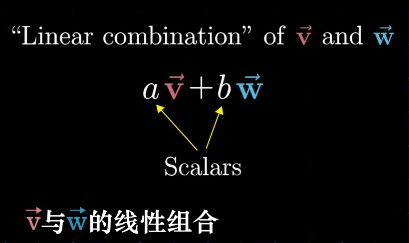
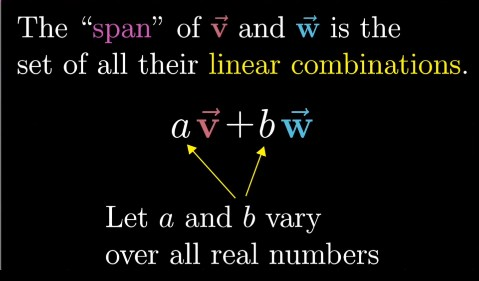
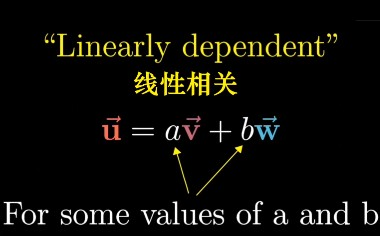

## Chapter 2: Linear combinations, span and bases

> Mathematics requires a small dose, not of genius, but of an imaginative freedom which, in a larger dose, would be insanity.
>
> —— Angus K. Rodgers
>
> 数学需要的不是天赋，而是少量的自由想象，但想象太过自由又会陷入疯狂。
>
> —— 安古斯·罗杰斯

#### Basis Vectors

###### Think of each coordinate as a scalar（标量）.

> In this sense, the vectors that these coordinates describe is the sum of two scaled vectors.
>
> `i-hat` and `j-hat` are the **basis vectors** of the `xy` coordinate system.

###### What if we chose different basis vectors?

> All the different vectors that you can get by choosing two scalars, using each one to scale one of the vectors, then adding together what you get. 
>
> (Two situations: ......)
>
> You can reach every possible two-dimensional vector by altering the choices of scalars. 
>
> But the association is definitely different from the one that you get using the more standard basis of `i-hat` and `j-hat`. 
>
> Any time we describe vectors numerically, it depends on an implicit choice of what basis vectors we're using.

#### Linear Combination

###### Linear Combination of two vectors

> Any time that you're scaling two vectors and adding them like this, it's called a linear combination of those two vectors. 

> **Q:** Where does this word "linear" come from? Why does this have anything to do with lines? 
>
> **A:** One way I like to think about it is that if you fix one of those scalars and let the other one change its value freely, the tip of the resulting vector draws a straight line. 

###### The span of two vectors

> The **span** of most pairs of 2-D vectors is all vectors of 2-D space. 
>
> But when they **line up**（共线）, their span is all vectors whose tip sits on a certain line. 

> The span of two vectors is basically a way of asking what are all the possible vectors you can reach using only these two fundamental operations - **vector addition（向量加法）** and **scalar multiplication（向量数乘）**. 

###### Vectors vs. Points

> It's a way to simplify. 
>
> It gets really crowded to think about a whole collection of vectors sitting on a line. 
>
> It's common to represent each one with just a point in space, the point at the tip of that vector, where, as usual, I want you thinking about that vector with its tail on the origin. 
>
> That way, if you want to think about every possible vector whose tip sits on a certain line, just think about the line itself. 

> In general, if you're thinking about a vector on its own, think of it as an arrow. 
>
> And if you're dealing with a collection of vectors, it's convenient to think of them all as points. 

###### What does the span of two 3d vectors look like?

> That tip will trace out some kind of flat sheet, cutting through the origin of three-dimensional space. This flat sheet is the span of the two vectors. 
>
> Or more precisely, the set of all possible vectors, whose tips sit on that flat sheet, is the span of your two vectors. 

###### The span of three vectors

> Two different things could happen here:
>
> 1. If your third vector happens to be sitting on the span of the first two, then the span doesn't change, you're sort of trapped on that same flat sheet. 
> 2. But if you just randomly choose a third vector, it's almost certainly not sitting on the span of those first two. It unlocks access to every possible three-dimensional vector. 
>
> As you scale that new third vector, it moves around that span sheet of the first two, sweeping it through all of space. 

#### Linearly Dependent / Independent

###### Linearly Dependent

> Whenever this happens, where you have multiple vectors and you could remove one without reducing the span, the relevant terminology is to say that they are **"Linearly dependent"**. 
>
> Another way of phrasing that would be to say that one of the vectors can be expressed as a linear combination of the others, since it's already in the span of the others. 

###### Linearly Independent

> On the other hand, if each vector really does add another dimension to the span, they're said to be **"linearly independent"**.

#### Basis

###### Technical definition of basis

> The **basis** of a vector space is a set of **linearly independent** vectors that span the full space. 
>
> 向量空间的一组基是张成该空间的一个线性无关的向量集。

