# Chapter3 - Matrices as Linear transformations

> Unfortunately, no one can be told what the Matrix is. You have to see it for yourself. 
>
> —— Morpheus
>
> (Surprisingly apt words on the importance of understanding matrix operations visually. )
>
> 很遗憾，矩阵是什么是说不清的。你必须得自己亲眼看看。
>
> —— 墨菲斯
>
> （描述直观理解矩阵操作重要性的绝佳台词。）

[TOC]

## Linear Transformation

### Transformation vs.  Function

> **Transformation** is essentially a fancy word for **function**, it's something that takes in inputs and spits out an output for each one. 
>
> Specifically, in the context of linear algebra, we like to think about transformations that **take in** some vector and **spit out** another vector. 

###### Why use the word "transformation" instead of "function" if they mean the same thing? 

> It's to be suggestive of a certain way to visualize this input-output relation. 
>
> The word "transformation" suggests that you think using **movement**. 
>
> - If a transformation takes some input vector to some output vector, we imagine that input vector moving over to the output vector. 
> - Then, to understand the transformation as a whole, we might imagine watching every possible input vector move over to its corresponding output vector. 

### Two properties of Linear Transformation

> Visually speaking, a transformation is linear if it has two properties:
>
> 1. **Lines remain lines（直线依旧是直线）**
> 2. **Origin remains fixed（原点保持固定）**
>
> Which means, **Grid lines remain parallel and evenly spaced. （网格线保持平行且等距分布）**

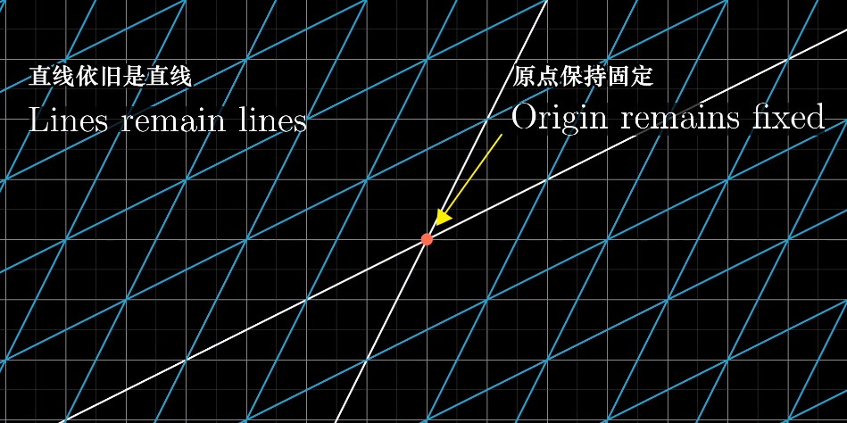

###### Examples

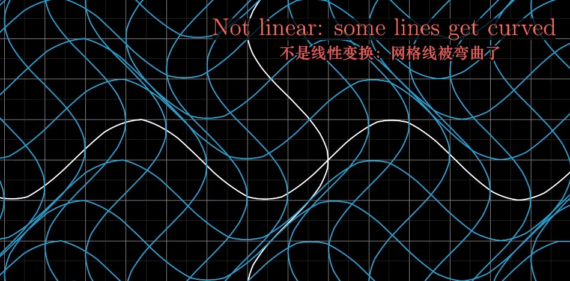

> Not linear: some lines get curved.

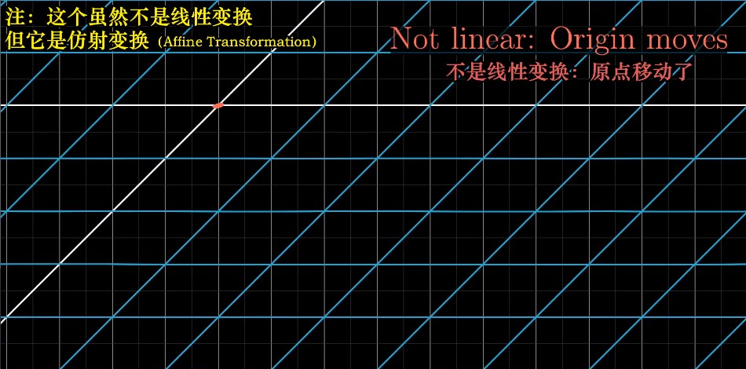

> Not linear: Origin moves.

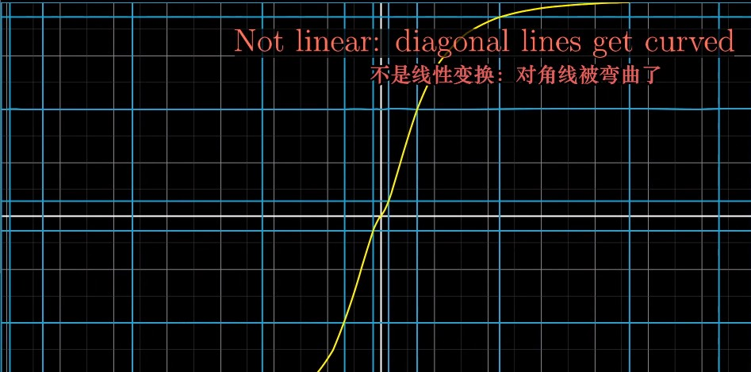

> Not linear: diagonal lines get curved. 

### How to describe Linear Transformation numerically?

> **Q:** If you were, say, programming some animations to make a video teaching the topic, what formula did you give the computer so that if you give it the coordinates of a vector, it can give you the coordinates of where that vector lands? 
>
> **A:** It turns out that you only need to record where the two basis vectors - `i-hat` and `j-hat` - each land, and everything else will follow from that.  

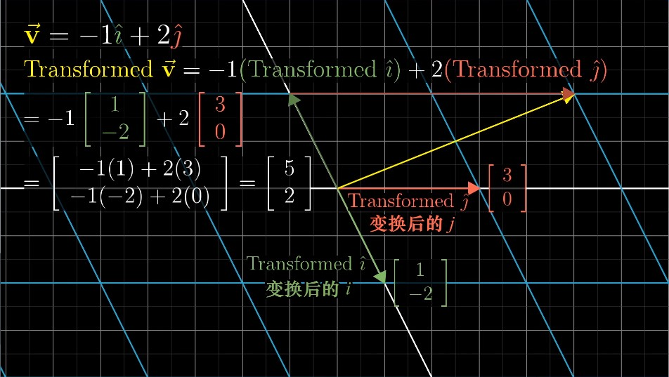

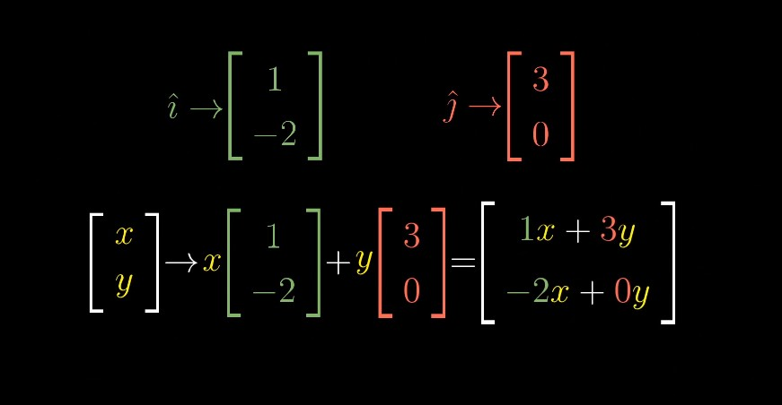

###### A 2 dimensional linear transformation is completely described by just 4 numbers

> - the two coordinates for where `i-hat` lands 
> - the two coordinates for where `j-hat` lands. 
>
> It's common to package these coordinates into a 2-by-2 grid of numbers, called a **2-by-2 matrix.** 

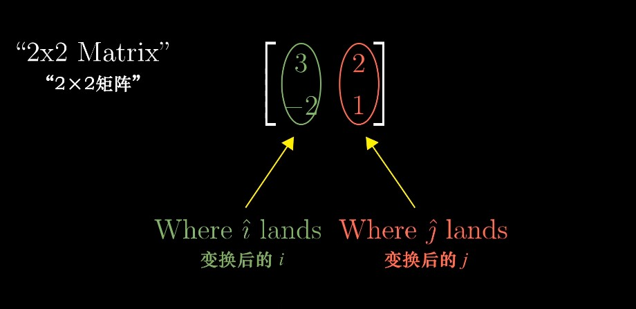

> If you're given a 2-by-2 matrix describing a linear transformation and some specific  vector, and you want to know where that linear transformation takes that vector, 
>
> you can take the coordinates of the vector, multiply them by the corresponding columns of the matrix, then add together what you get. 

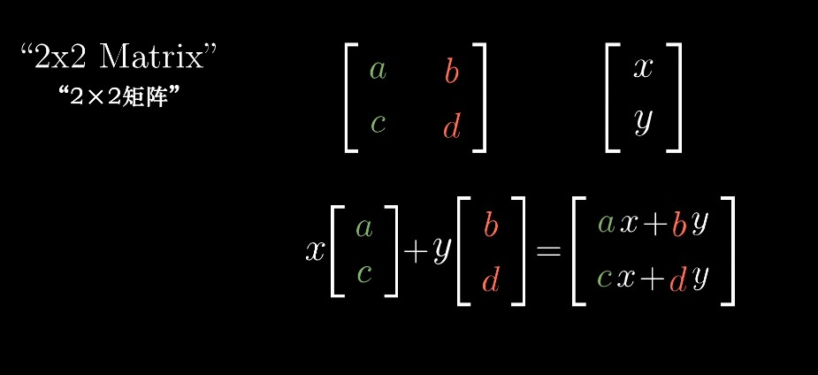

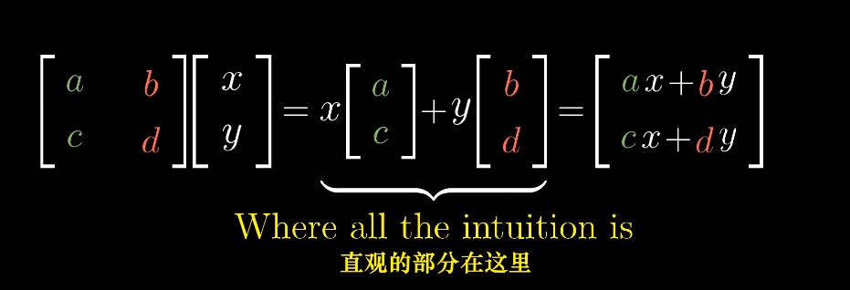

> Q: 为什么此处要右乘原向量？
>
> A: 根据矩阵乘法的定义，结果需要得到的是与原向量类型相同的矩阵，即2行1列，需右乘。若左乘向量，则结果为 2-by-2 的矩阵。

### Linear Transformation Examples

##### 90° rotation counter - clockwise（逆时针旋转90°）

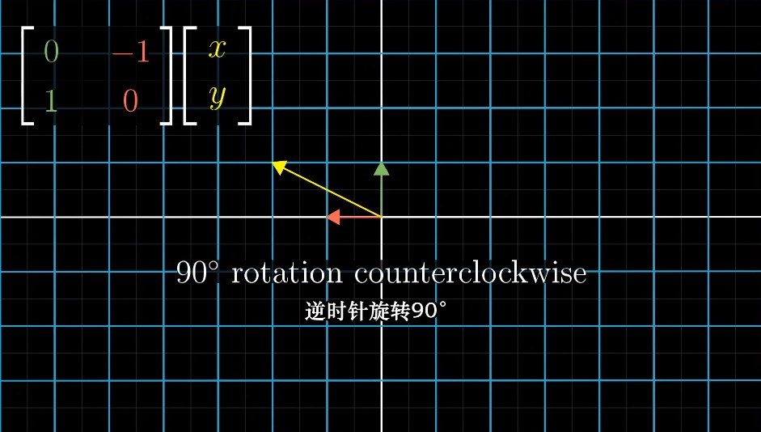

##### Shear（剪切 / 错切）

> Here's a fun transformation with a special name, called a **"shear"（剪切）**.
>
> In it, `i-hat` remains fixed, so the first column of the matrix is (1, 0), but `j-hat` moves over to the coordinate (1, 1), which become the second column of the matrix.

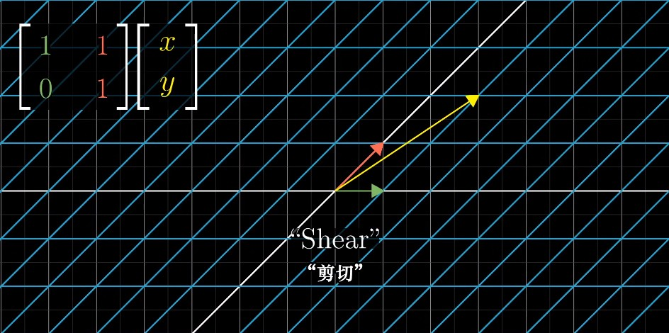

## Linearly dependent columns（列线性相关）

> If the vectors that `i-hat` and `j-hat` land on are **linearly dependent**, it means that the linear transformation squishes all of 2-D space onto the **line** where those two vectors sit, also known as the one-dimensional span of those two linearly dependent vectors. 

## Summary

> Linear transformations are way to move around space such the grid lines remain parallel and evenly spaced and such that the origin remains fixed. 
>
> Delightfully, these transformations can be described using only a handful of numbers, the coordinates of where each basis vector lands. 
>
> Matrices give us a language to describe these transformations, where the columns represent those coordinates. And matrix-vector multiplication is just a way to compute what that transformation does to a given vector. 

本节并未提及左乘与右乘的区别。

只阐述了矩阵与向量相乘的本质意义。