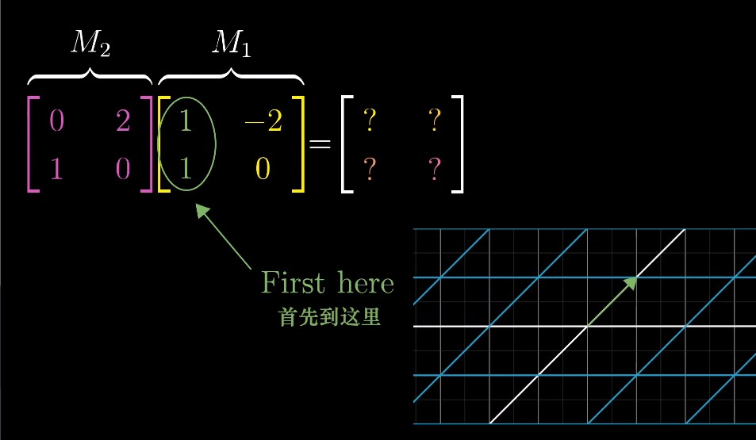
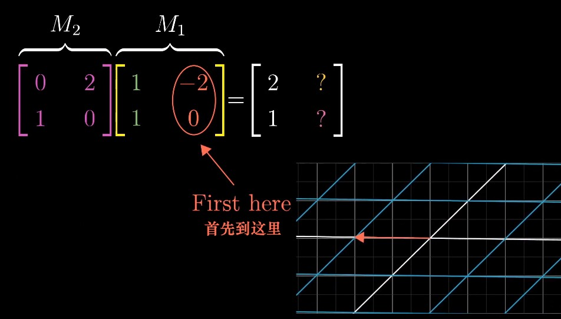
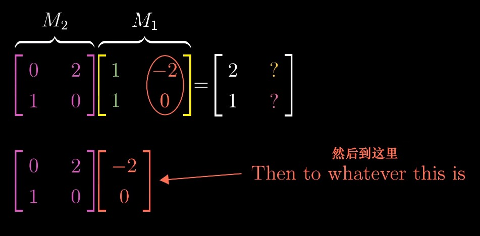
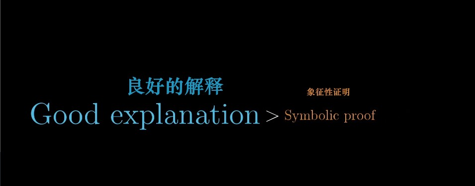

## Chapter 4: Matrix multiplication as composition

> It is my experience that proofs involving matrices can be shortened by 50% if one throws the matrices out. 
>
> —— Emil Artin
>
> 据我的经验，如果丢掉矩阵的话，那些涉及矩阵的证明可以缩短一半。
>
> —— 埃米尔·阿廷

#### Composition

###### Example

> Maybe you want to describe what happens when you first rotate the plane 90 degrees counter-clockwise, then apply a shear. 
>
> The overall effect here, from start to finish, is another linear transformation, distinct from rotation and the shear. 
>
> This new linear transformation is commonly called the **"composition"** of the two separate transformations we applied. 

> Multiplying two matrices like this has **the geometric meaning** of applying one transformation then another. 

###### Matrix composition vs. Function composition

> Read right to left. 

###### How to calculate?

> Where does `i-hat` go? 

> Where does `j-hat` go?

> This method works generally. 

###### Does it matter what order we put the two matrices in when we multiply them? 

###### Associativity（结合律）

> Now, if you try to work through this numerically, like I did back then, it's horrible, just horrible, and unenlightening for that matter. 
>
> But when you think about matrix multiplication as applying one transformation after another, this property is just trivial（平凡的）.

## Addition: Linear Transformations in Three Dimensions 

> Lisa: Well, where's my dad?
>
> Frink: Well, it should be obvious to even the most dimwitted individual who holds an advanced degree in hyperbolic topology that Homer Simpson has stumbled into...(dramatic pause)... the third dimension.
>
> Lisa: 呃，我爸爸到底在哪？
>
> Frink: 对于能拿到双曲拓扑学高等学位的傻瓜来说，这一点也足够明显 —— Homer Simpson误入了 .... 三维空间！

###### Three-dimensional Transformation

