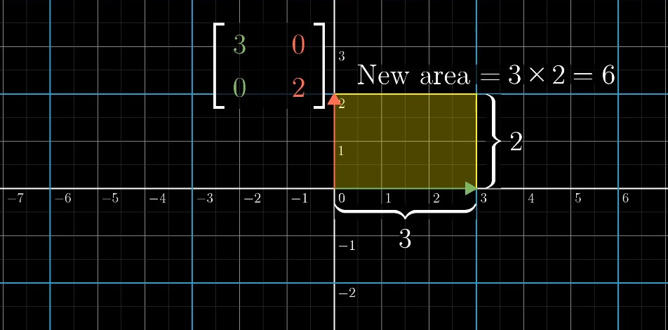
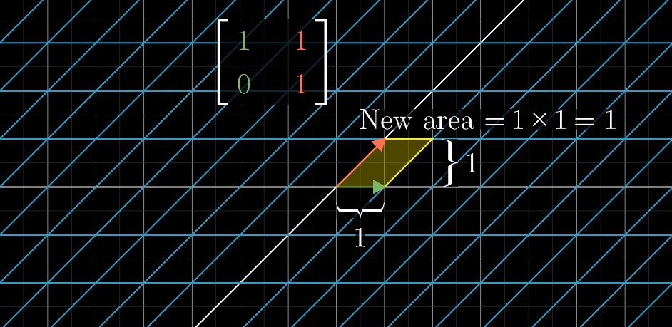
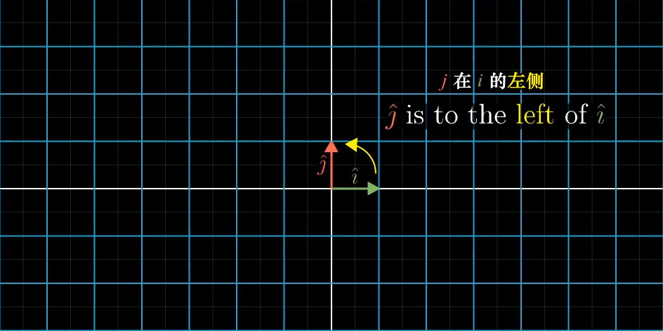
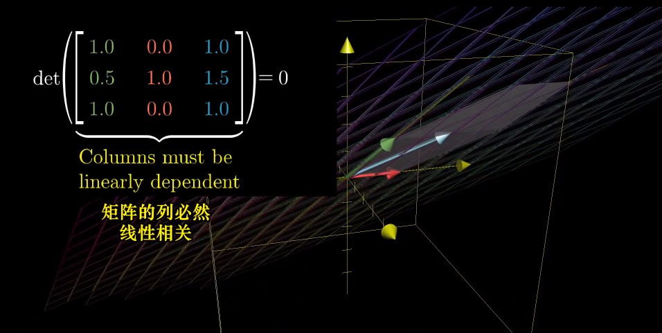
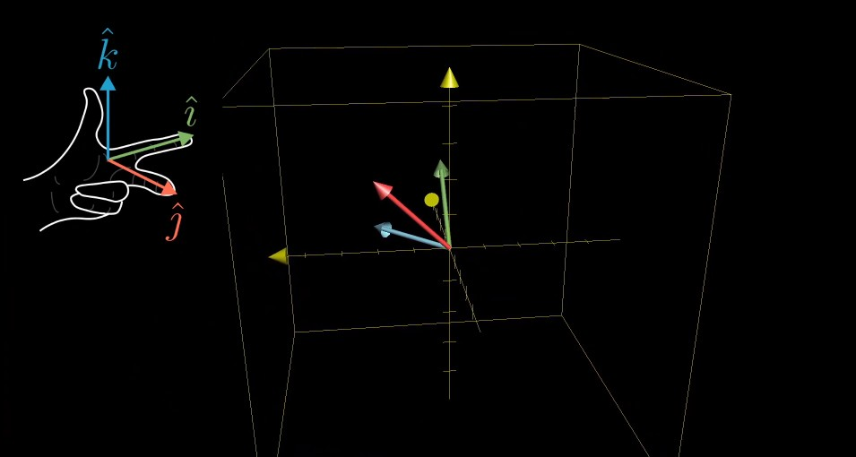
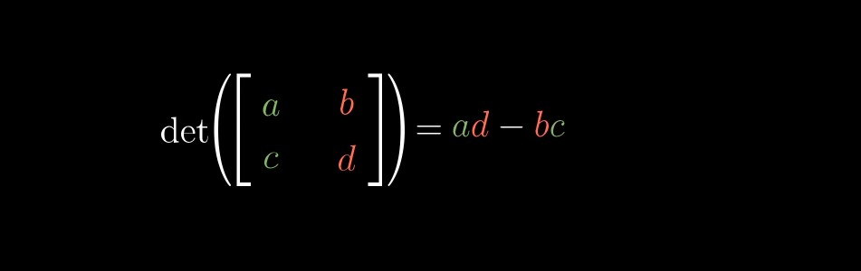
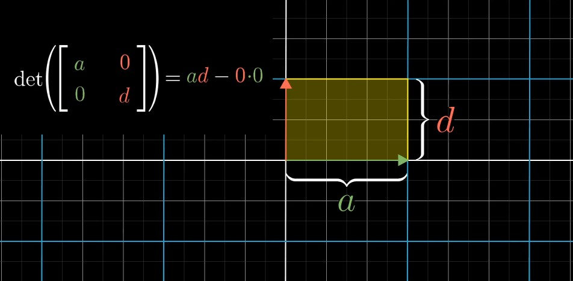
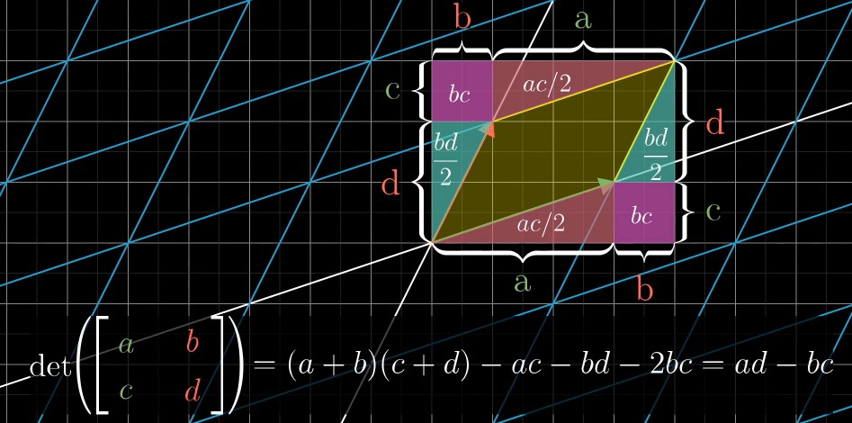

## Chapter 5: The determinant（行列式）

###### Exactly how much are things being stretched? 

> More specifically, to measure the factor by which the area of a given region increases or decreases. 

> Actually though, if you know how much the area of that one single unit square changes, it can tell you how the area of any possible region in space changes. 
>
> Then, any shape that's not a grid square can be approximated by grid squares pretty well, with arbitrarily good approximations if you use small enough grid squares. 

###### The Determinant of a Transformation

> For example, the determinant of a transformation would be 6, if that transformation increases the area of a region by a factor of 6.
>
> And the determinant of a 2-D transformation is 0, if it squishes all of space on to a line, or even onto a single point. Since then, the area of any region would become 0. 

> It means that checking if the determinant of a given matrix is 0 will give a way of computing whether or not the transformation associated with that matrix squishes everything into a smaller dimension. 

###### How can you scale area by a negative number? 

> The full concept of the determinant allows for negative values, but what would the idea of scaling an area by a negative amount even mean? 
>
> This has to do with the idea of **orientation**（定向）.

###### Flipping Space

> For example, notice how this transformation gives the sensation of flipping space over.
>
> If you're thinking of 2-D space as a sheet of paper, a transformation like that one seems to turn over that sheet onto the other side. 
>
> Any transformations that do this are said to **invert the orientation of space（改变了空间的定向）.** 

###### Example

> In their starting positions, `j-hat` is to the left of `i-hat`. 

> If after transformation `j-hat` is now on the right of `i-hat`. 

> **Orientation has been reversed. （定向发生了改变）**
>
> Whenever this happens, whenever the orientation of space is inverted, the determinant will be negative. 
>
> **The absolute value of the determinant**（绝对值） though, still tells you the factor by which areas have been scaled. 

###### Why does negative area relate to orientation-flipping? 

> Think about the series of transformations you get by slowly letting `i-hat` get closer and closer to `j-hat`. 
>
> As `i-hat` gets closer, all of the areas in space are getting squished more and more, meaning the determinant approaches 0. 
>
> Once `i-hat` lines up perfectly with `j-hat`, the determinant is 0. 
>
> Then if `i-hat` continues the way that it was going, doesn't it kind of feel natural for the determinant to keep decreasing into the negative numbers? 

###### What about 3-D Transformation? 

> It also tells you how much a transformation scales things, but this time, it tells you how much volumes get scaled. 
>
> In three dimensions, it helps to focus your attention on the specific **1-by-1-by-1 cube**, whose edges are resting on the basis vectors - `i-hat`, `j-hat` and `k-hat`. 
>
> After the transformation, that cube might get warped into some kind of `slanty-slanty`（斜不拉几的） cube. This shape, by the way, has the best name ever - "parallelepiped"（平行六面体）, 

###### What should negative determinants mean for 3-D?

> One way to describe orientation in 3-D is with the **"right hand rule"（右手定则）**.
>
> - Point the **forefinger**（食指） of your right hand in the direction of `i-hat`, 
> - Stick out your **middle finger**（中指） in the direction of `j-hat`
> - And notice how when you point your **thumb**（大拇指） up, it's in the direction of `k-hat`. 

> If you can still do that after the transformation, orientation has not changed and the determinant is positive. 
>
> Otherwise, if after the transformation it only makes sense to do that with your left hand, orientation has been flipped and the determinant is negative. 

###### How do you compute determinant?

###### Quits Time

