## Chapter 6: Inverse matrix, column space and null space （逆矩阵、列空间和零空间）

> **To ask the right question is harder than to answer it.** 
>
> —— Georg Cantor
>
> 提出正确的问题比回答它更困难。
>
> —— 格奥尔格·康托尔

#### Main Concepts

Under the light of linear transformations

- Inverse matrices（逆矩阵）
- Column space（列空间）
- Rank（秩）
- Null space（零空间）

> **Let the computers do the computing.** 

#### System of Equations

###### Usefulness of matrices

> Solve certain **systems of equations**.

###### What is system of equations? 

> You have a list of **variables** - things you don't know, and a list of **equations** relating them. 

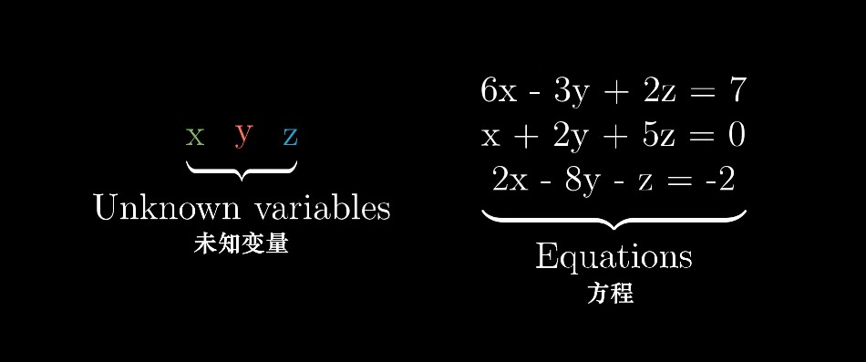

> If you're lucky, they might take on a certain special form. 
>
> Within each equation, the only thing happening to each variable is that it's scaled by some constant, and the only thing happening to each of those scaled variables is that they're added to each other. 
>
> So, no exponents（幂次）or fancy functions, or multiplying two variables together - things like that. 

> The typical way to organize this sort of special system of equations is to throw all the variables on the left and put any lingering constants on the right. 
>
> It's also nice to vertically line up the common variables, and to do that, you might need to throw in some zero coefficients（系数） whenever the variable doesn't show up in one of the equations. 
>
> This is called a **"linear system of equations"**.

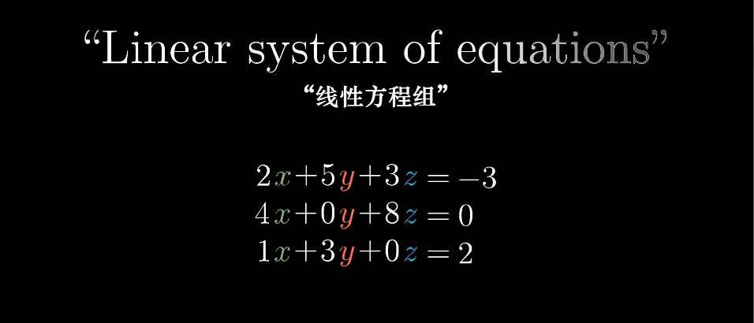

###### System of Equations to  Matrices

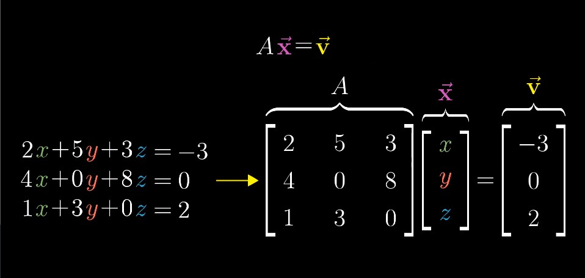

> - A —— the matrix containing all of the **constant coefficients**
> - `x-hat` —— a vector containing all of the **variables**
> - `v-hat` —— their matrix-vector product equals some different constant vector 

###### The geometric interpretation of system of equations 

> This is more than just a notational trick（书写技巧） to get our system of equations written on one line. 
>
> It sheds light on a pretty cool geometric interpretation for the problem.
>
> The **matrix A** corresponds with some linear transformation, So solving `Ax = v` means we're looking for a **vector x**, which after applying the transformation lands on **v**. 

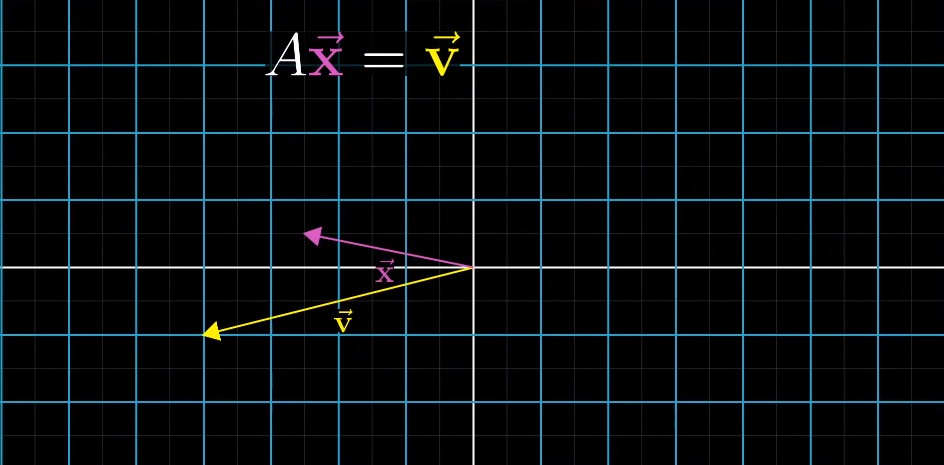

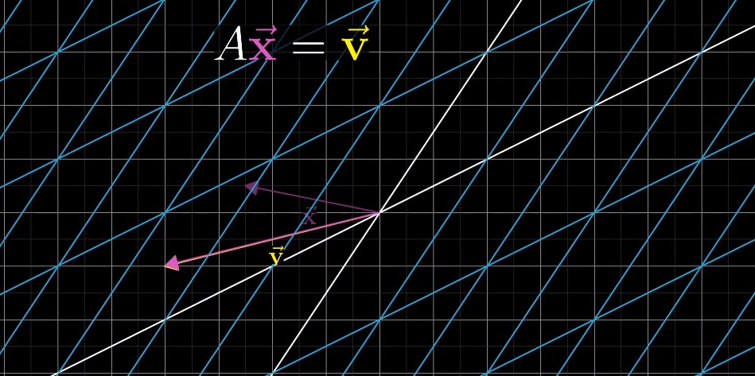

#### Example

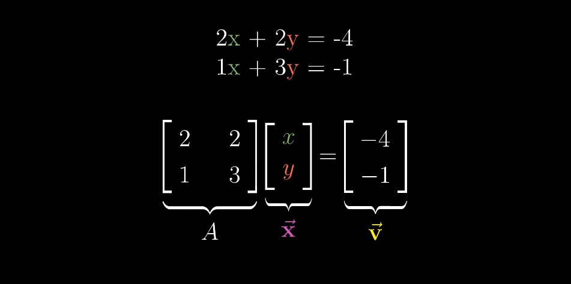

> How we think about the solutions to this equation depends on whether the transformation associated with A: 
>
> - squishes all of space into a lower dimension, like a line or a point
> - or if it leaves everything spanning the full two dimensions where it started. 
>
> We subdivide in two cases: 
>
> 1. the case where A has **zero determinant**
> 2. the case where A has **non-zero determinant**

#### 1. Non-zero Determinant

> In this case, there will always be one and only one vector that lands on v, and you can find it by playing the transformation in **reverse**.
>
> Following where v goes as we rewind the tape like this,  you'll find the vector x such that `Ax = v`. 

###### Inverse Transformation（逆变换）

> When you play the transformation in reverse, it actually corresponds to a separate linear transformation, commonly called **"the inverse of A"**, denoted **A to the negative one**. 

###### For Example

> - If A was a counter-clockwise rotation by 90 degrees, then the inverse of A would be a clockwise rotation by 90 degrees. 
> - If A was a rightward shear that pushes `j-hat` one unit to the right, the inverse of A would be a leftward shear that pushes `j-hat` one unit to the left. 

###### Identity Transformation（单位变换 / 恒等变换）

> In general, A inverse is the unique transformation with the property that  if you first apply A, then follow it with the transformation A inverse, you end up back where you started. 
>
> Applying one transformation after another is captured algebraically with matrix multiplication, so the core property of this transformation A inverse is that **A inverse times A equals the matrix that corresponds to "doing nothing".** 
>
> The transformation that "does nothing" is called the **identity transformation（单位变换 / 恒等变换） **.

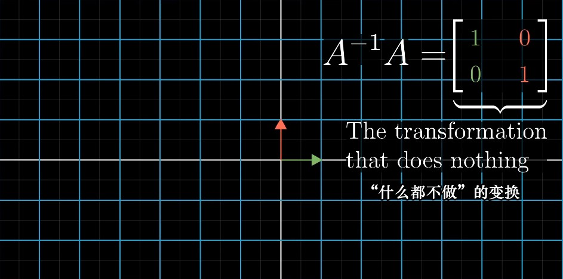

> Once you find this inverse, which in practice you do with a computer, you can solve your equation by multiplying this inverse matrix by v. 

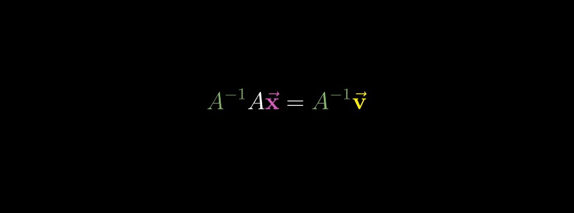

> And again, what this means geometrically is that you're playing the transformation in reverse and following v. 

#### 2. Zero Determinant

> But when the determinant is zero and the transformation associated with this system of equations squishes space into a smaller dimension, there is no inverse. 

###### Two - dimensional 

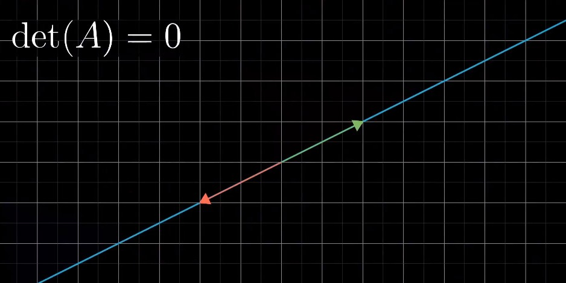

> You cannot "`unsquish`" a line to turn it into a plane.  
>
> At least, that's not something that a function can do. 
>
> That would require transforming each individual vector into a whole line full of vectors, but functions can only take a single input to a single output. 

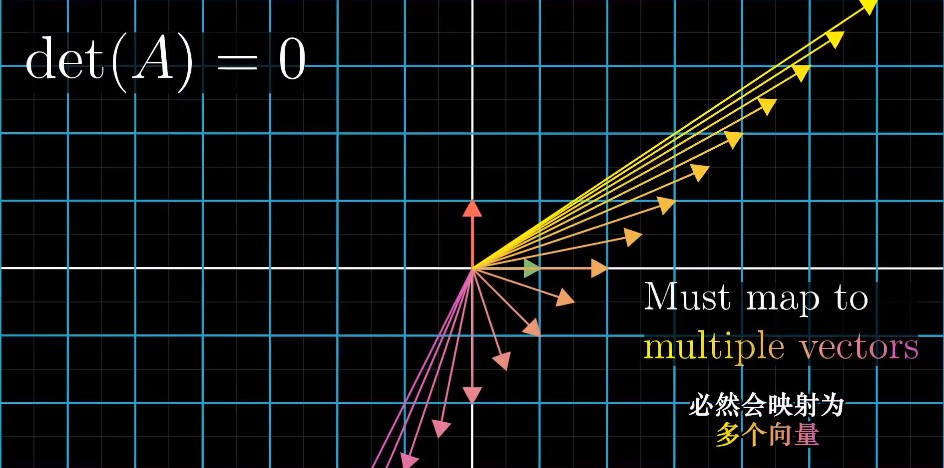

###### Three - dimensional

> Similarly, for three equations and three unknows, there will be no inverse if the corresponding transformation squishes 3-D space onto the plane, or even if it squishes it onto a line or a point. 

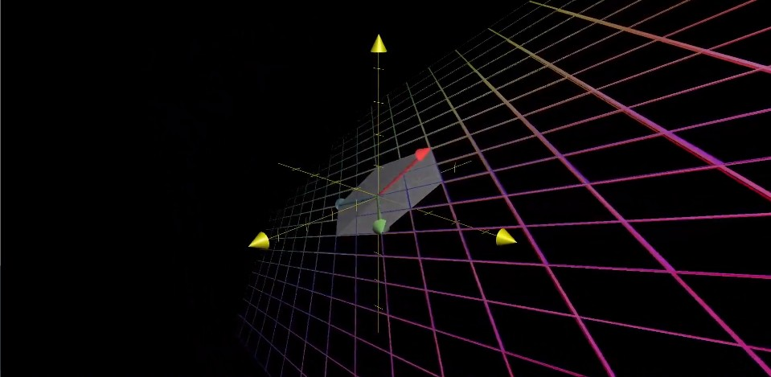

###### It's still possible that a solution exists even when there is no inverse.

> It's just that when your transformation squishes space onto, say, a line, you have to be lucky enough that the vector v lives somewhere on that line. 

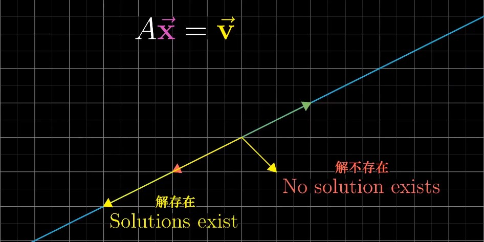

#### Rank（秩）

> You might notice that some of these zero determinant cases feel a lot more restrictive that others. 
>
> Given a 3-by-3 matrix, for example, it seems a lot harder for a solution to exist when it squishes space onto a line, compared to when it squishes things onto a plane, even though both of those are zero determinant. 
>
> We have some language that's a bit more specific than just saying zero determinant. 

###### Rank 1

> When the output of a transformation is a line, meaning it's one-dimensional, we say the transformation has a rank of 1. 

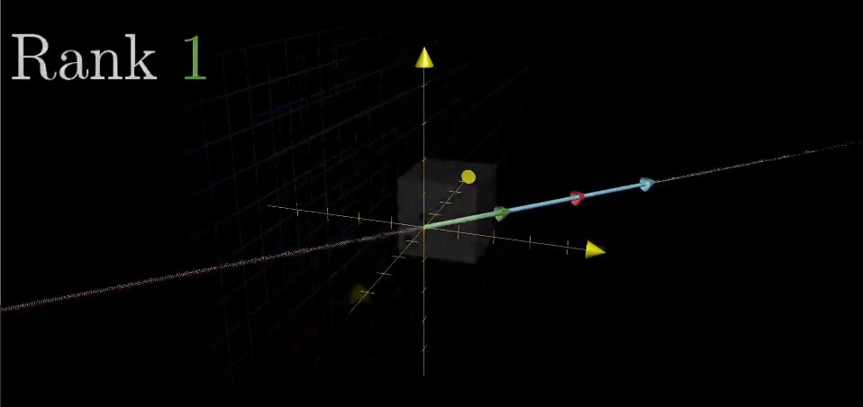

###### Rank 2

> If all the vectors land on some two-dimensional plane, we say the transformation has a rank of 2. 

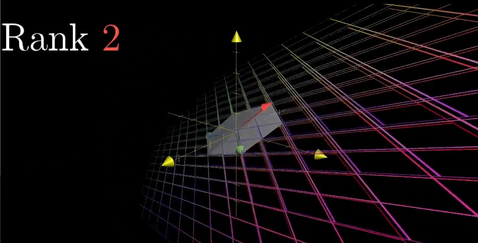

> So the word **"rank"** means the number of dimensions in the output of a transformation. 

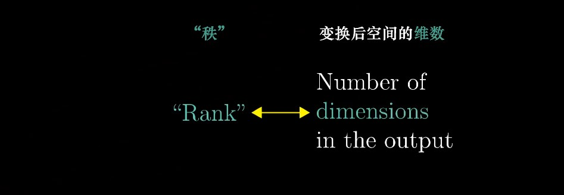

#### Column Space（列空间）

> This set of all possible outputs for your matrix, whether it's a line, a plane, 3-D space, whatever, it called the **"column space"** of your matrix. 

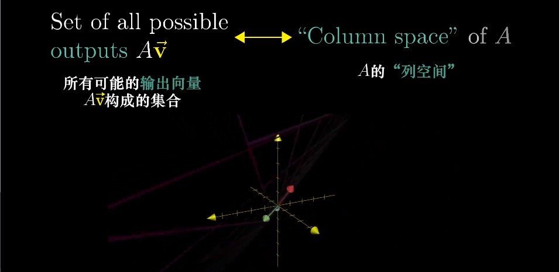

> The columns of your matrix tell you where the basis vectors land, and the span of those transformed basis vectors gives you all possible outputs. 
>
> In other words, the column space is the span of the columns of your matrix. 

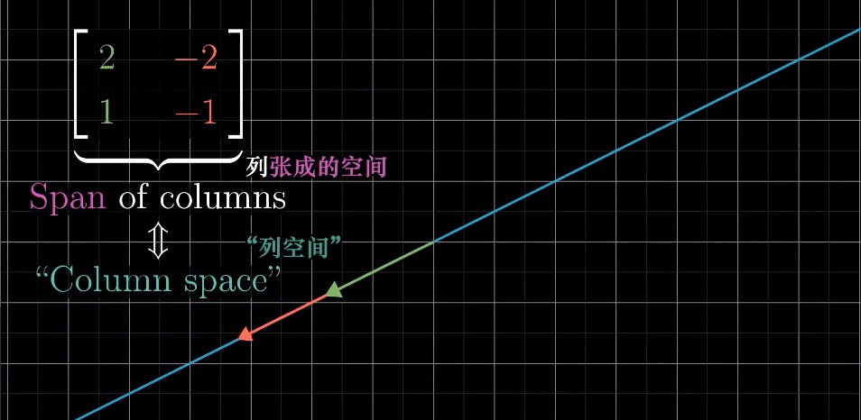

> So, **a more precise definition of rank would be that it's the number of dimensions in the column space.**
>
> （更精确的秩的定义是列空间的维数。）

###### Full Rank（满秩）

> When this rank is as high as it can be, meaning it equals the number of columns, we call the matrix **"full rank"**. 

> Notice, the **zero vector** will always be included in the column space. 
>
> Since linear transformations must keep the origin fixed in space. 

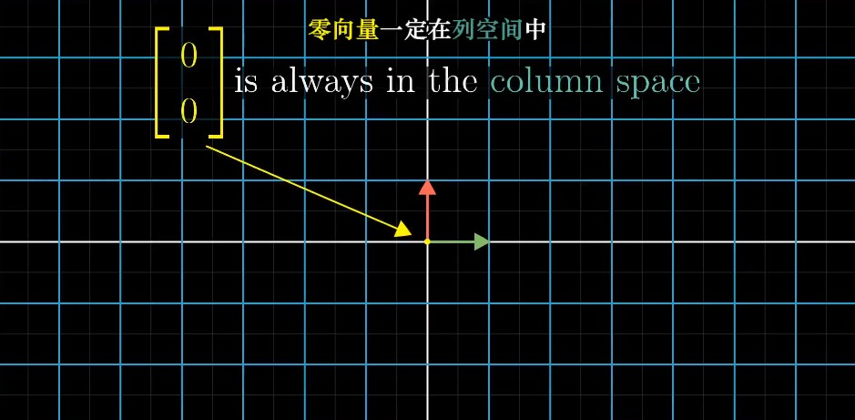

#### Null Space / Kernel（零空间 / 核）

> For a **full rank transformation**, the only vector that lands at the origin is the zero vector itself.
>
> But for matrices that aren't full rank, which squish to a smaller dimension, you can have a whole bunch of vectors that land on zero. 
>
> This set of vectors that lands on the origin is called the **"null space"** or the **"kernel"** of your matrix. 

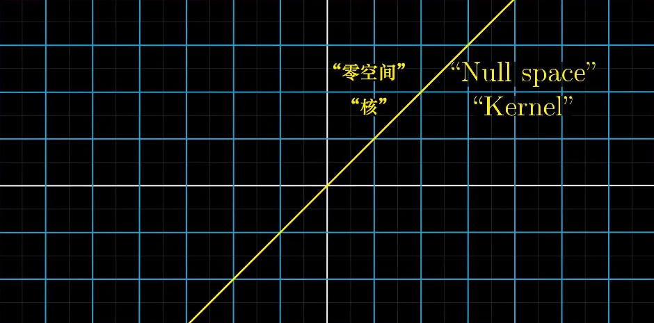

> It's the space of all vectors that become null, in the sense that they land on the zero vector. 

> In terms of the linear system of equations, when v happens to be the zero vector, the null space gives you all of the possible solutions to the equation. 

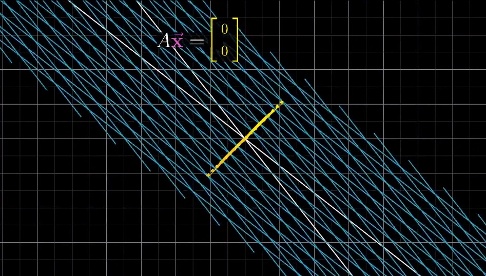

#### To sum up

> So that's a very high-level overview of how to think about linear systems of equations geometrically. 
>
> Each system has some kind of **linear transformation** associated with it, and when that transformation has an **inverse**, you can use that inverse to solve your system. 
>
> Otherwise, the idea of **column space** lets us understand when a solution even exists.
>
> And the idea of a **null space** helps us to understand what the set of all possible solutions can look like. 

## Addition: Non-square Matrices（非方阵）

> "On this quiz, I asked you to find the determinant of a 2x3 matrix. Some of you, to my great amusement, actually tried to do this. "
>
> —— (Via mathprofessorquotes.com, no name listed)
>
> “在这个小测验里，我让你们求一个2x3矩阵的行列式。让我感动非常可笑的是，你们当中竟然有人尝试去做。”
>
> —— 摘自mathprofessorquotes.com, 作者佚名

#### How to interpret?

