## Chapter 8: Cross Products in the light of linear transformations

> "Every dimension is special. "
>
> —— Jeff Lagarias
>
> “每一个维度都很特别。”
>
> —— 杰弗里·拉家里亚斯

### Standard Introduction of Cross Products（叉积的标准介绍）

#### The Definition of Cross Products

> The **cross product** of v and w, written with the x-shaped multiplication symbol, is the area of this parallelogram. 

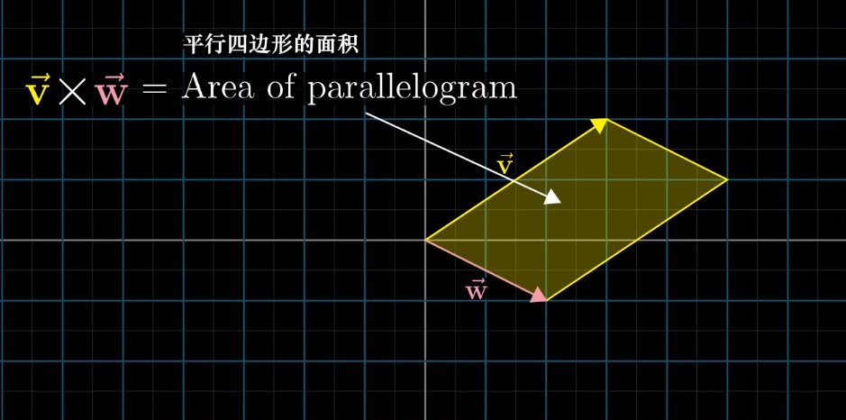

> - If **v is on the right of w**, then `v x w` is **positive** and equal to the area of the parallelogram. 

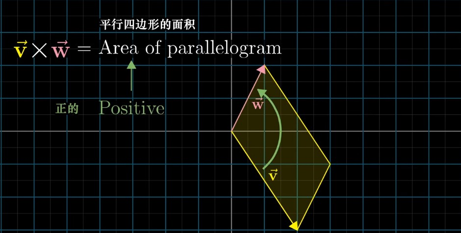

> - If **v is on the left of w**, then `v x w` is **negative**, namely the negative area of that parallelogram. 

> This means that order matters. 

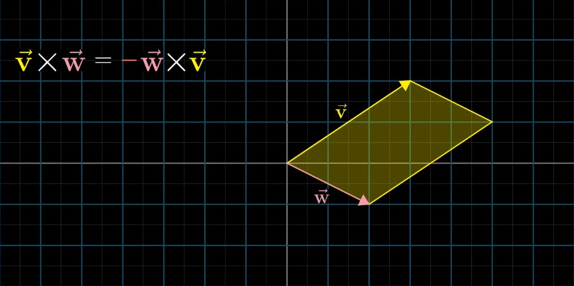

#### The Orientation of Cross Products

> The order of your basis vectors is what defines orientation.
>
> So, since `i-hat` is on the right of `j-hat`, I remember that `v x w` has to be positive whenever v is on the right of w. 

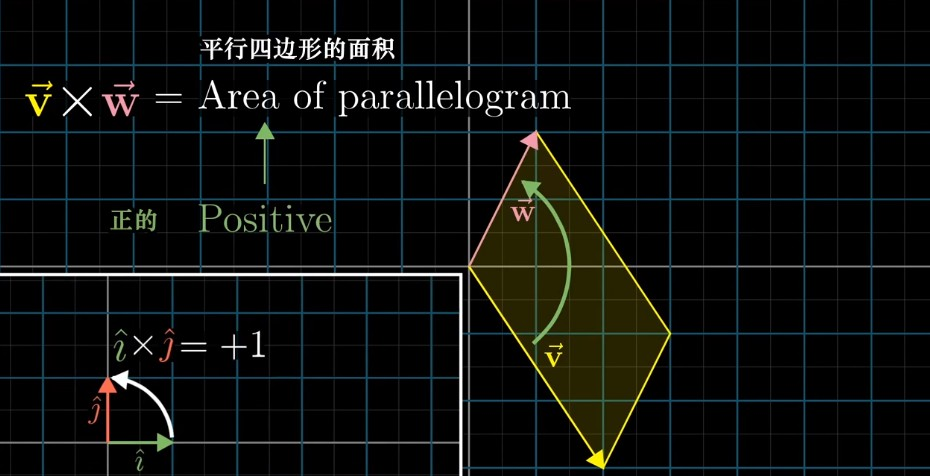

#### How to Compute?

> For the 2-D cross products, `v x w`, what you do is you write the coordinates of v as the first column of the matrix, and you take the coordinates of w and make them the second column, then you just compute the determinant. 

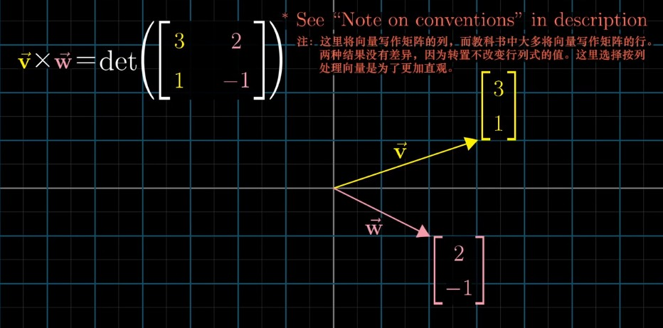

> 

> This is because a matrix whose columns represent v and w corresponds with a linear transformation that moves the basis vectors `i-hat` and `j-hat` to v and w. 

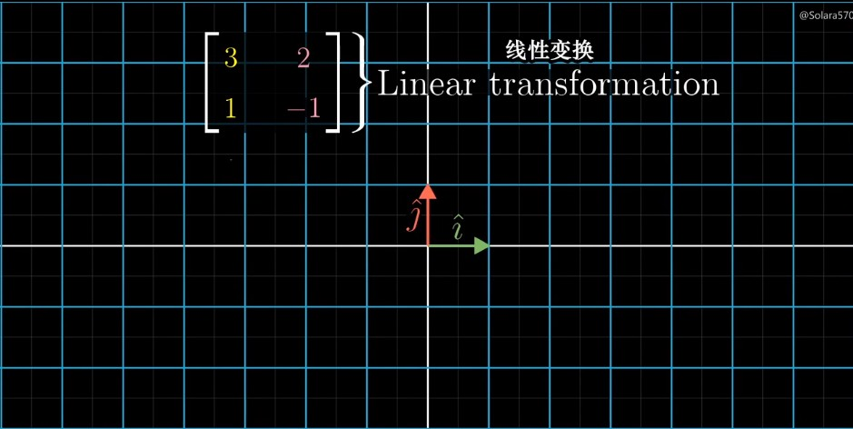

> The determinant is all about measuring how areas change due to a transformation 

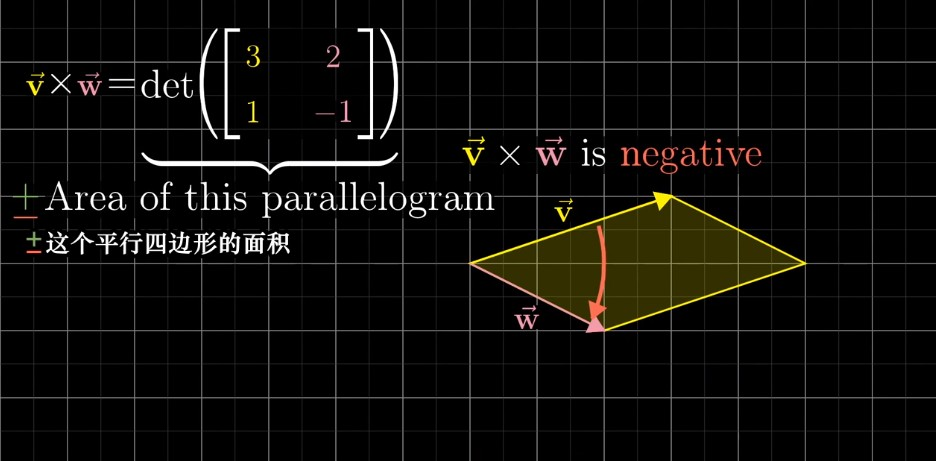

###### Perpendicular

> When two vectors are perpendicular or at least close to being perpendicular, the cross product is larger than it would be if they are pointing in very similar directions.
>
> Because the area of that parallelogram is larger when the sides are closer to being perpendicular. 

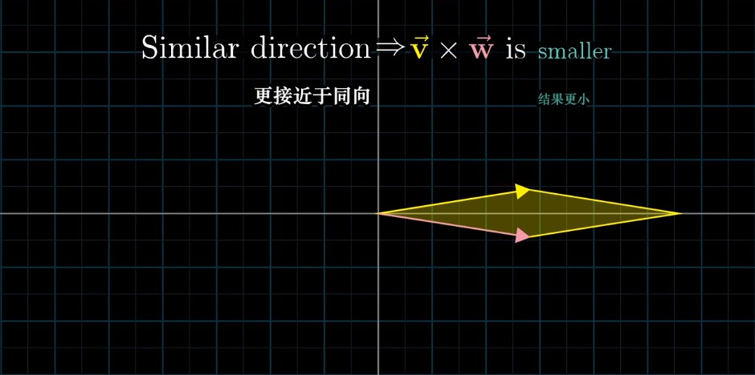

###### Scale

> If you were to scale up one of those vectors, perhaps multiplying v by 3, then the area of that parallelogram is also scaled up by a factor of 3. 

#### The True Cross Product

> The true cross product is something that combines two different 3-D vectors to get a new 3-D vector. 

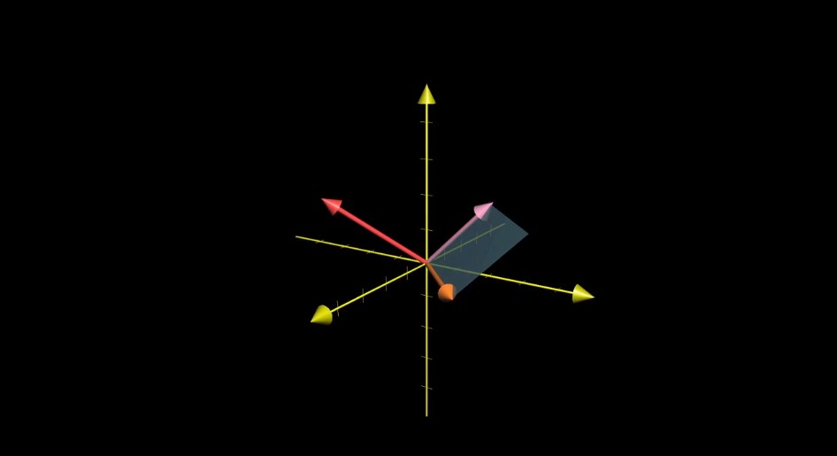

> The cross product is not a number, it's a vector. 
>
> This new vector's length will be the area of that parallelogram, which in this case is 2.5, and the direction of that new vector is going to be perpendicular to the parallelogram. 

> But there are two possible vectors with length 2.5 that are perpendicular to a given plane.
>
> This is where the right hand rule comes in.  

###### Right hand rule（右手定则）

> - **forefinger** of your right hand in the direction of v
> - **middle finger** in the direction of w
> - Point up your **thumb**, that's the direction of the **cross product**

> What on earth does it mean to put in a vector as the entry of a matrix?

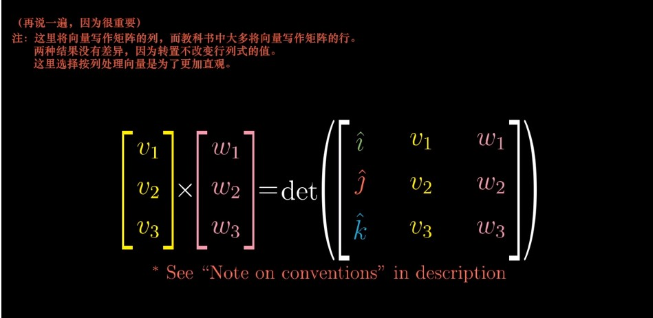

> Students are often told that this is just a notational trick, when you carry out the computations as if `i-hat`, `j-hat` and `k-hat` are numbers, then you get some linear combination of those basis vectors. 
>
> And the vector find by that linear combination, students are told to just believe, is the unique vector perpendicular to v and w, whose magnitude is the area of the appropriate parallelogram and whose direction obeys the right hand rule. 

> But there is a reason for doing it. 
>
> Let's talk about in the next video. 

### Deeper Understanding with Linear Transformations（通过线性变换深入理解叉积）

> From (Grothendieck), I have also learned not to take glory in the difficulty of a proof: difficulty means we have not understood. The ideal is to be able to paint a landscape in which the proof is obvious. 
>
> —— Pierre Deligne
>
> 从他（格罗滕迪克）和他的作为中，我还学到了一点：不以高难度的证明为傲，因为难度高意味着我们还不理解。理想的情况是能够绘出一幅美景，而其中的证明显而易见。
>
> —— 皮埃尔·德利涅

#### How to Compute a Three dimensional Cross Product

> There are some brute force computations that you could do to confirm these facts. 

###### Prerequisites（预备知识）

> - Chapter 5: Determinants
> - Chapter 7: Dot products and duality

> The takeaway is that whenever you're out in the mathematical wild and you find a linear transformation to the number line, you will be able to match it to some vector, which is called the dual vector of that transformations, so that performing the linear transformation is the same as taking a dot product with that vector. 

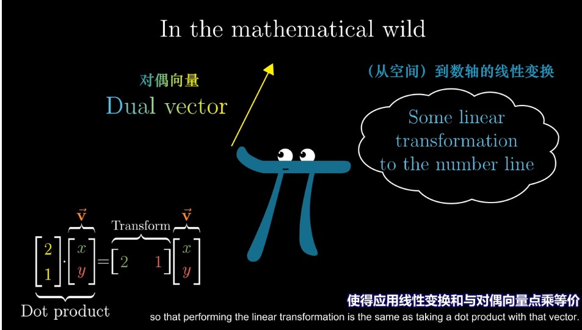

###### The Plan

> 1. Define a 3d-to-1d linear transformation in terms of v and w
> 2. Find its dual vector
> 3. Show that this dual is `v x w`

> The reason for doing this will be that understanding that transformation is going to make clear the connection between the computation and the geometry of the cross product. 

###### The wrong cross product

> If you didn't already know the 3-D cross product and you're trying to extrapolate（外推）, you might imagine that it involves taking three separate 3-D vectors - u, v and w, and making their coordinates the columns of a 3-by-3 matrix, then computing the determinant of that matrix. 

> Geometrically, this would give you the volume of a parallelepiped spanned out by three vectors, with the plus or minus sign depending on the right hand rule orientation of those three vectors. 
>
> But this is not the real cross product ! 

###### The real cross product

> The actual 3-D cross product takes in two vectors and spits out a vector. 
>
> Consider that first vector u to be a variable, say with variable entries (x, y, z), while v and w remain fixed. 
>
> What we have then is a function from three dimensions to the number line. 
>
> You input some vector (x, y, z) and you get out a number by taking the determinant of a matrix, whose first column is (x, y, z) and whose other two columns are the coordinates of the constant vectors v and w. 

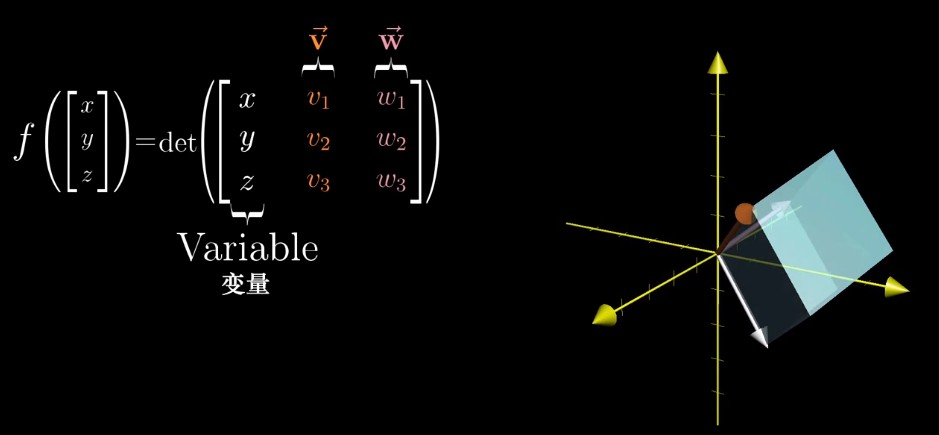

> Geometrically, the meaning of this function is that for any input vector (x, y, z), you consider the parallelepiped defined by this vector, v and w, then you return its volume, with the plus or minus sign depending on orientations. 

###### Where does this function come from? 

> One really important fact about this function is that it's linear. 
>
> Once you know that it's linear, you know that there's some way to describe this function as matrix multiplication. 

> And the whole idea of duality is that the special thing about transformations from several dimensions to one dimension is that you can turn that matrix on its side, and instead, interpret the entire transformation as the dot product with a certain vector. 

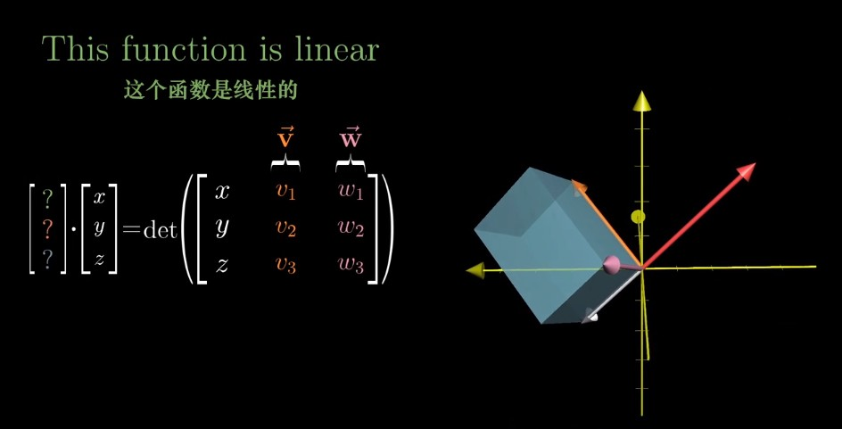

> What we're looking for is the special 3-D vector, that I'll call p, such that taking the dot product between p and any other vector (x, y, z) , gives the same result as plugging in (x, y, z) as the first column of a 3-by-3 matrix, whose other two columns have the coordinates of v and w, then computing the determinant. 

###### What this means computationally

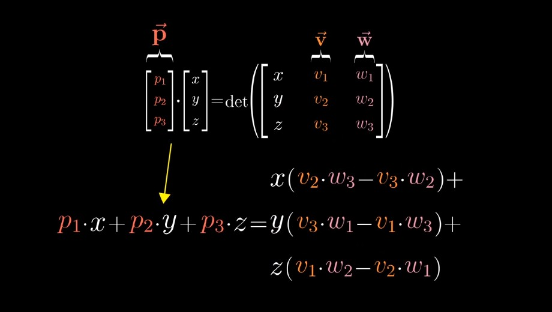

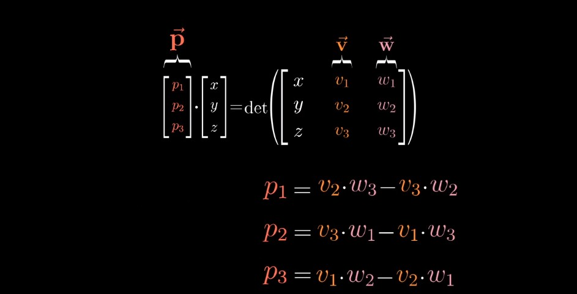

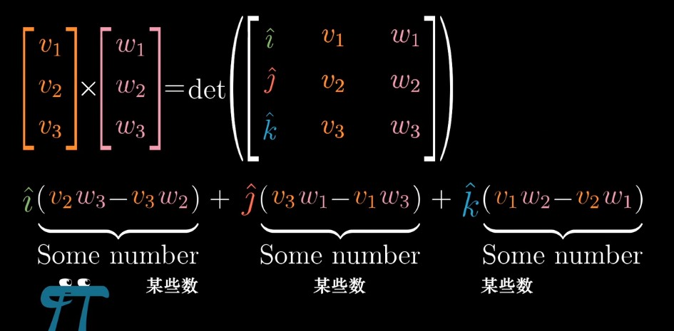

> This funky computation can be thought of as a way to answer the following question: 
>
> What vector p has the special property that when you take a dot product between p and some vector (x, y, z), it gives the same result as plugging in (x, y, z) to the first column of the matrix, whose other two columns have the coordinates of v and w, then computing the determinant? 

 

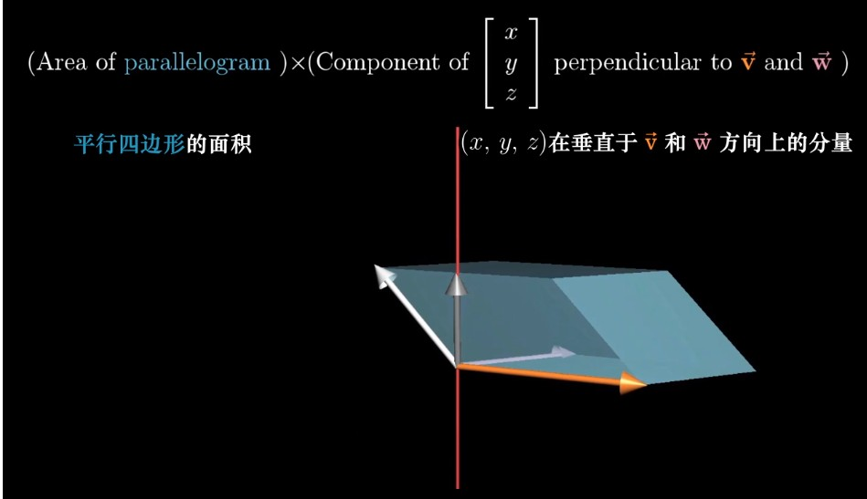

> Start by taking the area of the parallelogram defined by v and w, then multiply it not by the length of (x, y, z), but by the component of (x, y, z) that's perpendicular to that parallelogram. 

> In other words, the way our linear function works on a given vector is to project that vector onto a line that's perpendicular to both v and w, then to multiply the length of that projection by the area of the parallelogram spanned by v and w. 

