# Chapter9: Change of basis

> "Mathematics is the art of giving the same name to different things. "
>
> —— Henri Poincare
>
> “数学是一门赋予不同事物相同名称的艺术。”
>
> —— 昂利·庞加莱

[TOC]

## Review

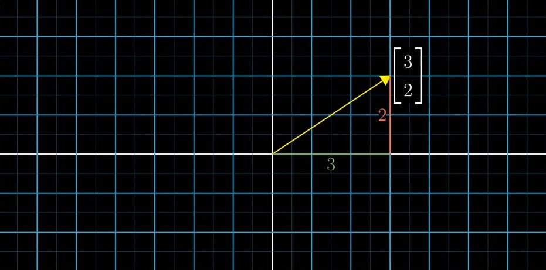

> If I have a vector sitting here in 2-D space, we have a standard way to describe it with coordinates. 
>
> In this case, the vector has coordinate (3, 2), which means going from its tail to its tip involves moving 3 units to the right and 2 units up.

#### More linear algebra oriented way to describe coordinates

> To think of each of these numbers as a scalar, a thing that stretches or squishes vectors. 

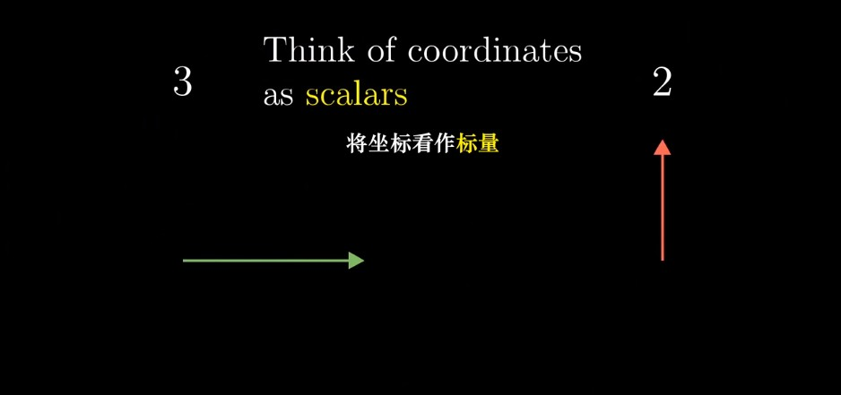

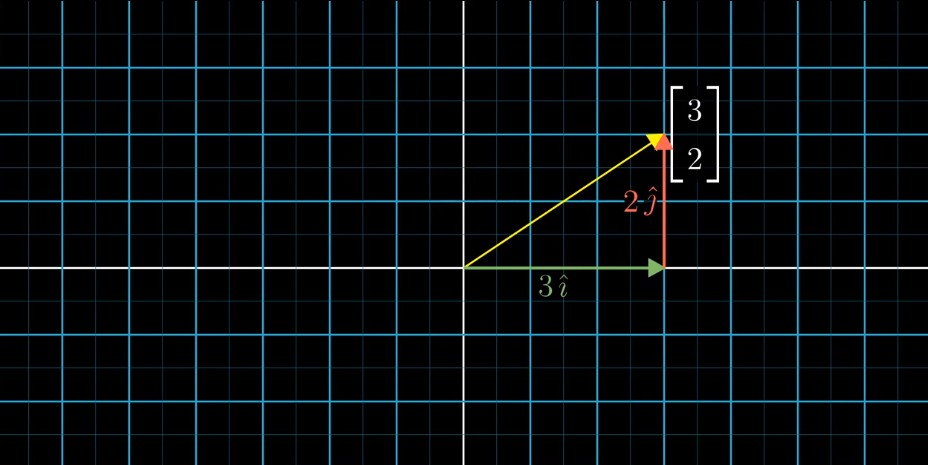

> You can think of these two special vectors as encapsulating all of the implicit assumptions of our coordinate system: 
>
> - the first number indicates rightward motion
> - the second one indicates upward motion
> - exactly how far unit of distances 

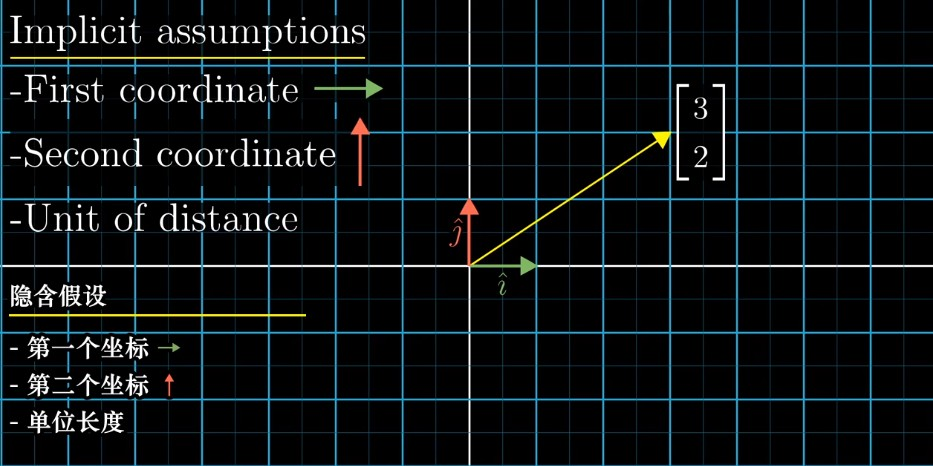

> All of that is tied up in the choice of `i-hat` and `j-hat` as the vectors which are scalar coordinates are meant to actually scale. 

## Coordinate system（坐标系）

> Anyway to translate between vectors and sets of numbers is called a **coordinate system**.
>
> And two special vectors `i-hat` and `j-hat` are called the **basis vectors** of our standard coordinate system. 

###### Example

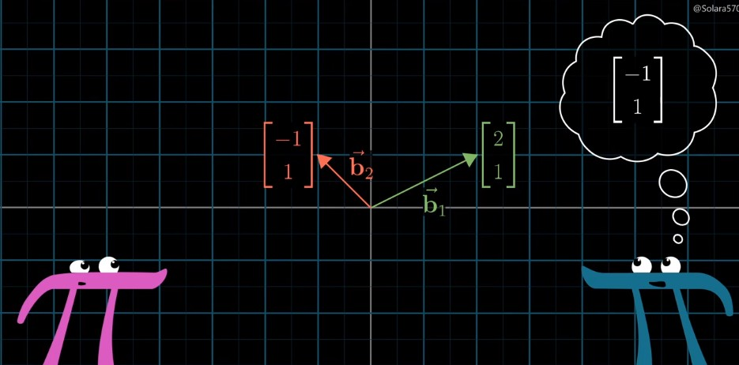

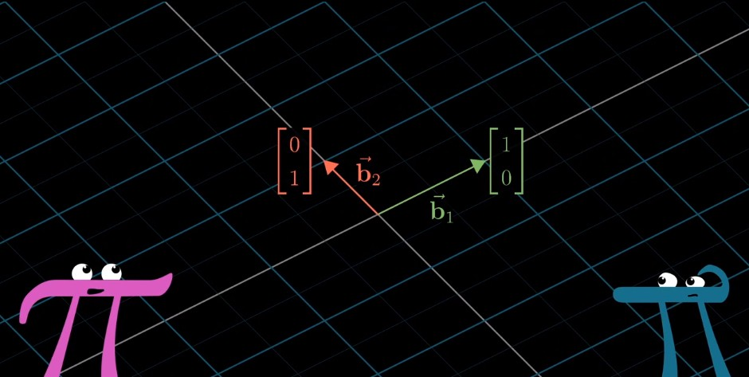

> So in effect, we're speaking different languages. 
>
> We're all looking at the same vectors in space, but Jennifer uses different words and numbers to describe them. 

#### How to translate between coordinate systems? 

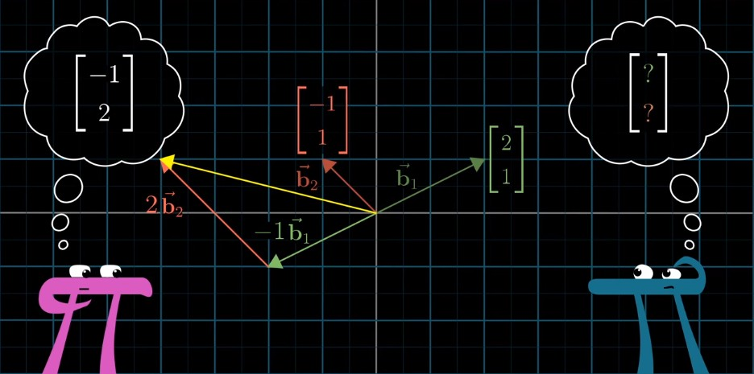

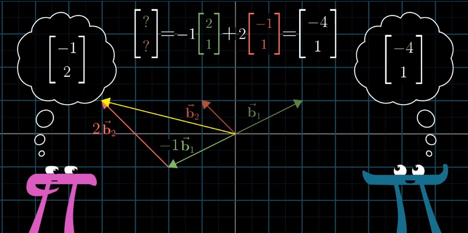

> This process here of scaling each of her basis vectors by the corresponding coordinates of some vector, then adding them together might feel somewhat familiar. 
>
> It's **matrix-vector multiplication**, with a matrix, whose columns represent Jennifer's basis vectors in our language. 

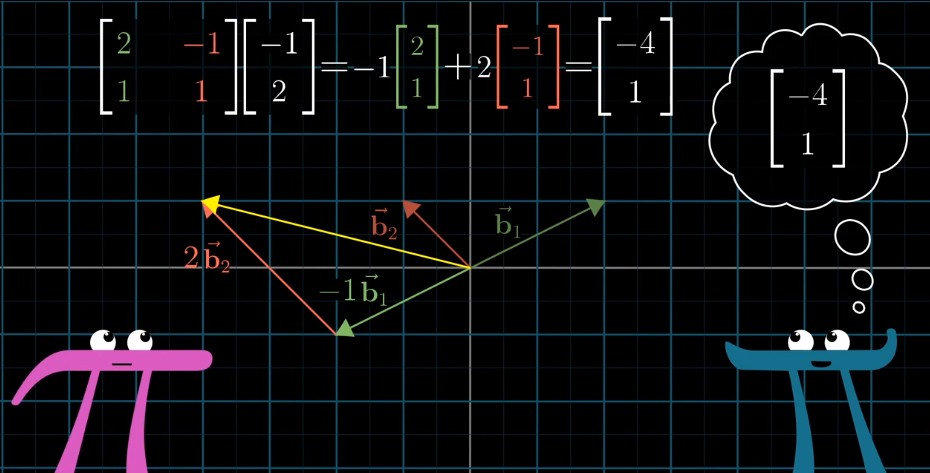

> A matrix, whose columns represent Jennifer's basis vectors, can be thought of as a transformation that moves our basis vectors `i-hat` and `j-hat`, the things we think of when we say (1, 0) and (0, 1), to Jennifer's basis vectors, the things she thinks of when she says (1, 0) and (0, 1). 

> Geometrically, this matrix transforms our grid into Jennifer's grid, but numerically, it's translating a vector described in her language to our language. 

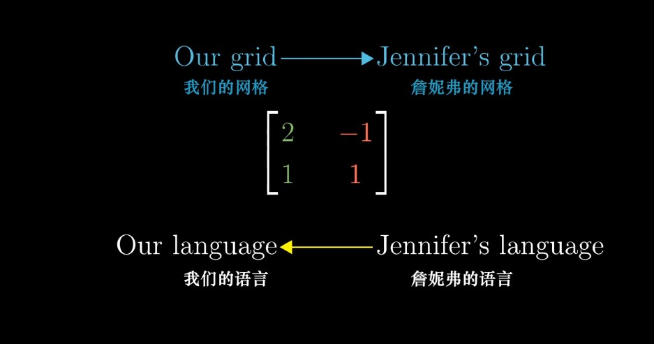

> What made it finally clicked for me was thinking about how it takes our misconception of what Jennifer means, the vector we get, using the same coordinates but in our system, then it transforms it into the vector that she really meant. 

#### What about the other way around? 

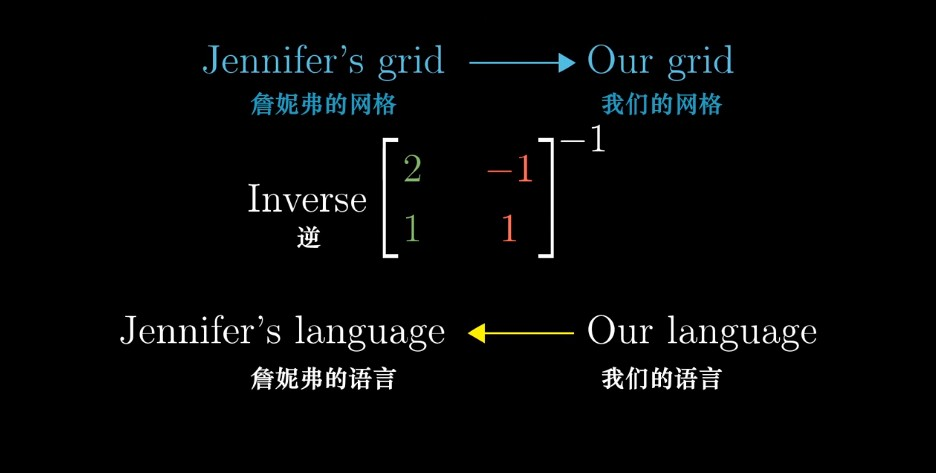

> Remember, the inverse of a transformation is a new transformation that corresponds to playing that first one backwards. 

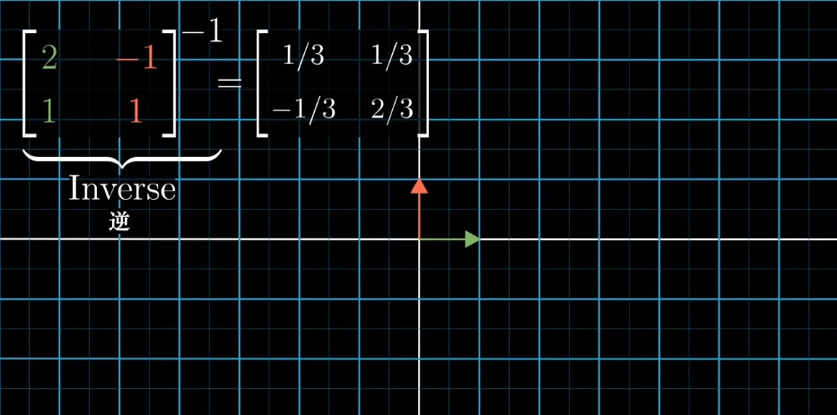

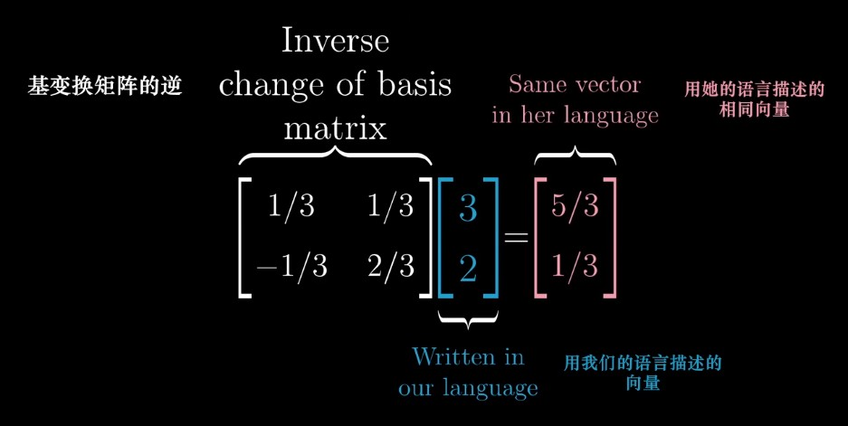

## How to translate a matrix? 

#### Prerequisites

> - Chapter3 - Linear transformations
> - Chapter4 - Matrix multiplication

#### Example

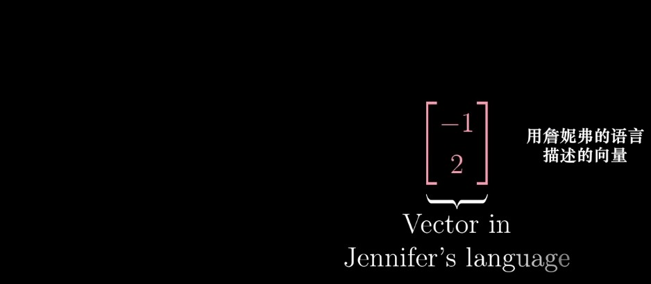

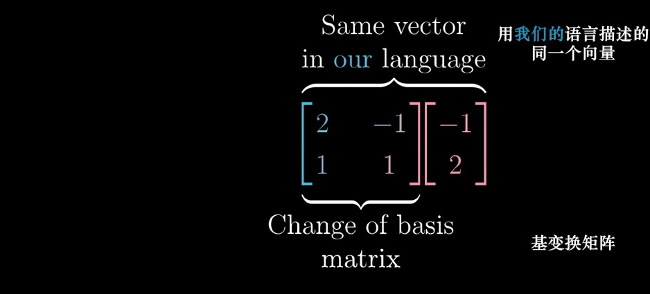

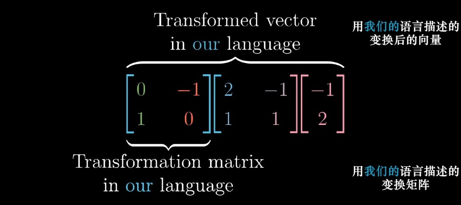

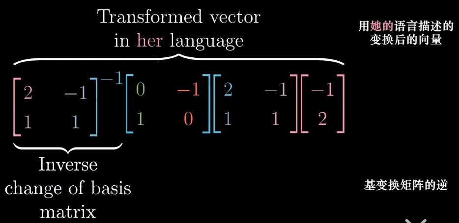

> Since we can do this with any vector written in her language, 
>
> - first applying the change of basis,
> - then the transformation, 
> - then the inverse change of basis, 
>
> that composition of three matrices gives us the transformation matrix in Jennifer's language. It takes in a vector of her language and split out the transformed version of that vector in her language. 

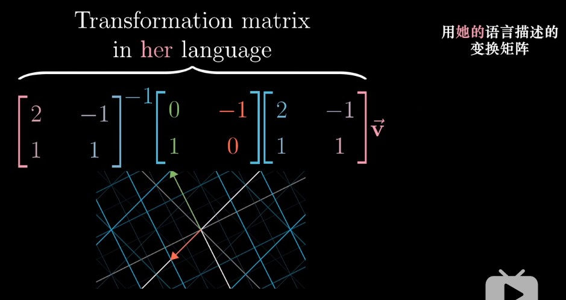

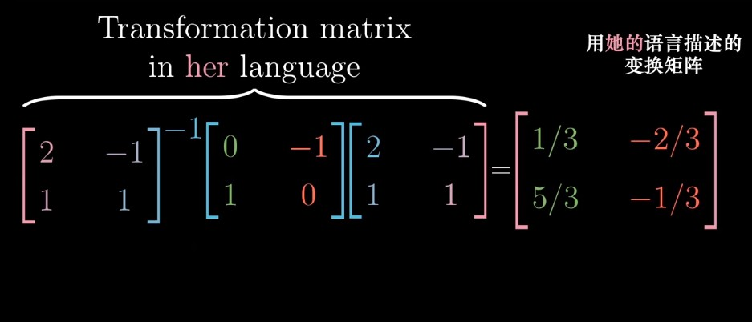

> So if Jennifer multiplies that matrix by the coordinates of a vector in her system, it will return the 90-degree rotated version of that expressed in her coordinate system. 

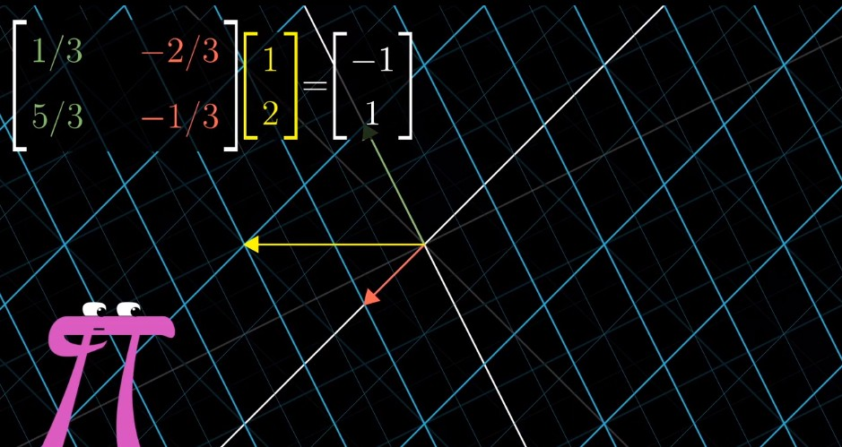

#### To Sum Up

> In general, whenever you see an expression like A inverse times M times A, it suggests a mathematical sort of empathy. 

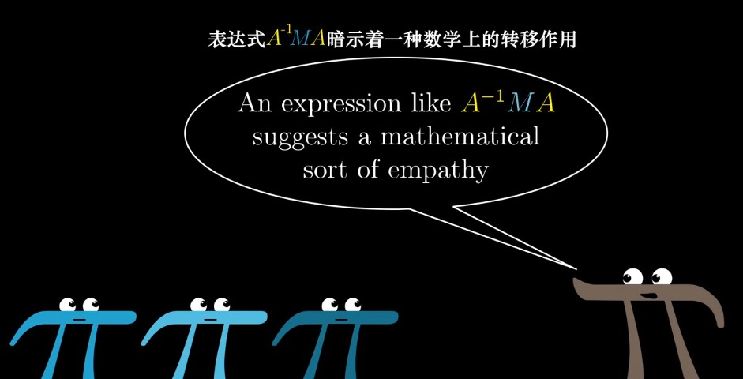

> That middle matrix represents a transformation of some kind as you see it, and the outer two matrices represent the empathy, the shift in perspective. 
>
> And the full matrix product represents that same transformation, but as someone else sees it. 