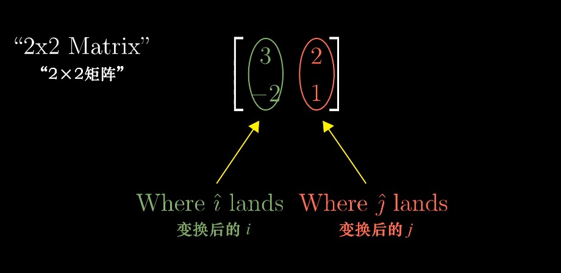
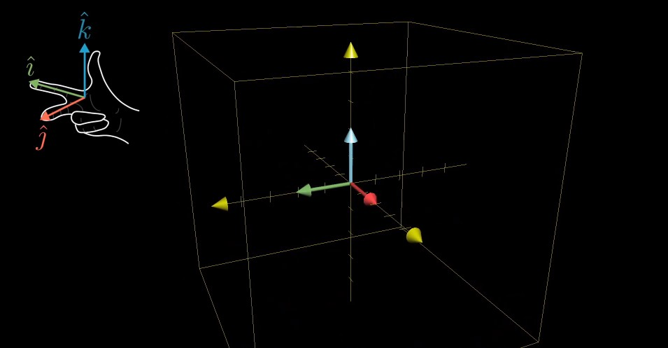
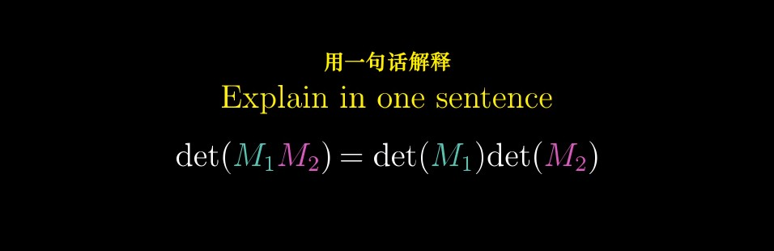

# Essence of Linear Algebra Notes

@3Blue1Brown

[TOC]

> "There is hardly any theory which is more elementary than linear algebra, in spite of the fact that generations of professors and textbook writers have obscured its simplicity by preposterous calculations with matrices. "
>
> —— `Jean Dieudonne`
>
> “尽管一批教授和教科书编者用关于矩阵的荒唐至极的计算内容掩盖了线性代数的简明性，但是鲜有与之相较更为初等的理论。”
>
> —— J. 狄多涅

## Catalogue

## Chapter 1: Vectors, what even are they?

> "The introduction of numbers as coordinates is an act of violence. "
>
> —— Hermann Weyl
>
> “引入一些数作为坐标是一种鲁莽的行为。”
>
> —— 赫尔曼·外尔

#### Three distinct but related ideas about vectors

###### 1. Physics student

> Vectors are arrows pointing in space. 
>
> What defines a given vector is its length, and the direction it's pointing. 
>
> As long as those two factors are the same, you can move it all around and it's still the same vector. 
>
> Vectors are free. 

###### 2. CS student

> Vectors are ordered lists of numbers. 
>
> In this context, "vector" is pretty much just a fancy word for "list". 

3. ###### Mathematician

> The mathematician seeks to generalize both of these views, basically saying that a vector can be anything where there's a sensible notion of adding two vectors and multiplying a vector by a number. 
>
> The ideas of **vector addition and multiplication** by numbers will play an important role throughout linear algebra. 

###### Physics perspective vs. CS perspective

> Every pair of numbers gives you one and only one vector, and every vector is associated with one and only one pair of numbers. 

#### Vector addition

> To add these two vectors, move the second one so that its tail sits at the tip of the first one. 
>
> Then, if you draw a new vector from the tail of the first one to where the tip of the second one now sits. 
>
> That new vector is their sum. 

> The way I like to think about it is that each vector represents a certain movement, a step with a certain distance and direction in space. 

#### Vector Multiplication

###### Example

> If you take the number 2, and multiply it by a given vector, it means you stretch out that vector so that it's 2 times as long as when you started. 

###### Scaling（缩放）

> This process of stretching or squishing or sometimes reversing the direction of a vector is called "scaling". 

###### Scalars（标量）

> Whenever you catch a number like 2 or 1/3 or -1.8 acting like this, scaling some vector, you call it a **"scalar"**. 
>
> In fact, throughout linear algebra, one of the main things that numbers do is scale vectors. 

##  Chapter 2: Linear combinations, span and bases

> Mathematics requires a small dose, not of genius, but of an imaginative freedom which, in a larger dose, would be insanity.
>
> —— Angus K. Rodgers
>
> 数学需要的不是天赋，而是少量的自由想象，但想象太过自由又会陷入疯狂。
>
> —— 安古斯·罗杰斯

#### Basis Vectors

###### Think of each coordinate as a scalar（标量）.

> In this sense, the vectors that these coordinates describe is the sum of two scaled vectors.
>
> `i-hat` and `j-hat` are the **basis vectors** of the `xy` coordinate system.

###### What if we chose different basis vectors?

> All the different vectors that you can get by choosing two scalars, using each one to scale one of the vectors, then adding together what you get. 
>
> (Two situations: ......)
>
> You can reach every possible two-dimensional vector by altering the choices of scalars. 
>
> But the association is definitely different from the one that you get using the more standard basis of `i-hat` and `j-hat`. 
>
> Any time we describe vectors numerically, it depends on an implicit choice of what basis vectors we're using.

#### Linear Combination

###### Linear Combination of two vectors

> Any time that you're scaling two vectors and adding them like this, it's called a linear combination of those two vectors. 

> **Q:** Where does this word "linear" come from? Why does this have anything to do with lines? 
>
> **A:** One way I like to think about it is that if you fix one of those scalars and let the other one change its value freely, the tip of the resulting vector draws a straight line. 

###### The span of two vectors

> The **span** of most pairs of 2-D vectors is all vectors of 2-D space. 
>
> But when they **line up**（共线）, their span is all vectors whose tip sits on a certain line. 

> The span of two vectors is basically a way of asking what are all the possible vectors you can reach using only these two fundamental operations - **vector addition（向量加法）** and **scalar multiplication（向量数乘）**. 

###### Vectors vs. Points

> It's a way to simplify. 
>
> It gets really crowded to think about a whole collection of vectors sitting on a line. 
>
> It's common to represent each one with just a point in space, the point at the tip of that vector, where, as usual, I want you thinking about that vector with its tail on the origin. 
>
> That way, if you want to think about every possible vector whose tip sits on a certain line, just think about the line itself. 

> In general, if you're thinking about a vector on its own, think of it as an arrow. 
>
> And if you're dealing with a collection of vectors, it's convenient to think of them all as points. 

###### What does the span of two 3d vectors look like?

> That tip will trace out some kind of flat sheet, cutting through the origin of three-dimensional space. This flat sheet is the span of the two vectors. 
>
> Or more precisely, the set of all possible vectors, whose tips sit on that flat sheet, is the span of your two vectors. 

###### The span of three vectors

> Two different things could happen here:
>
> 1. If your third vector happens to be sitting on the span of the first two, then the span doesn't change, you're sort of trapped on that same flat sheet. 
> 2. But if you just randomly choose a third vector, it's almost certainly not sitting on the span of those first two. It unlocks access to every possible three-dimensional vector. 
>
> As you scale that new third vector, it moves around that span sheet of the first two, sweeping it through all of space. 

#### Linearly Dependent / Independent

###### Linearly Dependent

> Whenever this happens, where you have multiple vectors and you could remove one without reducing the span, the relevant terminology is to say that they are **"Linearly dependent"**. 
>
> Another way of phrasing that would be to say that one of the vectors can be expressed as a linear combination of the others, since it's already in the span of the others. 

###### Linearly Independent

> On the other hand, if each vector really does add another dimension to the span, they're said to be **"linearly independent"**.

#### Basis

###### Technical definition of basis

> The **basis** of a vector space is a set of **linearly independent** vectors that span the full space. 
>
> 向量空间的一组基是张成该空间的一个线性无关的向量集。

## Chapter 3: Matrices as Linear Transformations

> Unfortunately, no one can be told what the Matrix is. You have to see it for yourself. 
>
> —— Morpheus
>
> (Surprisingly apt words on the importance of understanding matrix operations visually. )
>
> 很遗憾，矩阵是什么是说不清的。你必须得自己亲眼看看。
>
> —— 墨菲斯
>
> （描述直观理解矩阵操作重要性的绝佳台词。）

#### Linear Transformation

###### Transformation vs.  Function

> **Transformation** is essentially a fancy word for **function**, it's something that takes in inputs and spits out an output for each one. 
>
> Specifically, in the context of linear algebra, we like to think about transformations that take in some vector and spit out another vector. 

###### Why use the word "transformation" instead of "function" if they mean the same thing? 

> It's to be suggestive of a certain way to visualize this input-output relation. 
>
> The word "transformation" suggests that you think using **movement**. 
>
> - If a transformation takes some input vector to some output vector, we imagine that input vector moving over to the output vector. 
> - Then, to understand the transformation as a whole, we might imagine watching every possible input vector move over to its corresponding output vector. 

###### Two properties of Linear Transformation

> Visually speaking, a transformation is linear if it has two properties:
>
> 1. **Lines remain lines（直线依旧是直线）**
> 2. **Origin remains fixed（原点保持固定）**
>
> Which means, **Grid lines remain parallel and evenly spaced. （网格线保持平行且等距分布）**

###### Examples

> Not linear: some lines get curved.

> Not linear: Origin moves.

> Not linear: diagonal lines get curved. 

###### How would you describe Linear Transformation numerically?

> **Q:** If you were, say, programming some animations to make a video teaching the topic, what formula did you give the computer so that if you give it the coordinates of a vector, it can give you the coordinates of where that vector lands? 
>
> **A:** It turns out that you only need to record where the two basis vectors - `i-hat` and `j-hat` - each land, and everything else will follow from that.  

###### A 2 dimensional linear transformation is completely described by just 4 numbers

> - the two coordinates for where `i-hat` lands 
> - the two coordinates for where `j-hat` lands. 
>
> It's common to package these coordinates into a 2-by-2 grid of numbers, called a **2-by-2 matrix.** 

> If you're given a 2-by-2 matrix describing a linear transformation and some specific  vector, and you want to know where that linear transformation takes that vector, 
>
> you can take the coordinates of the vector, multiply them by the corresponding columns of the matrix, then add together what you get. 

> Q: 为什么此处要右乘原向量？
>
> A: 根据矩阵乘法的定义，结果需要得到的是与原向量类型相同的矩阵，即2行1列，需右乘。若左乘向量，则结果为 2-by-2 的矩阵。

#### Linear Transformation Examples

###### 90° rotation counter - clockwise（逆时针旋转90°）

###### Shear（剪切 / 错切）

> Here's a fun transformation with a special name, called a **"shear"（剪切）**.
>
> In it, `i-hat` remains fixed, so the first column of the matrix is (1, 0), but `j-hat` moves over to the coordinate (1, 1), which become the second column of the matrix.

#### Linearly dependent columns（列线性相关）

> If the vectors that `i-hat` and `j-hat` land on are **linearly dependent**, it means that the linear transformation squishes all of 2-D space onto the line where those two vectors sit, also known as the one-dimensional span of those two linearly dependent vectors. 

#### To sum up

> Linear transformations are way to move around space such the grid lines remain parallel and evenly spaced and such that the origin remains fixed. 
>
> Delightfully, these transformations can be described using only a handful of numbers, the coordinates of where each basis vector lands. 
>
> Matrices give us a language to describe these transformations, where the columns represent those coordinates. And matrix-vector multiplication is just a way to compute what that transformation does to a given vector. 

本节并未提及左乘与右乘的区别。

只阐述了矩阵与向量相乘的本质意义。

## Chapter 4: Matrix multiplication as composition

> It is my experience that proofs involving matrices can be shortened by 50% if one throws the matrices out. 
>
> —— Emil Artin
>
> 据我的经验，如果丢掉矩阵的话，那些涉及矩阵的证明可以缩短一半。
>
> —— 埃米尔·阿廷

#### Composition

###### Example

> Maybe you want to describe what happens when you first rotate the plane 90 degrees counter-clockwise, then apply a shear. 
>
> The overall effect here, from start to finish, is another linear transformation, distinct from rotation and the shear. 
>
> This new linear transformation is commonly called the **"composition"** of the two separate transformations we applied. 

> Multiplying two matrices like this has **the geometric meaning** of applying one transformation then another. 

###### Matrix composition vs. Function composition

> Read right to left. 

###### How to calculate?

> Where does `i-hat` go? 

> Where does `j-hat` go?

> This method works generally. 

###### Does it matter what order we put the two matrices in when we multiply them? 

###### Associativity（结合律）

> Now, if you try to work through this numerically, like I did back then, it's horrible, just horrible, and unenlightening for that matter. 
>
> But when you think about matrix multiplication as applying one transformation after another, this property is just trivial（平凡的）.

## Addition: Linear Transformations in Three Dimensions 

> Lisa: Well, where's my dad?
>
> Frink: Well, it should be obvious to even the most dimwitted individual who holds an advanced degree in hyperbolic topology that Homer Simpson has stumbled into...(dramatic pause)... the third dimension.
>
> Lisa: 呃，我爸爸到底在哪？
>
> Frink: 对于能拿到双曲拓扑学高等学位的傻瓜来说，这一点也足够明显 —— Homer Simpson误入了 .... 三维空间！

###### Three-dimensional Transformation

## Chapter 5: The determinant（行列式）

###### Exactly how much are things being stretched? 

> More specifically, to measure the factor by which the area of a given region increases or decreases. 

> Actually though, if you know how much the area of that one single unit square changes, it can tell you how the area of any possible region in space changes. 
>
> Then, any shape that's not a grid square can be approximated by grid squares pretty well, with arbitrarily good approximations if you use small enough grid squares. 

###### The Determinant of a Transformation

> For example, the determinant of a transformation would be 6, if that transformation increases the area of a region by a factor of 6.
>
> And the determinant of a 2-D transformation is 0, if it squishes all of space on to a line, or even onto a single point. Since then, the area of any region would become 0. 

> It means that checking if the determinant of a given matrix is 0 will give a way of computing whether or not the transformation associated with that matrix squishes everything into a smaller dimension. 

###### How can you scale area by a negative number? 

> The full concept of the determinant allows for negative values, but what would the idea of scaling an area by a negative amount even mean? 
>
> This has to do with the idea of **orientation**（定向）.

###### Flipping Space

> For example, notice how this transformation gives the sensation of flipping space over.
>
> If you're thinking of 2-D space as a sheet of paper, a transformation like that one seems to turn over that sheet onto the other side. 
>
> Any transformations that do this are said to **invert the orientation of space（改变了空间的定向）.** 

###### Example

> In their starting positions, `j-hat` is to the left of `i-hat`. 

> If after transformation `j-hat` is now on the right of `i-hat`. 

> **Orientation has been reversed. （定向发生了改变）**
>
> Whenever this happens, whenever the orientation of space is inverted, the determinant will be negative. 
>
> **The absolute value of the determinant**（绝对值） though, still tells you the factor by which areas have been scaled. 

###### Why does negative area relate to orientation-flipping? 

> Think about the series of transformations you get by slowly letting `i-hat` get closer and closer to `j-hat`. 
>
> As `i-hat` gets closer, all of the areas in space are getting squished more and more, meaning the determinant approaches 0. 
>
> Once `i-hat` lines up perfectly with `j-hat`, the determinant is 0. 
>
> Then if `i-hat` continues the way that it was going, doesn't it kind of feel natural for the determinant to keep decreasing into the negative numbers? 

###### What about 3-D Transformation? 

> It also tells you how much a transformation scales things, but this time, it tells you how much volumes get scaled. 
>
> In three dimensions, it helps to focus your attention on the specific **1-by-1-by-1 cube**, whose edges are resting on the basis vectors - `i-hat`, `j-hat` and `k-hat`. 
>
> After the transformation, that cube might get warped into some kind of slanty-slanty（斜不拉几的） cube. This shape, by the way, has the best name ever - "parallelepiped"（平行六面体）, 

###### What should negative determinants mean for 3-D?

> One way to describe orientation in 3-D is with the **"right hand rule"（右手定则）**.
>
> Point the forefinger（食指） of your right hand in the direction of `i-hat`, stick out your middle finger（中指） in the direction of `j-hat`, and notice how when you point your thumb（大拇指） up, it's in the direction of `k-hat`. 

> If you can still do that after the transformation, orientation has not changed and the determinant is positive. 
>
> Otherwise, if after the transformation it only makes sense to do that with your left hand, orientation has been flipped and the determinant is negative. 

###### How do you compute determinant?

###### Quits Time

## Chapter 6: Inverse matrix, column space and null space （逆矩阵、列空间和零空间）

