# Essence of Linear Algebra Notes

@3Blue1Brown

[TOC]

> "There is hardly any theory which is more elementary than linear algebra, in spite of the fact that generations of professors and textbook writers have obscured its simplicity by preposterous calculations with matrices. "
>
> —— `Jean Dieudonne`
>
> “尽管一批教授和教科书编者用关于矩阵的荒唐至极的计算内容掩盖了线性代数的简明性，但是鲜有与之相较更为初等的理论。”
>
> —— J. 狄多涅

## Catalogue

## Chapter 1: Vectors, what even are they?

> "The introduction of numbers as coordinates is an act of violence. "
>
> —— Hermann Weyl
>
> “引入一些数作为坐标是一种鲁莽的行为。”
>
> —— 赫尔曼·外尔

#### Three distinct but related ideas about vectors

###### 1. Physics student

> Vectors are arrows pointing in space. 
>
> What defines a given vector is its length, and the direction it's pointing. 
>
> As long as those two factors are the same, you can move it all around and it's still the same vector. 
>
> Vectors are free. 

###### 2. CS student

> Vectors are ordered lists of numbers. 
>
> In this context, "vector" is pretty much just a fancy word for "list". 

3. ###### Mathematician

> The mathematician seeks to generalize both of these views, basically saying that a vector can be anything where there's a sensible notion of adding two vectors and multiplying a vector by a number. 
>
> The ideas of **vector addition and multiplication** by numbers will play an important role throughout linear algebra. 

###### Physics perspective vs. CS perspective

> Every pair of numbers gives you one and only one vector, and every vector is associated with one and only one pair of numbers. 

#### Vector addition

> To add these two vectors, move the second one so that its tail sits at the tip of the first one. 
>
> Then, if you draw a new vector from the tail of the first one to where the tip of the second one now sits. 
>
> That new vector is their sum. 

> The way I like to think about it is that each vector represents a certain movement, a step with a certain distance and direction in space. 

#### Vector Multiplication

###### Example

> If you take the number 2, and multiply it by a given vector, it means you stretch out that vector so that it's 2 times as long as when you started. 

###### Scaling（缩放）

> This process of stretching or squishing or sometimes reversing the direction of a vector is called "scaling". 

###### Scalars（标量）

> Whenever you catch a number like 2 or 1/3 or -1.8 acting like this, scaling some vector, you call it a **"scalar"**. 
>
> In fact, throughout linear algebra, one of the main things that numbers do is scale vectors. 

##  Chapter 2: Linear combinations, span and bases

> Mathematics requires a small dose, not of genius, but of an imaginative freedom which, in a larger dose, would be insanity.
>
> —— Angus K. Rodgers
>
> 数学需要的不是天赋，而是少量的自由想象，但想象太过自由又会陷入疯狂。
>
> —— 安古斯·罗杰斯

#### Basis Vectors

###### Think of each coordinate as a scalar（标量）.

> In this sense, the vectors that these coordinates describe is the sum of two scaled vectors.
>
> `i-hat` and `j-hat` are the **basis vectors** of the `xy` coordinate system.

###### What if we chose different basis vectors?

> All the different vectors that you can get by choosing two scalars, using each one to scale one of the vectors, then adding together what you get. 
>
> (Two situations: ......)
>
> You can reach every possible two-dimensional vector by altering the choices of scalars. 
>
> But the association is definitely different from the one that you get using the more standard basis of `i-hat` and `j-hat`. 
>
> Any time we describe vectors numerically, it depends on an implicit choice of what basis vectors we're using.

#### Linear Combination

###### Linear Combination of two vectors

> Any time that you're scaling two vectors and adding them like this, it's called a linear combination of those two vectors. 

> **Q:** Where does this word "linear" come from? Why does this have anything to do with lines? 
>
> **A:** One way I like to think about it is that if you fix one of those scalars and let the other one change its value freely, the tip of the resulting vector draws a straight line. 

###### The span of two vectors

> The **span** of most pairs of 2-D vectors is all vectors of 2-D space. 
>
> But when they **line up**（共线）, their span is all vectors whose tip sits on a certain line. 

> The span of two vectors is basically a way of asking what are all the possible vectors you can reach using only these two fundamental operations - **vector addition（向量加法）** and **scalar multiplication（向量数乘）**. 

###### Vectors vs. Points

> It's a way to simplify. 
>
> It gets really crowded to think about a whole collection of vectors sitting on a line. 
>
> It's common to represent each one with just a point in space, the point at the tip of that vector, where, as usual, I want you thinking about that vector with its tail on the origin. 
>
> That way, if you want to think about every possible vector whose tip sits on a certain line, just think about the line itself. 

> In general, if you're thinking about a vector on its own, think of it as an arrow. 
>
> And if you're dealing with a collection of vectors, it's convenient to think of them all as points. 

###### What does the span of two 3d vectors look like?

> That tip will trace out some kind of flat sheet, cutting through the origin of three-dimensional space. This flat sheet is the span of the two vectors. 
>
> Or more precisely, the set of all possible vectors, whose tips sit on that flat sheet, is the span of your two vectors. 

###### The span of three vectors

> Two different things could happen here:
>
> 1. If your third vector happens to be sitting on the span of the first two, then the span doesn't change, you're sort of trapped on that same flat sheet. 
> 2. But if you just randomly choose a third vector, it's almost certainly not sitting on the span of those first two. It unlocks access to every possible three-dimensional vector. 
>
> As you scale that new third vector, it moves around that span sheet of the first two, sweeping it through all of space. 

#### Linearly Dependent / Independent

###### Linearly Dependent

> Whenever this happens, where you have multiple vectors and you could remove one without reducing the span, the relevant terminology is to say that they are **"Linearly dependent"**. 
>
> Another way of phrasing that would be to say that one of the vectors can be expressed as a linear combination of the others, since it's already in the span of the others. 

###### Linearly Independent

> On the other hand, if each vector really does add another dimension to the span, they're said to be **"linearly independent"**.

#### Basis

###### Technical definition of basis

> The **basis** of a vector space is a set of **linearly independent** vectors that span the full space. 
>
> 向量空间的一组基是张成该空间的一个线性无关的向量集。

## Chapter 3: Matrices as Linear Transformations

> Unfortunately, no one can be told what the Matrix is. You have to see it for yourself. 
>
> —— Morpheus
>
> (Surprisingly apt words on the importance of understanding matrix operations visually. )
>
> 很遗憾，矩阵是什么是说不清的。你必须得自己亲眼看看。
>
> —— 墨菲斯
>
> （描述直观理解矩阵操作重要性的绝佳台词。）

#### Linear Transformation

###### Transformation vs.  Function

> **Transformation** is essentially a fancy word for **function**, it's something that takes in inputs and spits out an output for each one. 
>
> Specifically, in the context of linear algebra, we like to think about transformations that **take in** some vector and **spit out** another vector. 

###### Why use the word "transformation" instead of "function" if they mean the same thing? 

> It's to be suggestive of a certain way to visualize this input-output relation. 
>
> The word "transformation" suggests that you think using **movement**. 
>
> - If a transformation takes some input vector to some output vector, we imagine that input vector moving over to the output vector. 
> - Then, to understand the transformation as a whole, we might imagine watching every possible input vector move over to its corresponding output vector. 

###### Two properties of Linear Transformation

> Visually speaking, a transformation is linear if it has two properties:
>
> 1. **Lines remain lines（直线依旧是直线）**
> 2. **Origin remains fixed（原点保持固定）**
>
> Which means, **Grid lines remain parallel and evenly spaced. （网格线保持平行且等距分布）**

###### Examples

> Not linear: some lines get curved.

> Not linear: Origin moves.

> Not linear: diagonal lines get curved. 

###### How would you describe Linear Transformation numerically?

> **Q:** If you were, say, programming some animations to make a video teaching the topic, what formula did you give the computer so that if you give it the coordinates of a vector, it can give you the coordinates of where that vector lands? 
>
> **A:** It turns out that you only need to record where the two basis vectors - `i-hat` and `j-hat` - each land, and everything else will follow from that.  

###### A 2 dimensional linear transformation is completely described by just 4 numbers

> - the two coordinates for where `i-hat` lands 
> - the two coordinates for where `j-hat` lands. 
>
> It's common to package these coordinates into a 2-by-2 grid of numbers, called a **2-by-2 matrix.** 

> If you're given a 2-by-2 matrix describing a linear transformation and some specific  vector, and you want to know where that linear transformation takes that vector, 
>
> you can take the coordinates of the vector, multiply them by the corresponding columns of the matrix, then add together what you get. 

> Q: 为什么此处要右乘原向量？
>
> A: 根据矩阵乘法的定义，结果需要得到的是与原向量类型相同的矩阵，即2行1列，需右乘。若左乘向量，则结果为 2-by-2 的矩阵。

#### Linear Transformation Examples

###### 90° rotation counter - clockwise（逆时针旋转90°）

###### Shear（剪切 / 错切）

> Here's a fun transformation with a special name, called a **"shear"（剪切）**.
>
> In it, `i-hat` remains fixed, so the first column of the matrix is (1, 0), but `j-hat` moves over to the coordinate (1, 1), which become the second column of the matrix.

#### Linearly dependent columns（列线性相关）

> If the vectors that `i-hat` and `j-hat` land on are **linearly dependent**, it means that the linear transformation squishes all of 2-D space onto the line where those two vectors sit, also known as the one-dimensional span of those two linearly dependent vectors. 

#### To sum up

> Linear transformations are way to move around space such the grid lines remain parallel and evenly spaced and such that the origin remains fixed. 
>
> Delightfully, these transformations can be described using only a handful of numbers, the coordinates of where each basis vector lands. 
>
> Matrices give us a language to describe these transformations, where the columns represent those coordinates. And matrix-vector multiplication is just a way to compute what that transformation does to a given vector. 

本节并未提及左乘与右乘的区别。

只阐述了矩阵与向量相乘的本质意义。

## Chapter 4: Matrix multiplication as composition

> It is my experience that proofs involving matrices can be shortened by 50% if one throws the matrices out. 
>
> —— Emil Artin
>
> 据我的经验，如果丢掉矩阵的话，那些涉及矩阵的证明可以缩短一半。
>
> —— 埃米尔·阿廷

#### Composition

###### Example

> Maybe you want to describe what happens when you first rotate the plane 90 degrees counter-clockwise, then apply a shear. 
>
> The overall effect here, from start to finish, is another linear transformation, distinct from rotation and the shear. 
>
> This new linear transformation is commonly called the **"composition"** of the two separate transformations we applied. 

> Multiplying two matrices like this has **the geometric meaning** of applying one transformation then another. 

###### Matrix composition vs. Function composition

> Read right to left. 

###### How to calculate?

> Where does `i-hat` go? 

> Where does `j-hat` go?

> This method works generally. 

###### Does it matter what order we put the two matrices in when we multiply them? 

###### Associativity（结合律）

> Now, if you try to work through this numerically, like I did back then, it's horrible, just horrible, and unenlightening for that matter. 
>
> But when you think about matrix multiplication as applying one transformation after another, this property is just trivial（平凡的）.

## Addition: Linear Transformations in Three Dimensions 

> Lisa: Well, where's my dad?
>
> Frink: Well, it should be obvious to even the most dimwitted individual who holds an advanced degree in hyperbolic topology that Homer Simpson has stumbled into...(dramatic pause)... the third dimension.
>
> Lisa: 呃，我爸爸到底在哪？
>
> Frink: 对于能拿到双曲拓扑学高等学位的傻瓜来说，这一点也足够明显 —— Homer Simpson误入了 .... 三维空间！

###### Three-dimensional Transformation

## Chapter 5: The determinant（行列式）

###### Exactly how much are things being stretched? 

> More specifically, to measure the factor by which the area of a given region increases or decreases. 

> Actually though, if you know how much the area of that one single unit square changes, it can tell you how the area of any possible region in space changes. 
>
> Then, any shape that's not a grid square can be approximated by grid squares pretty well, with arbitrarily good approximations if you use small enough grid squares. 

###### The Determinant of a Transformation

> For example, the determinant of a transformation would be 6, if that transformation increases the area of a region by a factor of 6.
>
> And the determinant of a 2-D transformation is 0, if it squishes all of space on to a line, or even onto a single point. Since then, the area of any region would become 0. 

> It means that checking if the determinant of a given matrix is 0 will give a way of computing whether or not the transformation associated with that matrix squishes everything into a smaller dimension. 

###### How can you scale area by a negative number? 

> The full concept of the determinant allows for negative values, but what would the idea of scaling an area by a negative amount even mean? 
>
> This has to do with the idea of **orientation**（定向）.

###### Flipping Space

> For example, notice how this transformation gives the sensation of flipping space over.
>
> If you're thinking of 2-D space as a sheet of paper, a transformation like that one seems to turn over that sheet onto the other side. 
>
> Any transformations that do this are said to **invert the orientation of space（改变了空间的定向）.** 

###### Example

> In their starting positions, `j-hat` is to the left of `i-hat`. 

> If after transformation `j-hat` is now on the right of `i-hat`. 

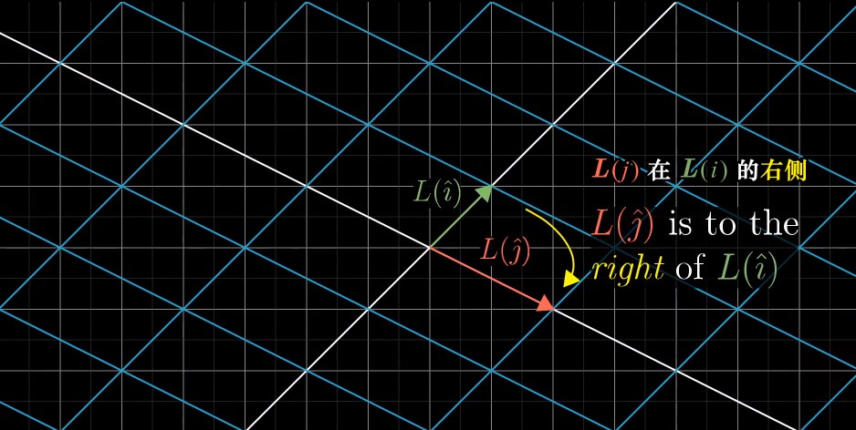

> **Orientation has been reversed. （定向发生了改变）**
>
> Whenever this happens, whenever the orientation of space is inverted, the determinant will be negative. 
>
> **The absolute value of the determinant**（绝对值） though, still tells you the factor by which areas have been scaled. 

###### Why does negative area relate to orientation-flipping? 

> Think about the series of transformations you get by slowly letting `i-hat` get closer and closer to `j-hat`. 
>
> As `i-hat` gets closer, all of the areas in space are getting squished more and more, meaning the determinant approaches 0. 
>
> Once `i-hat` lines up perfectly with `j-hat`, the determinant is 0. 
>
> Then if `i-hat` continues the way that it was going, doesn't it kind of feel natural for the determinant to keep decreasing into the negative numbers? 

###### What about 3-D Transformation? 

> It also tells you how much a transformation scales things, but this time, it tells you how much volumes get scaled. 
>
> In three dimensions, it helps to focus your attention on the specific **1-by-1-by-1 cube**, whose edges are resting on the basis vectors - `i-hat`, `j-hat` and `k-hat`. 
>
> After the transformation, that cube might get warped into some kind of `slanty-slanty`（斜不拉几的） cube. This shape, by the way, has the best name ever - "parallelepiped"（平行六面体）, 

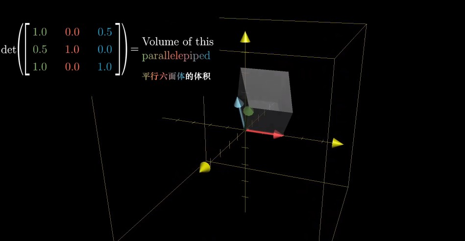

###### What should negative determinants mean for 3-D?

> One way to describe orientation in 3-D is with the **"right hand rule"（右手定则）**.
>
> - Point the **forefinger**（食指） of your right hand in the direction of `i-hat`, 
>
> - Stick out your **middle finger**（中指） in the direction of `j-hat`
> - And notice how when you point your **thumb**（大拇指） up, it's in the direction of `k-hat`. 

> If you can still do that after the transformation, orientation has not changed and the determinant is positive. 
>
> Otherwise, if after the transformation it only makes sense to do that with your left hand, orientation has been flipped and the determinant is negative. 

###### How do you compute determinant?

###### Quits Time

## Chapter 6: Inverse matrix, column space and null space （逆矩阵、列空间和零空间）

> **To ask the right question is harder than to answer it.** 
>
> —— Georg Cantor
>
> 提出正确的问题比回答它更困难。
>
> —— 格奥尔格·康托尔

#### Main Concepts

Under the light of linear transformations

- Inverse matrices（逆矩阵）
- Column space（列空间）
- Rank（秩）
- Null space（零空间）

> **Let the computers do the computing.** 

#### System of Equations

###### Usefulness of matrices

> Solve certain **systems of equations**.

###### What is system of equations? 

> You have a list of **variables** - things you don't know, and a list of **equations** relating them. 

> If you're lucky, they might take on a certain special form. 
>
> Within each equation, the only thing happening to each variable is that it's scaled by some constant, and the only thing happening to each of those scaled variables is that they're added to each other. 
>
> So, no exponents（幂次）or fancy functions, or multiplying two variables together - things like that. 

> The typical way to organize this sort of special system of equations is to throw all the variables on the left and put any lingering constants on the right. 
>
> It's also nice to vertically line up the common variables, and to do that, you might need to throw in some zero coefficients（系数） whenever the variable doesn't show up in one of the equations. 
>
> This is called a **"linear system of equations"**.

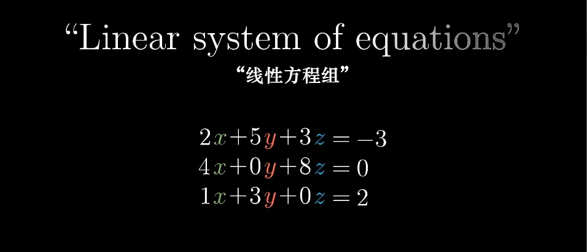

###### System of Equations to  Matrices

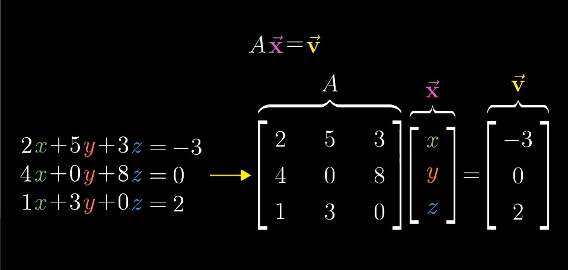

> - A —— the matrix containing all of the **constant coefficients**
> - `x-hat` —— a vector containing all of the **variables**
> - `v-hat` —— their matrix-vector product equals some different constant vector 

###### The geometric interpretation of system of equations 

> This is more than just a notational trick（书写技巧） to get our system of equations written on one line. 
>
>  It sheds light on a pretty cool geometric interpretation for the problem.
>
>  The **matrix A** corresponds with some linear transformation, So solving `Ax = v` means we're looking for a **vector x**, which after applying the transformation lands on **v**. 

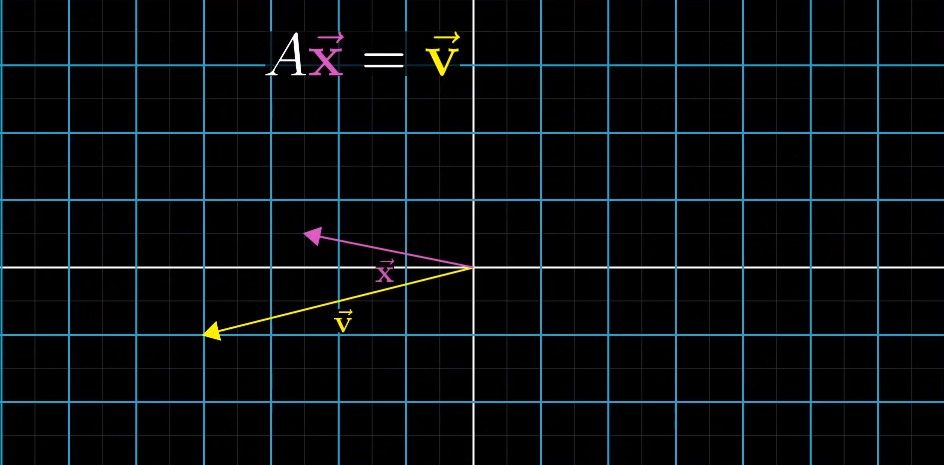

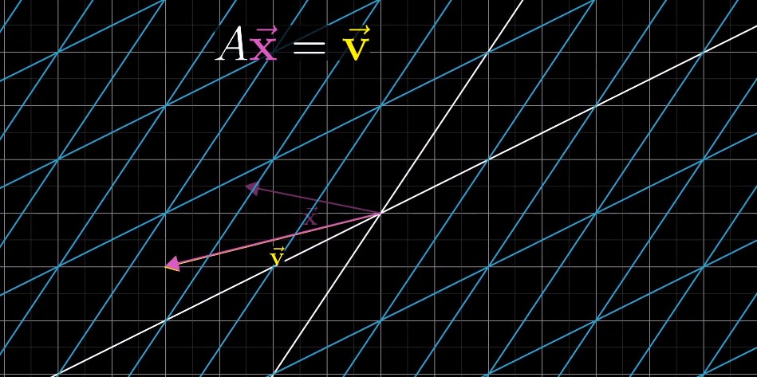

#### Example

> How we think about the solutions to this equation depends on whether the transformation associated with A: 
>
> - squishes all of space into a lower dimension, like a line or a point
> - or if it leaves everything spanning the full two dimensions where it started. 
>
> We subdivide in two cases: 
>
> 1. the case where A has **zero determinant**
> 2. the case where A has **non-zero determinant**

#### 1. Non-zero Determinant

> In this case, there will always be one and only one vector that lands on v, and you can find it by playing the transformation in **reverse**.
>
> Following where v goes as we rewind the tape like this,  you'll find the vector x such that `Ax = v`. 

###### Inverse Transformation（逆变换）

> When you play the transformation in reverse, it actually corresponds to a separate linear transformation, commonly called **"the inverse of A"**, denoted **A to the negative one**. 

###### For Example

> - If A was a counter-clockwise rotation by 90 degrees, then the inverse of A would be a clockwise rotation by 90 degrees. 
> - If A was a rightward shear that pushes `j-hat` one unit to the right, the inverse of A would be a leftward shear that pushes `j-hat` one unit to the left. 

###### Identity Transformation（单位变换 / 恒等变换）

> In general, A inverse is the unique transformation with the property that  if you first apply A, then follow it with the transformation A inverse, you end up back where you started. 
>
> Applying one transformation after another is captured algebraically with matrix multiplication, so the core property of this transformation A inverse is that **A inverse times A equals the matrix that corresponds to "doing nothing".** 
>
> The transformation that "does nothing" is called the **identity transformation（单位变换 / 恒等变换） **.

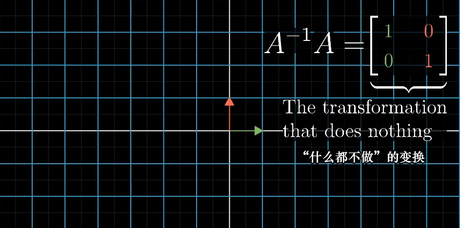

> Once you find this inverse, which in practice you do with a computer, you can solve your equation by multiplying this inverse matrix by v. 

> And again, what this means geometrically is that you're playing the transformation in reverse and following v. 

#### 2. Zero Determinant

> But when the determinant is zero and the transformation associated with this system of equations squishes space into a smaller dimension, there is no inverse. 

###### Two - dimensional 

> You cannot "`unsquish`" a line to turn it into a plane.  
>
> At least, that's not something that a function can do. 
>
> That would require transforming each individual vector into a whole line full of vectors, but functions can only take a single input to a single output. 

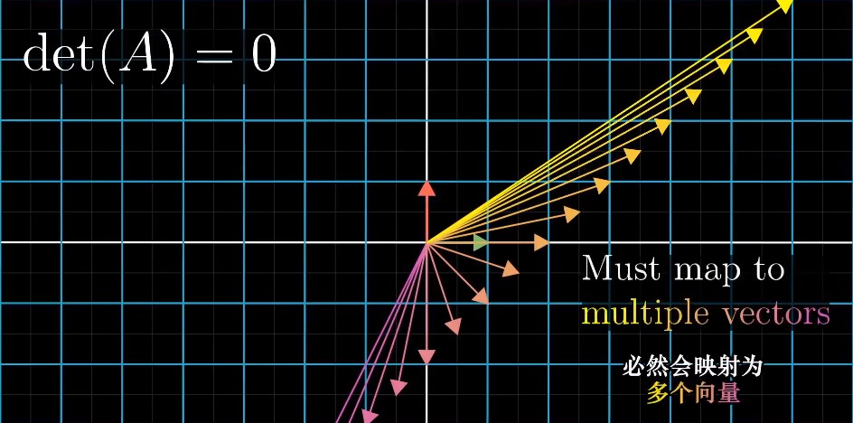

###### Three - dimensional

> Similarly, for three equations and three unknows, there will be no inverse if the corresponding transformation squishes 3-D space onto the plane, or even if it squishes it onto a line or a point. 

###### It's still possible that a solution exists even when there is no inverse.

> It's just that when your transformation squishes space onto, say, a line, you have to be lucky enough that the vector v lives somewhere on that line. 

#### Rank（秩）

> You might notice that some of these zero determinant cases feel a lot more restrictive that others. 
>
> Given a 3-by-3 matrix, for example, it seems a lot harder for a solution to exist when it squishes space onto a line, compared to when it squishes things onto a plane, even though both of those are zero determinant. 
>
> We have some language that's a bit more specific than just saying zero determinant. 

###### Rank 1

> When the output of a transformation is a line, meaning it's one-dimensional, we say the transformation has a rank of 1. 

###### Rank 2

> If all the vectors land on some two-dimensional plane, we say the transformation has a rank of 2. 

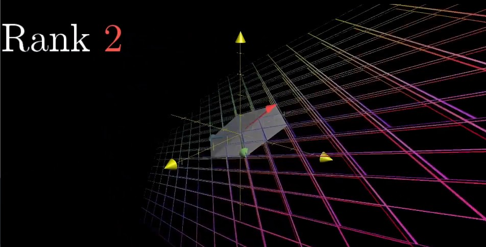

> So the word **"rank"** means the number of dimensions in the output of a transformation. 

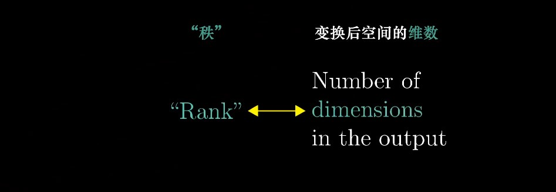

#### Column Space（列空间）

> This set of all possible outputs for your matrix, whether it's a line, a plane, 3-D space, whatever, it called the **"column space"** of your matrix. 

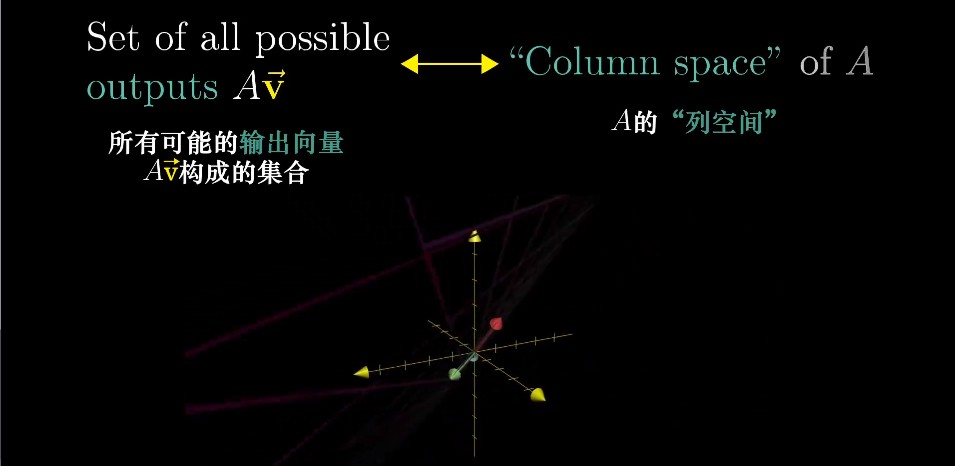

> The columns of your matrix tell you where the basis vectors land, and the span of those transformed basis vectors gives you all possible outputs. 
>
> In other words, the column space is the span of the columns of your matrix. 

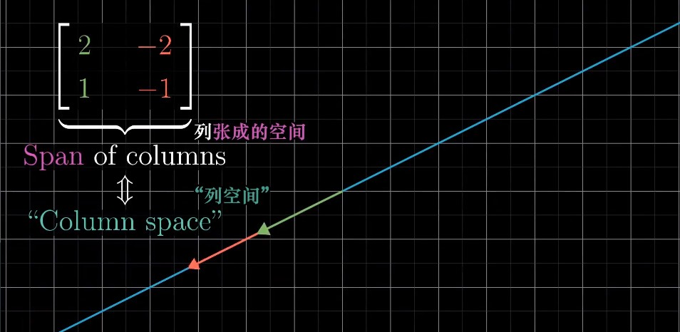

> So, **a more precise definition of rank would be that it's the number of dimensions in the column space.**
>
> （更精确的秩的定义是列空间的维数。）

###### Full Rank（满秩）

> When this rank is as high as it can be, meaning it equals the number of columns, we call the matrix **"full rank"**. 

> Notice, the **zero vector** will always be included in the column space. 
>
> Since linear transformations must keep the origin fixed in space. 

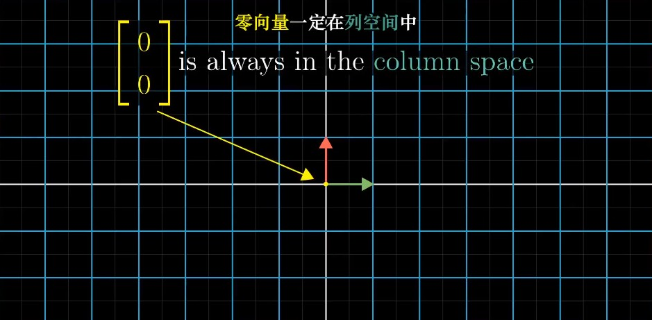

#### Null Space / Kernel（零空间 / 核）

> For a **full rank transformation**, the only vector that lands at the origin is the zero vector itself.
>
> But for matrices that aren't full rank, which squish to a smaller dimension, you can have a whole bunch of vectors that land on zero. 
>
> This set of vectors that lands on the origin is called the **"null space"** or the **"kernel"** of your matrix. 

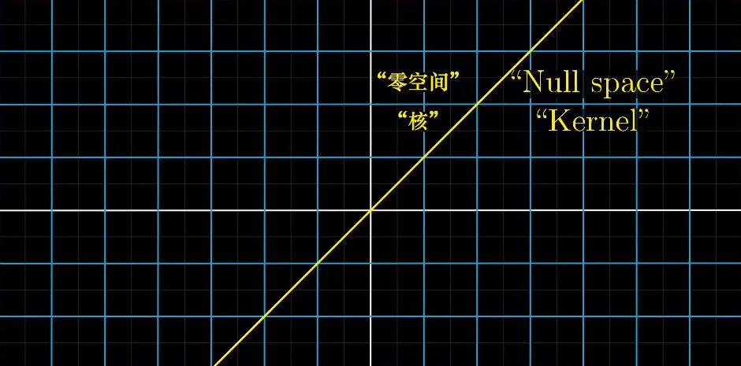

> It's the space of all vectors that become null, in the sense that they land on the zero vector. 

> In terms of the linear system of equations, when v happens to be the zero vector, the null space gives you all of the possible solutions to the equation. 

#### To sum up

> So that's a very high-level overview of how to think about linear systems of equations geometrically. 
>
> Each system has some kind of **linear transformation** associated with it, and when that transformation has an **inverse**, you can use that inverse to solve your system. 
>
> Otherwise, the idea of **column space** lets us understand when a solution even exists.
>
> And the idea of a **null space** helps us to understand what the set of all possible solutions can look like. 

## Addition: Non-square Matrices（非方阵）

> "On this quiz, I asked you to find the determinant of a 2x3 matrix. Some of you, to my great amusement, actually tried to do this. "
>
> —— (Via mathprofessorquotes.com, no name listed)
>
> “在这个小测验里，我让你们求一个2x3矩阵的行列式。让我感动非常可笑的是，你们当中竟然有人尝试去做。”
>
> —— 摘自mathprofessorquotes.com, 作者佚名

#### How to interpret?

## Chapter 7: Dot Products and Duality（点积和对偶性）

> Calvin: You know, I don't think math is a science, I think it's a religion. 
>
> Hobbes: A religion? 
>
> Calvin: Yeah. All these equations are like miracles. You take two numbers and when you add them, they magically become one NEW number! No one can say how it happens. You either believe it or you don't. 
>
> 卡尔文：你知道吗，我觉得数学不是一门科学，而是一种宗教。
>
> 霍布斯：一种宗教？
>
> 卡尔文：是啊。这些公式就像奇迹一般。你取出两个数，把它们相加时，它们神奇地成为了一个全新的数！没人能说清这到底是怎么发生的。你要么完全相信，要么完全不信。
>
> —— 《卡尔文与霍布斯》连载四格漫画，1991/03/06

> Only with transformations can we truly understand. 

#### Dot Products

###### Numerically

> Numerically, if you have two vectors of the same dimension, two lists of numbers with the same lengths, taking their **dot product**, means: 
>
> - pairing up all of the coordinates, 
> - multiplying those pairs together 
> - and adding the result. 

###### Geometric Interpretation

> Luckily, this computation has a really nice geometric interpretation: 
>
> To think about the dot product between two vectors - v and w,
>
> imagine projecting w onto the line that passes through the origin and the tip of v, 
>
> multiplying the length of this **projection（投影）** by the length of v, 
>
> you have the dot product - v dot w. 

###### Similar directions

###### Perpendicular

###### Opposing directions

###### Order doesn't matter

> **Q:** Why order doesn't matter?
>
> **A: ** If v and w happened to have the same length, we could leverage some **symmetry**. 
>
> Since projecting w onto v then multiplying the length of that projection by the length of v is a complete mirror image of projecting v onto w then multiplying the length of that projection by the length of w. 

> Now, if you scale one of them, say v, by some constant, like 2, so they don't have equal length, **the symmetry is broken.** 
>
> If you think of w as getting projected onto v, then the dot product, 2v dot w, will be exactly twice the dot product, v dot w. 
>
> This is because when you scale v by 2, it doesn't change the length of the projection of w, but it doubles the length of the vector that you are projecting onto. 

#### Duality（对偶性）

###### Number Line（数轴）

###### Linear Transformation

> These are functions that take in a 2-D vector and spit out some number. 
>
> But linear transformations are, of course, much more restricted than you run of the mill function with a 2-D input and a 1-D output. 
>
> Linear functions are quite special. 

> If you take a line of evenly spaced dots and apply a transformation, a linear transformation will keep those dots evenly spaced once they land in the output space, which is the number line. 

> One of these linear transformations is completely determined by where it takes `i-hat` and `j-hat`, but this time each one of those basis vectors just lands on a number. 
>
> So when we record where they land as the columns of a matrix, each of those columns just has a single number. 

######  Example

> Now, this numerical operation of multiplying a 1-by-2 matrix by a vector feels just like taking the dot product of two vectors. 
>
> Doesn't that 1-by-2 matrix just look like a vector that we tipped on its side? 

###### 1-by-2 Matrices（1x2 矩阵） vs. 2-D vectors（二维向量）

> There's a nice association between 1-by-2 matrices and 2-D vectors, defined by tilting the numerical representation of a vector on its side to get the associated matrix, or to tip the matrix back up to get the associated vector. 

> This suggests something that's truly awesome from the geometric view. 
>
> There's some kind of connection between linear transformations that take vectors to numbers and vectors themselves. 

#### Example

###### 1. Unit Vector

> So the entries of the 1-by-2 matrix describing the projection transformation are going to be the coordinates of `u-hat`. 
>
> And computing this projection transformation for arbitrary vectors in space, which requires multiplying that matrix by those vectors, is computationally identical to taking a dot product with `u-hat`. 

> This is why taking a dot product with a unit vector can be interpreted as projecting a vector onto the span of that unit vector and taking the length. 

###### 2. Non-unit Vectors

> We had a linear transformation from 2-D space to the number line, which was not defined in terms of numerical vectors or numerical dot products, it was just defined by projecting space onto a diagonal copy of the number line. 
>
> But because the transformation is linear, it was necessarily described by some 1-by-2 matrix. 
>
> And since multiplying a 1-by-2 matrix by a 2-D vector is the same as turning that matrix on its side and taking a dot product, this transformation was inescapably related to some 2-D vector. 

> The lesson here is that anytime you have one of these linear transformations, whose output space is the number line, no matter how it was defined, there is going to be some unique vector v corresponding to that transformation, in the sense that applying the transformation is the same thing as taking a dot product with that vector. 

> You'd say that **dual of a vector** is the linear transformation that it encodes,
>
> **the dual of a linear transformation** from some space to one dimension is a certain vector in that space. 

#### To Sum Up

> On the surface, the dot product is a very useful geometric tool for understanding projections. 
>
> And for testing whether or not vectors tend to point in the same direction. And that's probably the most important thing for you to remember thing for you to remember about the dot product. 
>
> But at a deeper level, **dotting two vectors together is a way to translate one of them into the world of transformations.** 
>
> Again, numerically this might seem like a silly point to emphasize. It's just two computations that happen to look similar. 
>
> But the reason I find this so important is that throughout math when you are dealing with a vector, once you really get to know its personality, sometimes you realize that it's easier to understand it not as an arrow in space, but as the physical embodiment of a linear transformation. 
>
> It's as if the vector is really just a conceptual shorthand for a certain trans formation, since it's easier for us to think about arrows in space rather than moving all of that space to the number line. 

## Chapter 8: Cross Products in the light of linear transformations

> "Every dimension is special. "
>
> —— Jeff Lagarias
>
> “每一个维度都很特别。”
>
> —— 杰弗里·拉家里亚斯

###  Standard Introduction of Cross Products（叉积的标准介绍）

#### The Definition of Cross Products

> The **cross product** of v and w, written with the x-shaped multiplication symbol, is the area of this parallelogram. 

> - If **v is on the right of w**, then `v x w` is **positive** and equal to the area of the parallelogram. 

> - If **v is on the left of w**, then `v x w` is **negative**, namely the negative area of that parallelogram. 

> This means that order matters. 

#### The Orientation of Cross Products

> The order of your basis vectors is what defines orientation.
>
> So, since `i-hat` is on the right of `j-hat`, I remember that `v x w` has to be positive whenever v is on the right of w. 

#### How to Compute?

> For the 2-D cross products, `v x w`, what you do is you write the coordinates of v as the first column of the matrix, and you take the coordinates of w and make them the second column, then you just compute the determinant. 

> 

> This is because a matrix whose columns represent v and w corresponds with a linear transformation that moves the basis vectors `i-hat` and `j-hat` to v and w. 

> The determinant is all about measuring how areas change due to a transformation 

###### Perpendicular

> When two vectors are perpendicular or at least close to being perpendicular, the cross product is larger than it would be if they are pointing in very similar directions.
>
> Because the area of that parallelogram is larger when the sides are closer to being perpendicular. 

###### Scale

> If you were to scale up one of those vectors, perhaps multiplying v by 3, then the area of that parallelogram is also scaled up by a factor of 3. 

#### The True Cross Product

> The true cross product is something that combines two different 3-D vectors to get a new 3-D vector. 

> The cross product is not a number, it's a vector. 
>
> This new vector's length will be the area of that parallelogram, which in this case is 2.5, and the direction of that new vector is going to be perpendicular to the parallelogram. 

> But there are two possible vectors with length 2.5 that are perpendicular to a given plane.
>
> This is where the right hand rule comes in.  

###### Right hand rule（右手定则）

> - **forefinger** of your right hand in the direction of v
> - **middle finger** in the direction of w
> - Point up your **thumb**, that's the direction of the **cross product**

> What on earth does it mean to put in a vector as the entry of a matrix?

> Students are often told that this is just a notational trick, when you carry out the computations as if `i-hat`, `j-hat` and `k-hat` are numbers, then you get some linear combination of those basis vectors. 
>
> And the vector find by that linear combination, students are told to just believe, is the unique vector perpendicular to v and w, whose magnitude is the area of the appropriate parallelogram and whose direction obeys the right hand rule. 

> But there is a reason for doing it. 
>
> Let's talk about in the next video. 

### Deeper Understanding with Linear Transformations（通过线性变换深入理解叉积）

> From (Grothendieck), I have also learned not to take glory in the difficulty of a proof: difficulty means we have not understood. The ideal is to be able to paint a landscape in which the proof is obvious. 
>
> —— Pierre Deligne
>
> 从他（格罗滕迪克）和他的作为中，我还学到了一点：不以高难度的证明为傲，因为难度高意味着我们还不理解。理想的情况是能够绘出一幅美景，而其中的证明显而易见。
>
> —— 皮埃尔·德利涅

#### How to Compute a Three dimensional Cross Product

> There are some brute force computations that you could do to confirm these facts. 

###### Prerequisites（预备知识）

> - Chapter 5: Determinants
> - Chapter 7: Dot products and duality

> The takeaway is that whenever you're out in the mathematical wild and you find a linear transformation to the number line, you will be able to match it to some vector, which is called the dual vector of that transformations, so that performing the linear transformation is the same as taking a dot product with that vector. 

###### The Plan

> 1. Define a 3d-to-1d linear transformation in terms of v and w
> 2. Find its dual vector
> 3. Show that this dual is `v x w`

> The reason for doing this will be that understanding that transformation is going to make clear the connection between the computation and the geometry of the cross product. 

###### The wrong cross product

> If you didn't already know the 3-D cross product and you're trying to extrapolate（外推）, you might imagine that it involves taking three separate 3-D vectors - u, v and w, and making their coordinates the columns of a 3-by-3 matrix, then computing the determinant of that matrix. 

> Geometrically, this would give you the volume of a parallelepiped spanned out by three vectors, with the plus or minus sign depending on the right hand rule orientation of those three vectors. 
>
> But this is not the real cross product ! 

###### The real cross product

> The actual 3-D cross product takes in two vectors and spits out a vector. 
>
> Consider that first vector u to be a variable, say with variable entries (x, y, z), while v and w remain fixed. 
>
> What we have then is a function from three dimensions to the number line. 
>
> You input some vector (x, y, z) and you get out a number by taking the determinant of a matrix, whose first column is (x, y, z) and whose other two columns are the coordinates of the constant vectors v and w. 

> Geometrically, the meaning of this function is that for any input vector (x, y, z), you consider the parallelepiped defined by this vector, v and w, then you return its volume, with the plus or minus sign depending on orientations. 

###### Where does this function come from? 

> One really important fact about this function is that it's linear. 
>
> Once you know that it's linear, you know that there's some way to describe this function as matrix multiplication. 

> And the whole idea of duality is that the special thing about transformations from several dimensions to one dimension is that you can turn that matrix on its side, and instead, interpret the entire transformation as the dot product with a certain vector. 

> What we're looking for is the special 3-D vector, that I'll call p, such that taking the dot product between p and any other vector (x, y, z) , gives the same result as plugging in (x, y, z) as the first column of a 3-by-3 matrix, whose other two columns have the coordinates of v and w, then computing the determinant. 

###### What this means computationally

> This funky computation can be thought of as a way to answer the following question: 
>
> What vector p has the special property that when you take a dot product between p and some vector (x, y, z), it gives the same result as plugging in (x, y, z) to the first column of the matrix, whose other two columns have the coordinates of v and w, then computing the determinant? 

 

> Start by taking the area of the parallelogram defined by v and w, then multiply it not by the length of (x, y, z), but by the component of (x, y, z) that's perpendicular to that parallelogram. 

> In other words, the way our linear function works on a given vector is to project that vector onto a line that's perpendicular to both v and w, then to multiply the length of that projection by the area of the parallelogram spanned by v and w. 

