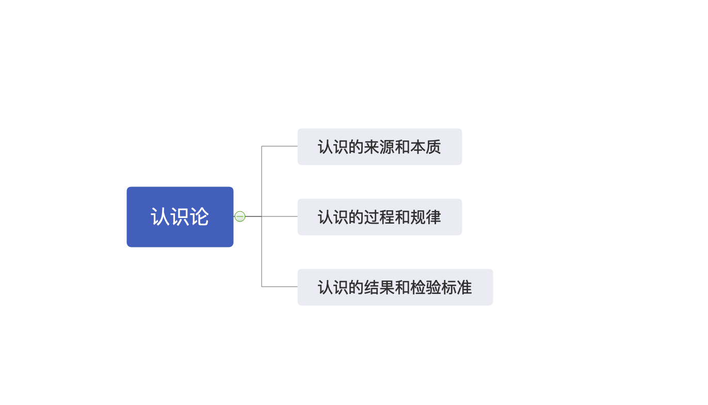
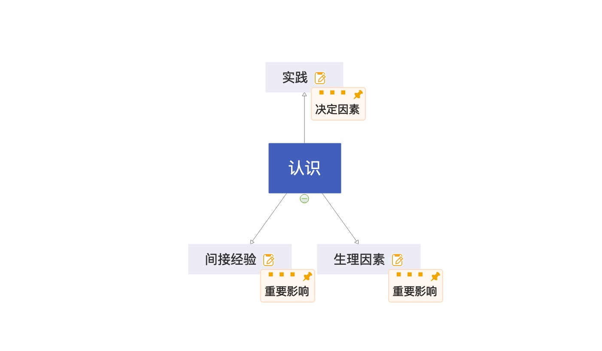
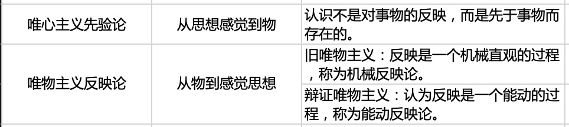

# 第三章 实践与认识及其发展规律

## 第一节 实践与认识

[TOC]

### 一、实践的本质与基本结构

#### （一）实践的本质和特征

##### 错误的实践观

- 中国古代哲学

> 实践被称为“践行”“实行”或“行”，与“知”相对应，但主要是指**道德伦理行为**。
>
> 错误点：道德伦理行为

- 康德

> 把实践看成理性自主的道德活动。
>
> 错误点：道德活动；理性自主（片面地强调了实践的主体，而忽略了实践的客体）

- 黑格尔

> 把实践理解为主观改造客观对象的创造性的精神活动。
>
> 错误点：精神活动（实践是一种客观的物质性活动，认识才是精神活动）

- 费尔巴哈

> 把实践与物质的活动联系起来，把他所理解的实践又仅限于日常生活活动，并将实践等同于生物适应环境的活动。
>
> 错误点：狭隘地把实践理解为一种生理行为。

##### 正确的实践观

实践是**感性的**、**对象性**的**物质活动**。

> 感性的：人的实践不是盲目的，而是由意识来指导的，并且体现着主体的意愿和目的。
>
> 对象性的：实践光有人本身是完成不了的，必须有一个客体，有一个实践所指向的对象。
>
> 物质活动：实践具有客观性，是属于物质的。

##### 实践的本质含义

实践是**人类能动地**改造世界的**客观物质性**活动。

> 随着人工智能的发展，机器人也可以代替人做很多事情，这说明机器人也可以代替人类从事某些实践活动。（×）
>
> **（实践是人类独有的）**。

##### 实践的基本特征

- **直接现实性**（本质特性）

> 实践具有将 “脑中的” 变成 “现实的” 功能。
>
> “你懂这么多的道理，但依旧过不好这一生。” 因为你没有抓住实践的直接现实性。

- **自觉能动性**（主体能动性）

> 实践受意识的指导，体现主体的目的性。

- **社会历史性**

> 不同历史阶段的实践内涵不同。

#### （二）实践的基本结构

> **主体**借助**中介**作用于**客体**。

##### 1. 实践主体

**（1）概念**

在实践活动中，实践主体是指具有一定的主体能力、从事现实社会实践活动的人，是实践活动中自主性和能动性的因素，担负着设定实践目的、操作实践中介、改造实践客体的任务。

> 所有的人都是主体。（×）

**（2）实践主体的能力**

- 自然能力
- 精神能力
  - 知识性因素（首要能力）
    - 既包括对理论知识的掌握，也包括对经验知识的掌握。
  - 非知识性因素
    - 主要指情感和意志因素。

**（3）三种基本形态**

- 个体主体
- 群体主体
- 人类主体

##### 2. 实践客体

实践客体是指实践活动所指向的对象。

> 所有的物都是客体。（×）
>
> 客体是物，但不是所有的物都是客体。（有很多东西是客观存在的，但却没有被我们实践活动所指向，比如人类还未认知和观测到的东西，客观存在在那里，但未纳入我们的实践范围之内的东西。）

##### 3. 实践中介

实践中介是指各种形式的工具、手段以及操作这些工具、手段的程序和方法。

分为两个子系统：

- 一是，作为人的肢体延长、感官延伸、体能放大的物质工具系统；
- 二是，语言符号工具系统。

##### 实践的主体和客体相互作用的关系

- 实践关系（最根本的关系）
- 认识关系
- 价值关系

> 实践的主体和客体与认识的主体和客体在本质上是一致的。

##### 实践的主客体不断发展变化

- 主体客体化

> 是人通过实践使自己的本质力量作用于客体，形成了世界上本来不存在的对象物。
>
> 如：大自然有一棵树，但人类把实践加诸于那棵树上，把它做成了纸张和筷子。树失去了它原来的样子，变成了大自然本没有的纸张和筷子，这个过程，就叫主体客体化。

- 客体主体化

> 是客体从客观对象的存在形式转化为主体生命结构的因素或主体本质力量的因素，客体失去客体性的形式，变成主体的一部分。
>
> 如：有一株天山雪莲，长在天山之上，被你采下来吃了，吃完之后你功力大增。
>
> 如：人跑得不快，但人可以造一辆汽车，然后与汽车融为一体，使得人跑得巨快。
>
> 如：人的计算能力不是很强，但我搞了一个计算机出来，我和计算机融为一体，使得我算得飞快。

#### （三）实践的基本类型（形式）

##### 1. 物质生产实践（最基本）

> 劳动

##### 2. 社会政治实践

> 搞关系

##### 3. 科学文化实践

> 探索

【虚拟实践】

> 现代信息技术的发展使得当代社会开始产生一种新的实践形式，即虚拟实践。
>
> 虚拟实践是伴随信息化和网络化发展而产生的，其实质是主体和客体之间通过数字化中介系统在虚拟空间进行的双向对象化的活动，主要活跃于网络世界，具有**交互性**、**开放性**、**间接性**等特点。
>
> 必须看到，虚拟实践是实践活动的**派生形式**，具有**相对独立性**。

#### （四）实践决定认识

- 实践是认识的**来源**。
  - 首先，实践产生了认识的需要。
  - 其次，实践还为认识的形成提供了可能。
- 实践是认识的**动力**。
- 实践是认识的**目的**。
- 实践是**检验真理的唯一标准**。

> 马克思认为，认识来源于实践，并不排斥**天赋**（生理因素）的影响。但天赋仅仅是影响因素。
>
> 马克思同时又承认，**间接经验**也是有用的。但也只是影响因素。

### 二、认识的本质与过程

#### （一）认识的本质

##### 唯物主义反映论与唯心主义先验论

##### 辩证唯物主义认识论

###### 概念

> 认识的本质是主体在实践基础上对客体的能动反映。

###### 特征

> - 不但具有反映客体内容的**反映性特征**。
> - 而且具有实践所要求的主体能动的、**创造性特征**。

> 一方面，认识的**反映特性**是人类认识的基本规定性。认识的反映特性是指人的认识必然要以客观事物为原型和摹本，在思维中再现或摹写客观事物的状态、属性和本质。
>
> 另一方面，认识的能动反映具有**创造性特性**。认识是一种在思维中的能动的 、创造性的活动，而不是主观对客观对象简单、直接的描摹或照镜子式的原物映现。

###### 反映特性与创造特性的关系

> 不可分割。
>
> - 只坚持认识的反映，看不到认识能动的创造性 —— 旧唯物主义直观机械反映论
> - 只坚持能动的创造性，使创造性脱离反映的前提 —— 唯心主义和不可知论

##### 能动反映论的优点

- 把**实践**的观点引入认识论。
- 把**辩证法**应用于反映论考察认识的发展过程。把认识看成一个由不知到知、由浅入深的充满矛盾的能动的认识过程，全面地揭示了认识过程的辩证性质。

#### （二）认识过程的两次飞跃

##### 1. 第一次飞跃 —— 从感性认识到理性认识

###### 感性认识

> 是人们在实践基础上，由感觉器官直接感知到的关于事物的现象、事物的外部联系、事物的各个方面的认识。包括感觉、知觉和表象三种形式。
>
> 感性认识是认识的初级阶段，直接性是感性认识的突出特点。

###### 理性认识

> 是认识的高级阶段，是指人们借助抽象思维，在概括整理大量感性材料的基础上，达到关于事物的本质、全体、内部联系和事物自身规律性的认识。
>
> 理性认识包括概念、判断、推理三种形式。
>
> 理性认识的特点是它的间接性和抽象性。

###### 感性认识与理性认识的辩证关系

- 既相区别

|              | 对象                                       | 形式             | 特点           |
| ------------ | ------------------------------------------ | ---------------- | -------------- |
| **感性认识** | 事物的现象、事物的外部联系、事物的各个方面 | 感觉、知觉和表象 | 直接性、具体性 |
| **理性认识** | 事物的本质、全体、内部联系和事物自身规律性 | 概念、判断和推理 | 间接性、抽象性 |

- 又相联系
  - 第一，感性认识有待于发展和深化为理性认识。
  - 第二，理性认识依赖于感性认识。
  - 第三，感性认识和理性认识相互渗透、相互包含。
    - 感性认识和理性认识的辩证统一关系是在实践的基础上形成的，也需要在实践中发展。
    - 如果割裂二者的辩证统一关系，就会走向唯理论或经验论，在实际工作中就会犯教条主义或经验主义错误。
      - 唯理论 —— 片面强调理性认识
      - 经验论 —— 片面强调感性认识

> 感受到的东西我们不能立刻理解，但理解了的东西我们可以更加深刻地感受。（强调理性更重要）
>
> 尽信书，不如无书。（强调感性更重要）
>
> 同一句格言，出自于饱经风霜的老人之口，和出自于缺乏阅历的少年之口，其内涵是不同的。（强调感性更重要）

###### 感性认识上升到理性认识的条件

- 勇于实践，深入调查，获取十分丰富和合乎实际的感性材料；
- 必须经过理性思考的作用，将丰富的感性材料加工制作。

##### 2. 第二次飞跃 —— 从理性认识到实践

**重要性**

> 从认识到实践，是 “认识过程的第二个阶段，即由精神到物质的阶段，由思想到存在的阶段“。
>
> 这是认识过程的第二次能动的飞跃，是认识过程中更为重要的一次飞跃。

**实现飞跃的条件**

> 需要经过一定的中介环节，包括确定实践目的、形成实践理念、制定实践方案、进行中间实验、运用科学实践方法等。
>
> 因此必须从实际出发，坚持理论和实际相结合，让理论为群众所掌握，转化为改造社会、改造自然的物质力量。只有这样，理论才能发挥指导作用，并随着实践的发展而发展。

#### （三）认识过程中的影响因素

##### 理性因素

概念

> 理性因素是指人的理性直观、理性思维等能力。

作用

> 它在认识活动中的作用主要有指导作用、解释作用和预见作用等。

##### 非理性因素（感性因素）

概念

> 非理性因素主要是指认识主体的情感和意志，从广义上看，人们还常把认识能力中具有不自觉、非逻辑等特点的认识形式，如联想、想象、猜测、顿悟、灵感等，也包括在人的非理性因素中。

作用

> 非理性因素对于人的认识能力和认识活动具有激活、驱动和控制作用。

#### （四）认识的规律

##### 反复性

认识过程的反复性是指，人们对于一个复杂事物的认识往往要经过由感性认识到理性认识、再由理性认识到实践的多次反复才能完成。

**原因**

- 从客观看，事物暴露有个过程；
- 从主观看，主体认识能力提高有个过程。

##### 无限性

认识发展的无限性是指，对于事物发展过程的推移来说，人类的认识是永无止境、无限发展的，它表现为 “实践、认识、再实践、再认识” 的无限循环，由低级阶段向高级阶段不断推移的永无止境的前进运动。

这种认识的无限发展过程，在形式上是循环往复，在实质上是前进上升。

#### （五）认识与实践的具体的历史的统一

**方法论**

- 实践超前与认识 - 激进主义（左）
- 实践落后于认识 - 保守主义（右）

> 如果你是共产党员：左倾/右倾
>
> 如果你是党外人士：左派/右派

### 三、实践与认识的辩证运动及其规律

