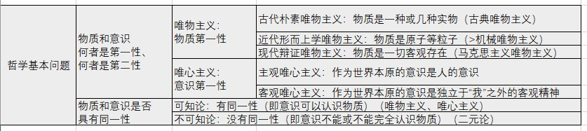
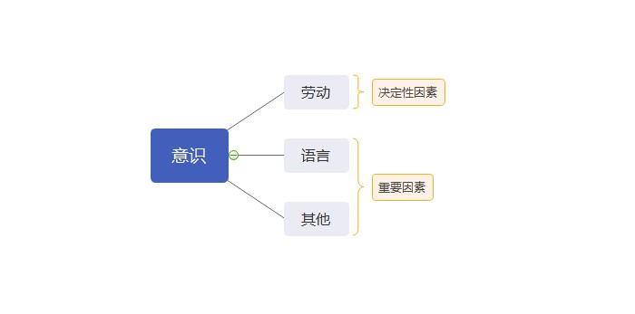
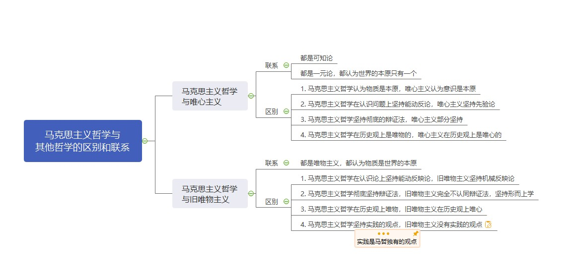
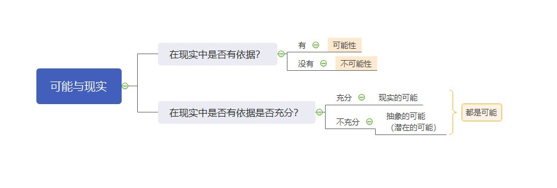

# 第二章 世界的物质性及发展规律

[TOC]

## 第一节 世界多样性与物质统一性

### 一、物质及其存在形态

#### （一）哲学基本问题及不同哲学流派

##### 1. 哲学基本问题

> 存在和思维的关系问题。（物质和意识的关系问题。）

##### 2. 哲学基本问题的两个方面

> - 存在和思维究竟谁是世界的本原，即物质和意识何者是第一性、何者是第二性。
> - 思维能否正确认识存在的问题，即物质和意识是否具有同一性。

##### 3. 不同哲学流派

> - 马克思主义者们是哲学史上第一次把**历史**当作是物质去看待的。
>
>   - **唯物史观**
>
> - 
马克思在哲学史上的两大历史贡献：

>- 
创立了唯物史观

>   
>- 
形成了辩证唯物主义

> - 主观唯心主义
>   - 笛卡尔：“我思故我在”
>   - 王阳明
>   - 慧能（佛教禅宗第六派祖师）“风吹帆动”
> - 客观唯心主义
>   - 上帝
>   - 道说（道生一，一生二，二生三，三生万象）
>   - 理说（程朱理学）
>   - 缘说（佛教）

> - 可知论
>   - 唯物主义、唯心主义都是可知论
> - 不可知论
>   - 二元论（不彻底的唯心主义）

##### 4. 哲学重要问题 ——世界是怎样存在的？

- **辩证法**

> 联系的、全面的、发展的、有矛盾的。
>
> 坚持用联系的、发展啊的观点看世界，认为发展的根本原因在于事物的内部矛盾。

- **形而上学**

> 孤立的、片面的、静止的、无矛盾的。
>
> 坚持用孤立的、静止的观点看问题，否认事物内部矛盾的存在和作用。

#### （二）物质

##### 1. 物质和物质范畴

- **恩格斯**

> 物、物质无非是各种物的总和，而这个概念就是从这一总和中**抽象**出来的。

- **列宁**

> “物质是标志客观实在的哲学范畴，这种客观实在是 **人通过感觉感知的**、**它不依赖我们的感觉而存在**，**为我们的感觉所复写、摄影、反映**。”

定义方式：通过物质和意识的关系。

物质的唯一特性：客观实在

##### 2. 物质和运动

- **物质的概念**

- **运动的概念**

> 运动是标志一切事物和现象的变化及其过程的哲学范畴。
>
> 运动是物质的存在方式和根本属性。

物质的根本属性：运动

- **物质和运动的关系** —— 不可分割

> 一方面，物质是运动着的物质。
>
> 另一方面，运动是物质在运动。

- **批判两种错误的观点**

> 唯心主义 —— 脱离物质谈运动
>
> 形而上学 —— 脱离运动谈物质

##### 3. 运动和静止

- **运动的概念**
- **静止的概念**

> 静止是物质运动在一定条件下的稳定状态，包括空间位置和**根本性质暂时未变**这样两种运动的特殊状态。

- **运动和静止的关系** —— 对立统一

> 相互区别：运动是绝对的、无条件性；静止是相对的、有条件的。
>
> 相互联系：运动和静止相互依赖、相互渗透、相互包含，“动中有静，静中有动”。
>
> （鸟鸣山更幽，风定花尤落。）

- **批判两种错误的观点**

> 形而上学 —— 夸大静止，否定运动
>
> 诡辩论 —— 夸大运动，否定静止
>
> （赫拉克利特：人不能两次踏入同一条河流。他的学生：人一次都不能踏入同一条河流。）

#### 【注】两个概念的关系

- 不可分割（词性不同）
- 对立统一（词性相同）

##### 4. 物质运动与时空

- **运动的概念**
- **时空的概念**

> **时间**是指物质运动的**持续性**、**顺序性**，特点是**一维性**，即一去不复返。
>
> **空间**是指物质运动的**广延性**、**伸张性**，特点是**三维性**。

- 时空与物质运动的关系 —— 不可分割

> 时空是物质运动的时空，物质运动是时空中的物质运动。

时间和空间是物质运动的存在形式（存在方式）。

- **时空的特点**
  - **客观性**
    - 不以人的意志为转移。
  - **绝对性**
    - 时空绝对存在。
  - **相对性**
    - 当物质运动的速度突破极限的时候，时空会发生变化。
  - **有限性**
    - 具体事物的时空是有限的。
  - **无限性**
    - 所有事物的时空是无限的。

### 二、实践

> 世界分为两极，一极叫做物质世界，另一极叫做意识世界。而横跨在这两极当中的，有且只有的，唯一桥梁，那就是**实践**。

#### （一）实践是自然存在和社会存在区分和统一的基础

##### 1. 从实践出发理解**社会生活的本质**，要把握以下两个方面：

> （社会生活的本质是实践）

- 一方面，实践是使**物质世界**分化为**自然界**和**人类社会**的历史前提，又是使自然界与人类社会统一起来的现实基础。

> （一切不以人的意志为转移的是物质世界。在没有人之前，整个物质世界都可以被称之为自然界。但有了人之后，人通过实践，对物质世界进行改造，使得物质世界开始分化。那些人还没有能够触及、还没有能够认知、还没有能够改造的地方，仍然称之为自然界，而已经通过了人的实践改造到了的那些东西，称之为人类社会。）

- 另一方面，实践是人类社会的基础，是理解和解释一切社会现象的钥匙。

> 如果脱离了实践，不从实践去考量，我们根本无法去理解人类社会。

##### 2. 社会生活的实践性主要表现在：

> （为什么实践是社会生活的本质）

- 第一，实践是社会关系形成的基础；
- 第二，实践形成了社会生活的基本领域；
  - （经济领域、政治领域、文化生活领域等）
- 第三，**实践构成了社会发展的动力**。
  - （干扰选项：实践是社会发展的动力（x）社会发展的动力是社会基本矛盾）

### 三、意识观

#### （一）意识的起源

##### 1. 意识的概念

- 意识是物质世界长期发展的产物
- 是人脑的机能和属性
- 是物质世界的主观映象

##### 2. 意识的来源

- 三个发展阶段
  - 一切物质所具有的反应特性到低等生物的刺激感应性
  - 再到高等动物的感觉和心理
  - 最终发展为人类的意识

> （意识是人独有的）

##### 3. 意识形成过程中的影响因素

意识不仅是自然界长期发展的产物，而且是社会历史的产物。

- 社会实践特别是 **劳动** 在意识的产生和发展中起着**决定性的作用**，劳动为意识的产生和发展提供了客观需要和可能。

- 在人们的劳动和交往中形成的 **语言** 促进了意识的发展，**语言是意识的物质外壳**。

> 语言是物质。
>
> 语言的含义是意识。

#### （二）意识的本质

意识从其本质来看是客观世界的主观映象，是客观内容和主观形式的统一。

> 意识虽具有主观性，但是意识的产生和存在必须依赖于物质，意识不可以脱离物质。

#### （三）意识的作用 —— 能动作用

- 第一，意识反映世界具有**自觉性**，具有**目的性**和**计划性**
- 第二，意识具有**创造性**
- 第三，意识具有指导实践**改造客观世界**的作用
- 第四，意识还具有**指导、控制人的行为和生理活动**的作用

#### （四）意识与物质的辩证关系 —— 对立统一

- 物质和意识**相互区别**
  - 物质是本原，意识是派生
  - 物质不是意识，意识不是物质
  - 物质不能代替意识，意识不能代替物质
- 物质和意识**相互联系**
  - 物质可以转化为意识，意识可以转化为物质
  - 意识对物质既有依赖性，又有相对独立性
  - 物质决定意识，意识反作用于物质

正确认识和把握物质与意识的辩证关系，还需要**处理好主观能动性和客观规律性的关系**：

> 一方面，尊重客观规律是正确发挥主观能动性的前提
>
> 另一方面，只有充分发挥主观能动性，才能正确认识和利用客观规律。

**正确发挥人的主观能动性的前提和条件：**

- 第一，**从实际出发**是正确发挥人的主观能动性的**前提**
- 第二，**实践**是正确发挥人的主观能动性的**基本途径**
- 第三，正确发挥人的主观能动性，还需要**依赖于一定的物质条件和物质手段**

**在社会历史领域**，主观能动性与客观规律性的辩证关系具体表现为**社会历史趋向与主体选择的关系**：

- **社会历史趋向**指的是社会历史规律的**客观性和必然性**；

- **主体选择**指的是历史主体在社会发展中的**能动性和选择性**。

社会历史规律的客观性和必然性规定了人的活动要受规律性的制约。与此同时，又不能否定人作为历史主体的能动性和选择性。

> 人不能为所欲为，但也不是无所作为。

### 四、世界的物质统一性

#### （一）世界的物质统一性原理

- 其一，世界是统一的，即世界的本原是一个。
- 其二，世界的统一性在于它的物质性，即世界统一的基础是物质。
- 其三，物质世界的统一性是多样性的统一，而不是单一的无差别的统一。

#### （二）世界统一于物质

- 世界的物质统一性首先体现在，**意识**统一于物质。
- 世界的物质统一性还体现在，**人类社会**也统一于物质。

#### （三）人类社会的物质性

- 人类社会依赖于自然界是整个物质世界的组成部分。
- 人类谋取物质资料的实践活动，虽然有意识的指导，但仍然是物质的活动。
- 物质资料的生产方式，是人类存在和发展的基础，集中体现着人类社会的物质性。

#### （四）世界的物质统一性原理的作用

世界的物质统一性原理是**马克思主义的基石。**

> 在认识世界和改造世界的过程中，坚持实事求是，一切从实际出发。
>
> 一切从实际出发，是世界的物质统一性原理在现实生活中和实际工作中的生动体现。

 

## 第二节 事物的联系和发展

- 两大总特征
  - 普遍联系
    - 联系的含义
    - 联系的特点
    - 方法论意义
  - 永恒发展
    - 发展的内涵与实质
    - 新、旧事物的关系
    - 过程的观点
    - 方法论意义

### 一、唯物辩证法两大总特征

#### （一）事物的普遍联系

##### 1. 联系的概念

事物内部各要素之间和事物之间相互影响、相互制约和相互作用的关系。

> 联系是以区别为前提的。

##### 2. 联系的特点

- **客观性**
  - 联系是事物本身所固有的，不是主观臆想的。
- **普遍性**
  - 任何事物内部的不同部分和要素都是相互联系的，即任何事物都具有内在结构性。
  - 任何事物都不能孤立存在，都同其他事物处在一定的相互联系之中。
  - 整个世界是相互联系的统一整体，每一个事物都是世界普遍联系中的一个成分或环节，并通过它表现出联系的普遍性。世界的普遍联系是通过 “中介” 来实现的。
- **多样性**
  - 世界上的事物是多样的，因而事物的联系也是多样的。
- **条件性**
  - 条件对事物发展和人的活动具有支持或抑制的作用。
  - 条件是可以改变的，人们经过努力可以创造出事物发展所需要的条件。
  - 改变和创造条件不是任意的，必须尊重事物发展的客观规律。

#### （二）事物的变化发展

##### 1. 发展的内涵（概念）

概括一切形式的变化就是运动，运动变化的趋势就是发展。

> **运动 = 变化 > 发展**
>
> 运动是绝对的、无条件的。（√）
>
> 发展是绝对的、无条件的。（×）
>
> 发展是永恒的。（√）

##### 2. 发展的实质

前进的上升的运动，发展的实质是新事物的产生和旧事物的灭亡。

##### 3. 新事物和旧事物

**新事物**是指 —— 合乎历史前进方向、具有远大前途的东西。

**旧事物**是指 —— 丧失历史必然性、日趋灭亡的东西。

> **命题角度**：如何区分新、旧事物？新、旧事物的区分是否与时间的先后有关？
>
> 新事物一定产生于旧事物之后。（×）

**新生事物是不可战胜的**，因为：

- 第一，新事物具有新结构，适应新环境。
- 第二，新事物是旧事物的改良，吸收了旧的优点，增添了新内容。
- 第三，新事物符合群众利益，受到群众拥护。

##### 4. 过程的观点

- 世界不是既成事物的集合体，而是过程的集合体。
- 一切在历史上产生的都要在历史上灭亡。
- 任何事物都有它的过去、现在和将来。
- ......

### 二、辩证法五对范畴

- 原因与结果
- 必然与偶然
- 可能与现实
- 内容与形式
- 现象与本质

#### （一）原因与结果

##### 1. 概念

原因和结果是揭示事物的**前后相继**、彼此制约的关系范畴。

> 原因和结果是前后相继的。（√）
>
> 前后相继即为因果。（×）

- **原因**是引起某种现象的现象。
- **结果**是被某种现象引起的现象。

##### 2. 关系 —— 对立统一

- 第一，原因和结果的区分既是确定的，又是不确定的。
- 第二，原因和结果相互作用，原因产生结果，结果反过来影响原因，互为因果。
- 第三，原因和结果相互渗透，结果存在于原因之中，原因表现在结果之中。
- 第四，原因和结果的关系是复杂多样的，有一因多果、同因异果、一果多因、异因同果、多因多果、复合因果。
  - （有其因必有其果（×））
  - （有因必有果（√））

##### 3. 方法论

凡事预则立不预则废。

#### （二）必然与偶然

##### 1. 概念

必然和偶然是揭示客观事物发生、发展和灭亡不同趋势的范畴。

- **必然**是指 —— 事物联系和发展过程中一定会发生、确定不移的趋势。
- **偶然**是指 —— 事物联系和发展过程中并非确定发生的，可以出现，也可以不出现，可以这样出现，也可以那样出现的不确定的趋势。

##### 2. 关系 —— 对立统一

- 相互区别
  - 它们产生和形成的原因不同；
  - 它们的表现形式不同；
  - 它们在事物发展中的地位和作用不同。
- 相互联系
  - 必然寓于偶然之中，通过大量的偶然表现出来，并为自己开辟道路；
  - 偶然背后隐藏着必然，受必然的支配，偶然是必然的表现形式和补充；
  - 必然和偶然在一定条件下可以互相转化。

##### 3. 方法论

必须重视事物发展的必然性，把握事物发展的总趋势，但也绝不可忽视偶然性的作用，要善于从偶然中发现必然。把握有利于事物发展的机遇。

#### （三）可能性与现实性

##### 1. 概念

可能和现实是揭示事物的过去、现在和将来的相互关系的范畴。

- **可能**是指 —— 事物发展过程中潜在的东西，是包含在事物中并预示事物发展前途的种种趋势。
- **现实**是指 —— 相互联系着的实际存在的事物的综合。

##### 2. 关系 —— 对立统一

- 相互区别
- 相互联系
  - 一方面，现实蕴藏着未来的发展方向，会不断产生出新的可能；
  - 另一方面，可能包含着发展成为现实的因素和根据，一旦主客观条件成熟，可能转化为现实。

##### 3. 方法论

要求人们立足现实，展望未来，注意分析事物发展的各种可能，发挥主观能动性，做好应对不利情况的准备，争取实现好的可能。

#### （四）内容与形式

##### 1. 概念

内容和形式揭示事物内在要素同这些要素的结构和表现方式的关系范畴。

- **内容**是 —— 构成事物一切要素的总和，是事物存在的基础。
- **形式**是 —— 内容诸要素相互结合的结构和表现方式。

##### 2. 关系 —— 相互依赖、不可分割

- 任何事物的内容都有一定的形式，任何形式也都有一定的内容，没有无内容的空洞形式，也没有无形式的纯粹的内容。

- 内容决定形式，形式反作用于内容。
  - 当形式适合内容时，对内容的发展起着积极的推动作用；
  - 当形式不适合内容时，对内容的发展起着消极的阻碍作用。

> 生产力就是社会生产的物质内容，生产关系就是社会生产的组织形式。

##### 3. 方法论

既要重视内容，根据内容的需要决定形式的取舍、改造和创新；

又要善于运用形式，发挥其积极作用，运用和创造必要的形式，适时地抛弃与内容不相适应的形式。

#### （五）现象与本质

##### 1. 概念

现象和本质是揭示客观事物的外部表现和内部联系相互关系的范畴。

- 现象是 —— 事物的外部联系和表面特征，人们可通过感官感知。
- 本质是 —— 事物的内在联系和根本性质，只有靠人的理性思维才能把握。

##### 2. 关系 —— 对立统一

- 相互区别
  - 现象是个别的、具体的，而本质是一般的，普遍的；
  - 现象是多变的，本质则是相对稳定的；
  - 现象是生动、丰富的，本质是比较深刻、单纯的；
  - 现象有真象和假象之分，假象与错觉不是一回事。
    - （错觉一定是由假象迷惑导致的。（×））
- 相互联系
  - 任何本质都是通过现象表现出来的，没有不表现为现象的本质；
  - 任何现象都从一定的方面表现着本质，**现象是本质的外部表现，即使是假象也是本质的表现。**

> **真象是正确的现象，而错觉是错误的感觉。（×）**
>
> （前半句错误。真象和假象都是现象，只要是现象就是客观存在的，感觉才是主观存在的。所以真象不能用 “正确” 或 “错误” 来形容。）
>
> **真象往往隐藏在事物内部，而假象往往外露于事物外部。（×）**
>
> （前半句错误。无论真象还是假象，都是现象，只要是现象就一律外露于事物外部。本质才是隐藏于事物内部的。）

##### 3. 方法论

正因为现象和本质是统一的，所以我们能够通过现象认识事物的本质。

同时又因为现象和本质是对立的，要求我们不能停留于现象而必须通过现象揭示本质。

## 第三节 唯物辩证法是认识世界和改造世界的根本方法

