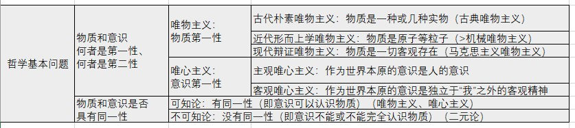
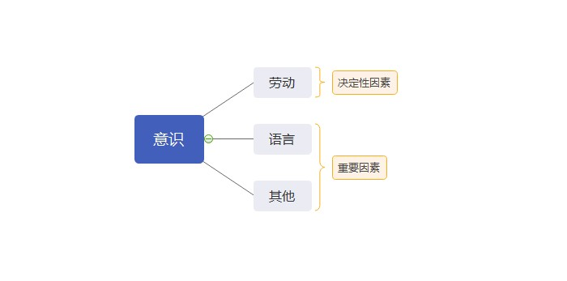
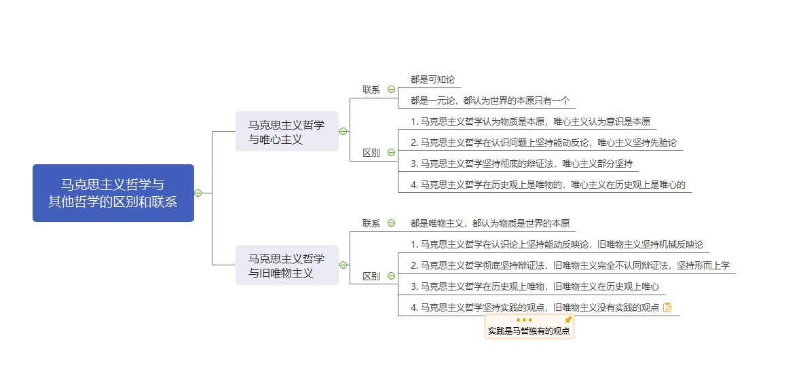

# 第二章 世界的物质性及发展规律

## 第一节 世界多样性与物质统一性

[TOC]

### 一、物质及其存在形态

#### （一）哲学基本问题及不同哲学流派

##### 1. 哲学基本问题

> 存在和思维的关系问题。（物质和意识的关系问题。）

##### 2. 哲学基本问题的两个方面

> （1）存在和思维究竟谁是世界的本原，即物质和意识何者是第一性、何者是第二性。
>
> （2）思维能否正确认识存在的问题，即物质和意识是否具有同一性。

##### 3. 不同哲学流派

> - 马克思主义者们是哲学史上第一次把**历史**当作是物质去看待的。
>
>   - **唯物史观**
>
> - 
马克思在哲学史上的两大历史贡献：

>
>   - 
创立了唯物史观

>
>   - 
形成了辩证唯物主义

>

> - 主观唯心主义
>   - 笛卡尔：“我思故我在”
>   - 王阳明
>   - 慧能（佛教禅宗第六派祖师）“风吹帆动”
> - 客观唯心主义
>   - 上帝
>   - 道说（道生一，一生二，二生三，三生万象）
>   - 理说（程朱理学）
>   - 缘说（佛教）

> - 可知论
>   - 唯物主义、唯心主义都是可知论
> - 不可知论
>   - 二元论（不彻底的唯心主义）

##### 4. 哲学重要问题 ——世界是怎样存在的？

- **辩证法**

> 联系的、全面的、发展的、有矛盾的。
>
> 坚持用联系的、发展啊的观点看世界，认为发展的根本原因在于事物的内部矛盾。

- **形而上学**

> 孤立的、片面的、静止的、无矛盾的。
>
> 坚持用孤立的、静止的观点看问题，否认事物内部矛盾的存在和作用。

#### （二）物质

##### 1. 物质和物质范畴

- **恩格斯**

> 物、物质无非是各种物的总和，而这个概念就是从这一总和中**抽象**出来的。

- **列宁**

> “物质是标志客观实在的哲学范畴，这种客观实在是 **人通过感觉感知的**、**它不依赖我们的感觉而存在**，**为我们的感觉所复写、摄影、反映**。”

定义方式：通过物质和意识的关系。

物质的唯一特性：客观实在

##### 2. 物质和运动

- **物质的概念**
- **运动的概念**

> 运动是标志一切事物和现象的变化及其过程的哲学范畴。
>
> 运动是物质的存在方式和根本属性。

物质的根本属性：运动

- **物质和运动的关系** —— 不可分割

> 一方面，物质是运动着的物质。
>
> 另一方面，运动是物质在运动。

- **批判两种错误的观点**

> 唯心主义 —— 脱离物质谈运动
>
> 形而上学 —— 脱离运动谈物质

##### 3. 运动和静止

- **运动的概念**
- **静止的概念**

> 静止是物质运动在一定条件下的稳定状态，包括空间位置和**根本性质暂时未变**这样两种运动的特殊状态。

- **运动和静止的关系** —— 对立统一

> 相互区别：运动是绝对的、无条件性；静止是相对的、有条件的。
>
> 相互联系：运动和静止相互依赖、相互渗透、相互包含，“动中有静，静中有动”。
>
> （鸟鸣山更幽，风定花尤落。）

- **批判两种错误的观点**

> 形而上学 —— 夸大静止，否定运动
>
> 诡辩论 —— 夸大运动，否定静止
>
> （赫拉克利特：人不能两次踏入同一条河流。他的学生：人一次都不能踏入同一条河流。）

#### 【注】两个概念的关系

- 不可分割（词性不同）
- 对立统一（词性相同）

##### 4. 物质运动与时空

- **运动的概念**
- **时空的概念**

> **时间**是指物质运动的**持续性**、**顺序性**，特点是**一维性**，即一去不复返。
>
> **空间**是指物质运动的**广延性**、**伸张性**，特点是**三维性**。

- 时空与物质运动的关系 —— 不可分割

> 时空是物质运动的时空，物质运动是时空中的物质运动。

时间和空间是物质运动的存在形式（存在方式）。

- **时空的特点**
  - **客观性**
    - 不以人的意志为转移。
  - **绝对性**
    - 时空绝对存在。
  - **相对性**
    - 当物质运动的速度突破极限的时候，时空会发生变化。
  - **有限性**
    - 具体事物的时空是有限的。
  - **无限性**
    - 所有事物的时空是无限的。

### 二、实践

> 世界分为两极，一极叫做物质世界，另一极叫做意识世界。而横跨在这两极当中的，有且只有的，唯一桥梁，那就是**实践**。

#### （一）实践是自然存在和社会存在区分和统一的基础

##### 1. 从实践出发理解**社会生活的本质**，要把握以下两个方面：

> （社会生活的本质是实践）

- 一方面，实践是使**物质世界**分化为**自然界**和**人类社会**的历史前提，又是使自然界与人类社会统一起来的现实基础。

> （一切不以人的意志为转移的是物质世界。在没有人之前，整个物质世界都可以被称之为自然界。但有了人之后，人通过实践，对物质世界进行改造，使得物质世界开始分化。那些人还没有能够触及、还没有能够认知、还没有能够改造的地方，仍然称之为自然界，而已经通过了人的实践改造到了的那些东西，称之为人类社会。）

- 另一方面，实践是人类社会的基础，是理解和解释一切社会现象的钥匙。

> 如果脱离了实践，不从实践去考量，我们根本无法去理解人类社会。

##### 2. 社会生活的实践性主要表现在：

> （为什么实践是社会生活的本质）

- 第一，实践是社会关系形成的基础；
- 第二，实践形成了社会生活的基本领域；
  - （经济领域、政治领域、文化生活领域等）
- 第三，**实践构成了社会发展的动力**。
  - （干扰选项：实践是社会发展的动力（x）社会发展的动力是社会基本矛盾）

### 三、意识观

#### （一）意识的起源

##### 1. 意识的概念

- 意识是物质世界长期发展的产物
- 是人脑的机能和属性
- 是物质世界的主观映象

##### 2. 意识的来源

- 三个发展阶段
  - 一切物质所具有的反应特性到低等生物的刺激感应性
  - 再到高等动物的感觉和心理
  - 最终发展为人类的意识

> （意识是人独有的）

##### 3. 意识形成过程中的影响因素

意识不仅是自然界长期发展的产物，而且是社会历史的产物。

- 社会实践特别是 **劳动** 在意识的产生和发展中起着**决定性的作用**，劳动为意识的产生和发展提供了客观需要和可能。
- 在人们的劳动和交往中形成的 **语言** 促进了意识的发展，**语言是意识的物质外壳**。

> 语言是物质。
>
> 语言的含义是意识。

#### （二）意识的本质

意识从其本质来看是客观世界的主观映象，是客观内容和主观形式的统一。

> 意识虽具有主观性，但是意识的产生和存在必须依赖于物质，意识不可以脱离物质。

#### （三）意识的作用 —— 能动作用

- 第一，意识反映世界具有**自觉性**，具有**目的性**和**计划性**
- 第二，意识具有**创造性**
- 第三，意识具有指导实践**改造客观世界**的作用
- 第四，意识还具有**指导、控制人的行为和生理活动**的作用

#### （四）意识与物质的辩证关系 —— 对立统一

- 物质和意识**相互区别**
  - 物质是本原，意识是派生
  - 物质不是意识，意识不是物质
  - 物质不能代替意识，意识不能代替物质
- 物质和意识**相互联系**
  - 物质可以转化为意识，意识可以转化为物质
  - 意识对物质既有依赖性，又有相对独立性
  - 物质决定意识，意识反作用于物质

正确认识和把握物质与意识的辩证关系，还需要**处理好主观能动性和客观规律性的关系**：

> 一方面，尊重客观规律是正确发挥主观能动性的前提
>
> 另一方面，只有充分发挥主观能动性，才能正确认识和利用客观规律。

**正确发挥人的主观能动性的前提和条件：**

- 第一，**从实际出发**是正确发挥人的主观能动性的**前提**
- 第二，**实践**是正确发挥人的主观能动性的**基本途径**
- 第三，正确发挥人的主观能动性，还需要**依赖于一定的物质条件和物质手段**

**在社会历史领域**，主观能动性与客观规律性的辩证关系具体表现为**社会历史趋向与主体选择的关系**：

- **社会历史趋向**指的是社会历史规律的**客观性和必然性**；
- **主体选择**指的是历史主体在社会发展中的**能动性和选择性**。

社会历史规律的客观性和必然性规定了人的活动要受规律性的制约。与此同时，又不能否定人作为历史主体的能动性和选择性。

> 人不能为所欲为，但也不是无所作为。

### 四、世界的物质统一性

#### （一）世界的物质统一性原理

- 其一，世界是统一的，即世界的本原是一个。
- 其二，世界的统一性在于它的物质性，即世界统一的基础是物质。
- 其三，物质世界的统一性是多样性的统一，而不是单一的无差别的统一。

#### （二）世界统一于物质

- 世界的物质统一性首先体现在，**意识**统一于物质。
- 世界的物质统一性还体现在，**人类社会**也统一于物质。

#### （三）人类社会的物质性

- 人类社会依赖于自然界是整个物质世界的组成部分。
- 人类谋取物质资料的实践活动，虽然有意识的指导，但仍然是物质的活动。
- 物质资料的生产方式，是人类存在和发展的基础，集中体现着人类社会的物质性。

#### （四）世界的物质统一性原理的作用

世界的物质统一性原理是**马克思主义的基石。**

> 在认识世界和改造世界的过程中，坚持实事求是，一切从实际出发。
>
> 一切从实际出发，是世界的物质统一性原理在现实生活中和实际工作中的生动体现。

