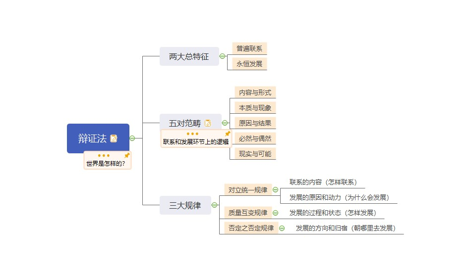
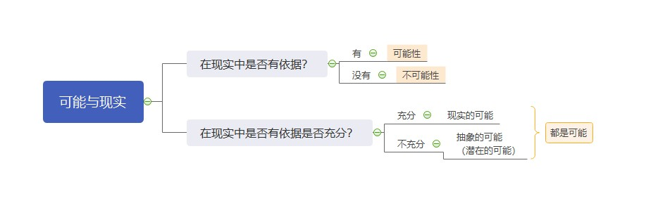
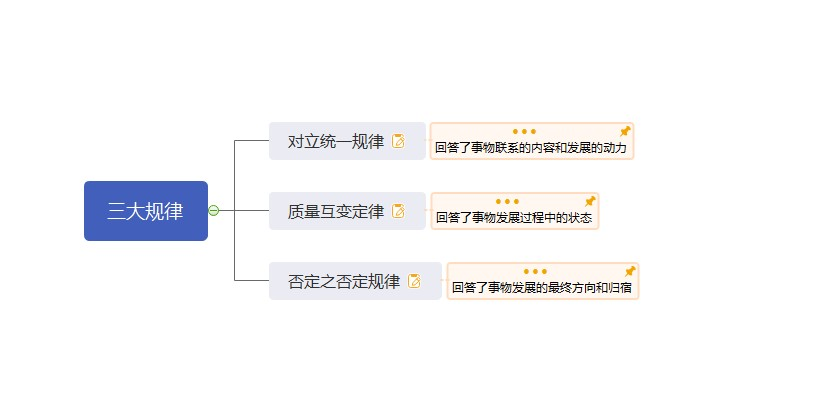

# 第二章 世界的物质性及发展规律

## 第二节 事物的联系和发展

[TOC]

 

- 两大总特征
  - 普遍联系
    - 联系的含义
    - 联系的特点
    - 方法论意义
  - 永恒发展
    - 发展的内涵与实质
    - 新、旧事物的关系
    - 过程的观点
    - 方法论意义

### 一、两大总特征

#### （一）事物的普遍联系

##### 1. 联系的概念

事物内部各要素之间和事物之间相互影响、相互制约和相互作用的关系。

> 联系是以区别为前提的。

##### 2. 联系的特点

- **客观性**
  - 联系是事物本身所固有的，不是主观臆想的。
- **普遍性**
  - 任何事物内部的不同部分和要素都是相互联系的，即任何事物都具有内在结构性。
  - 任何事物都不能孤立存在，都同其他事物处在一定的相互联系之中。
  - 整个世界是相互联系的统一整体，每一个事物都是世界普遍联系中的一个成分或环节，并通过它表现出联系的普遍性。世界的普遍联系是通过 “中介” 来实现的。
- **多样性**
  - 世界上的事物是多样的，因而事物的联系也是多样的。
- **条件性**
  - 条件对事物发展和人的活动具有支持或抑制的作用。
  - 条件是可以改变的，人们经过努力可以创造出事物发展所需要的条件。
  - 改变和创造条件不是任意的，必须尊重事物发展的客观规律。

#### （二）事物的变化发展

##### 1. 发展的内涵（概念）

概括一切形式的变化就是运动，运动变化的趋势就是发展。

> **运动 = 变化 > 发展**
>
> 运动是绝对的、无条件的。（√）
>
> 发展是绝对的、无条件的。（×）
>
> 发展是永恒的。（√）

##### 2. 发展的实质

前进的上升的运动，发展的实质是新事物的产生和旧事物的灭亡。

##### 3. 新事物和旧事物

**新事物**是指 —— 合乎历史前进方向、具有远大前途的东西。

**旧事物**是指 —— 丧失历史必然性、日趋灭亡的东西。

> **命题角度**：如何区分新、旧事物？新、旧事物的区分是否与时间的先后有关？
>
> 新事物一定产生于旧事物之后。（×）

**新生事物是不可战胜的**，因为：

- 第一，新事物具有新结构，适应新环境。
- 第二，新事物是旧事物的改良，吸收了旧的优点，增添了新内容。
- 第三，新事物符合群众利益，受到群众拥护。

##### 4. 过程的观点

- 世界不是既成事物的集合体，而是过程的集合体。
- 一切在历史上产生的都要在历史上灭亡。
- 任何事物都有它的过去、现在和将来。
- ......

### 二、五对范畴

- 原因与结果
- 必然与偶然
- 可能与现实
- 内容与形式
- 现象与本质

#### （一）原因与结果

1. **概念**

原因和结果是揭示事物的**前后相继**、彼此制约的关系范畴。

> 原因和结果是前后相继的。（√）
>
> 前后相继即为因果。（×）

- **原因**是引起某种现象的现象。
- **结果**是被某种现象引起的现象。

2. **关系 —— 对立统一**

- 第一，原因和结果的区分既是确定的，又是不确定的。
- 第二，原因和结果相互作用，原因产生结果，结果反过来影响原因，互为因果。
- 第三，原因和结果相互渗透，结果存在于原因之中，原因表现在结果之中。
- 第四，原因和结果的关系是复杂多样的，有一因多果、同因异果、一果多因、异因同果、多因多果、复合因果。
  - （有其因必有其果（×））
  - （有因必有果（√））

3. **方法论**

凡事预则立不预则废。

#### （二）必然与偶然

1. **概念**

必然和偶然是揭示客观事物发生、发展和灭亡不同趋势的范畴。

- **必然**是指 —— 事物联系和发展过程中一定会发生、确定不移的趋势。
- **偶然**是指 —— 事物联系和发展过程中并非确定发生的，可以出现，也可以不出现，可以这样出现，也可以那样出现的不确定的趋势。

2. **关系 —— 对立统一**

- 相互区别
  - 它们产生和形成的原因不同；
  - 它们的表现形式不同；
  - 它们在事物发展中的地位和作用不同。
- 相互联系
  - 必然寓于偶然之中，通过大量的偶然表现出来，并为自己开辟道路；
  - 偶然背后隐藏着必然，受必然的支配，偶然是必然的表现形式和补充；
  - 必然和偶然在一定条件下可以互相转化。

3. **方法论**

必须重视事物发展的必然性，把握事物发展的总趋势，但也绝不可忽视偶然性的作用，要善于从偶然中发现必然。把握有利于事物发展的机遇。

#### （三）可能性与现实性

1. **概念**

可能和现实是揭示事物的过去、现在和将来的相互关系的范畴。

- **可能**是指 —— 事物发展过程中潜在的东西，是包含在事物中并预示事物发展前途的种种趋势。
- **现实**是指 —— 相互联系着的实际存在的事物的综合。

2. **关系 —— 对立统一**

- 相互区别
- 相互联系
  - 一方面，现实蕴藏着未来的发展方向，会不断产生出新的可能；
  - 另一方面，可能包含着发展成为现实的因素和根据，一旦主客观条件成熟，可能转化为现实。

3. **方法论**

要求人们立足现实，展望未来，注意分析事物发展的各种可能，发挥主观能动性，做好应对不利情况的准备，争取实现好的可能。

#### （四）内容与形式

1. **概念**

内容和形式揭示事物内在要素同这些要素的结构和表现方式的关系范畴。

- **内容**是 —— 构成事物一切要素的总和，是事物存在的基础。
- **形式**是 —— 内容诸要素相互结合的结构和表现方式。

2. **关系 —— 相互依赖、不可分割**

- 任何事物的内容都有一定的形式，任何形式也都有一定的内容，没有无内容的空洞形式，也没有无形式的纯粹的内容。
- 内容决定形式，形式反作用于内容。
  - 当形式适合内容时，对内容的发展起着积极的推动作用；
  - 当形式不适合内容时，对内容的发展起着消极的阻碍作用。

> 生产力就是社会生产的物质内容，生产关系就是社会生产的组织形式。

3. **方法论**

既要重视内容，根据内容的需要决定形式的取舍、改造和创新；

又要善于运用形式，发挥其积极作用，运用和创造必要的形式，适时地抛弃与内容不相适应的形式。

#### （五）现象与本质

1. **概念**

现象和本质是揭示客观事物的外部表现和内部联系相互关系的范畴。

- 现象是 —— 事物的外部联系和表面特征，人们可通过感官感知。
- 本质是 —— 事物的内在联系和根本性质，只有靠人的理性思维才能把握。

2. **关系 —— 对立统一**

- 相互区别
  - 现象是个别的、具体的，而本质是一般的，普遍的；
  - 现象是多变的，本质则是相对稳定的；
  - 现象是生动、丰富的，本质是比较深刻、单纯的；
  - 现象有真象和假象之分，假象与错觉不是一回事。
    - （错觉一定是由假象迷惑导致的。（×））
- 相互联系
  - 任何本质都是通过现象表现出来的，没有不表现为现象的本质；
  - 任何现象都从一定的方面表现着本质，**现象是本质的外部表现，即使是假象也是本质的表现。**

> **真象是正确的现象，而错觉是错误的感觉。（×）**
>
> （前半句错误。真象和假象都是现象，只要是现象就是客观存在的，感觉才是主观存在的。所以真象不能用 “正确” 或 “错误” 来形容。）
>
> **真象往往隐藏在事物内部，而假象往往外露于事物外部。（×）**
>
> （前半句错误。无论真象还是假象，都是现象，只要是现象就一律外露于事物外部。本质才是隐藏于事物内部的。）

3. **方法论**

正因为现象和本质是统一的，所以我们能够通过现象认识事物的本质。

同时又因为现象和本质是对立的，要求我们不能停留于现象而必须通过现象揭示本质。

### 三、三大规律

- 唯物辩证法的实质和核心
- **五大重点分析题原理**
  - 同一性和斗争性的辩证关系原理
  - 同一性和斗争性在事物发展中的作用原理
  - 内因和外因的辩证关系原理
  - 普遍性和特殊性的辩证关系原理
  - 矛盾的不平衡发展原理
- 矛盾分析法（方法论总结）

#### （一）对立统一规律

##### 1. 唯物辩证法的实质和核心

- 对立统一规律揭示了事物普遍联系的根本内容和永恒发展的内在动力，从根本上回答了事物为什么会发展的问题；
- 对立统一规律是贯穿其他规律和范畴的中心线索；
- 对立统一规律提供矛盾分析法，它是对事物辩证认识的实质；
- 是否承认对立统一学说是唯物辩证法和形而上学对立的实质。

##### 2. 矛盾的同一性和斗争性的辩证关系原理

**（1）概念**

- **矛盾的同一性**是指 —— 矛盾双方**相互依存**、**相互贯通**的性质和趋势。
  - 相互依存
  - 相互贯通
- **矛盾的斗争性**是指 —— 矛盾着的对立面之间**相互排斥**、**相互分离**的性质和趋势。
  - 对抗性（按照激烈程度不同划分）
  - 非对抗性

> 同一和斗争不是时而...时而...的关系，而是既...又...的关系。

**（2）关系 —— 对立统一**

- 相互联系
  - 矛盾的同一性和矛盾的斗争性是相互联结、相辅相成的，没有斗争性就没有同一性，斗争性寓于同一性之中，没有同一性也没有斗争性。
- 相互区别
  - 在事物的矛盾中，矛盾的斗争性是无条件的、绝对的；
  - 矛盾的同一性是有条件的、相对的。

**（3）方法论**

- 看问题要一分为二
- 求同存异
- 批判地继承
- 事物之间会相互转化

##### 3. 矛盾的同一性和斗争性在事物发展中的作用原理

**（1）概念**

- **矛盾的同一性**在事物发展中的作用表现在：
  - 第一，由于矛盾双方相互依存，互为存在的条件，矛盾双方可以利用对方的发展使自己得到发展。
  - 第二，同一性使矛盾双方相互吸取有利于自身的因素，在相互作用中各自得到发展。
  - 第三，由于矛盾双方彼此相通，矛盾双方可以向着自己的对立面转化而得到发展，并规定着事物发展的方向。
- **矛盾的斗争性**在事物发展中的作用表现在：
  - 第一，矛盾双方的斗争促进矛盾双方力量的变化，竞长争高，此消彼长，造成事物的量变。
  - 第二，矛盾双方的斗争，促使矛盾双方的地位和性质发生变化，实现事物的质变。

**（2）方法论**

- 事物的发展不仅表现为 “相反相成”， 而且表现为 “相辅相成”
- 学会从事物的对立面把握事物的统一，逆向思考；
- 和谐不是无差别的一致。

> 同一性起主要作用 —— 相辅相成
>
> 斗争性起主要作用 —— 相反相成

##### 4. 内因和外因的辩证关系原理

**（1）概念**

- 事物的内部矛盾是事物发展的内因；
- 事物的外部矛盾是事物发展的外因。

**（2）关系 —— 对立统一**

- 相互区别
  - 内因即内部矛盾是事物存在的基础，是事物发展的根本原因；
  - 外因是事物变化的条件，它能够加速或延缓甚至暂时改变事物发展的进程，是事物发展的第二位的原因。
- 相互联系
  - 外因必须通过内因而起作用，两者共同推动事物的发展。

**（3）方法论**

- 事物发展是由内因决定的，并受外因影响。

##### 5. 矛盾的普遍性（共性）和特殊性（个性）的辩证关系原理

**（1）概念**

- **矛盾的普遍性**是指 —— 矛盾存在于一切事物中，存在于一切事物发展过程的始终，旧的矛盾解决了，新的矛盾又产生。事物始终在矛盾中运动。
- **矛盾的特殊性**是指 —— 具体事物在其运动中的矛盾及每一矛盾的各个方面都有其特点。矛盾的特殊性有三种情形：
  - 一是，不同事物的矛盾各有其特点；
  - 二是，同一事物的矛盾在不同发展过程和发展阶段有不同特点；
  - 三是，构成事物的诸多矛盾以及每一矛盾的不同方面各有不同的性质、地位和作用。

**（2）关系 —— 对立统一**

- 相互区别
  - 矛盾的共性（普遍性）是无条件的、绝对的，矛盾的个性（特殊性）是有条件的、相对的。
- 相互联系
  - 任何现实存在的事物都是共性和个性的有机统一，共性寓于个性之中，没有离开个性的共性，也没有离开共性的个性。

**（3）方法论**

- 具体问题具体分析
- 对症下药，量体裁衣

> 美国：抽象人权；中国：具体人权。

##### 6. 矛盾的不平衡发展原理

**（1）概念**

- 主要矛盾是 —— 矛盾体系中处于支配地位，对事物发展起着决定作用的矛盾。
- 次要矛盾是 —— 处于服从地位的矛盾。

在每一对矛盾中又有矛盾的主要方面与矛盾的次要方面。

**（2）原理**

事物的性质主要是由主要矛盾的主要方面决定的。

**（3）方法论**

- “两点论” 与 “重点论” 相结合；
- 抓关键，看主流

##### 7. 矛盾分析法（方法论总结）

| 原理                                       | 方法论                                           |
| ------------------------------------------ | ------------------------------------------------ |
| 矛盾的同一性和斗争性在事物发展中的作用原理 | 从事物的对立面把握事物的统一，反向思考，逆向思维 |
| 矛盾的同一性和斗争性的辩证关系原理         | 物极必反；否极泰来；福祸相依                     |
| 矛盾的同一性和斗争性的辩证关系原理         | 中庸、和谐，不走极端的思考方法和态度             |
| 矛盾的普遍性和特殊性的辩证关系原理         | 具体问题具体分析，对症下药，量体裁衣             |
| 矛盾的同一性和斗争性的辩证关系原理         | 求同存异，差异中谋求共识                         |
| 矛盾的不平衡发展原理                       | 两点论和重点论；抓关键，看主流                   |

#### （二）质量互变规律

##### 1. 概念

- **质** —— 一事物成为其自身并区别于其他事物的内在规定性

> 认识质是认识和实践的起点和基础。
>
> 只有认识质，才能区别事物。

- **量** —— 事物的规模、程度、速度 以及 它的构成成分在空间上的排列组合等可以用数量关系表示的规定性。

> 量的意义：
>
> - 认识量是认识的深化和精确化。
> - 只有正确了解事物的量，才能正确估计事物在实践中的地位和作用。

- **度** —— 是保持事物质的稳定性的数量界限，即事物的限度、幅度和范围，度的两端叫**关节点**或**临界点**。

> 度是一个区间。
>
> 关节点是两端点。

- **量变** —— 是事物 数量的增减 和 次序的变动，是保持事物的质的相对稳定性的**不显著变化**，体现了事物渐进过程的**连续性**。
- 质变 —— 是事物性质的**根本变化**，是事物由一种质态向另一种质态的飞跃，体现了事物渐进过程和连续性的**中断**。

##### 2. 关系

- **相互区别**
- **相互联系**
  - 第一，量变是质变的**必要准备**。
  - 第二，质变是量变的**必然结果**。
  - 第三，量变和质变是**相互渗透**的。
    - 一方面，在总的量变过程中有阶段性和局部性的部分质变。
    - 另一方面，在质变过程中也有旧质在量上的收缩和新质在量上的扩张。

> 激变论：过分夸大质变，否定量变。
>
> 庸俗进化论：夸大量变，否定质变。

##### 3. 方法论

- 理论上的方法论
  - 夸大质变导致 - **激变论**
  - 夸大量变导致 - **庸俗进化论**
- 实践中的方法论
  - 适度原则
  - 对社会主义初级阶段的认识
  - 改革、发展和稳定

#### （三）否定之否定规律

##### 1. 概念 —— 辩证否定观

- **肯定因素** —— 是维持现成事物存在的因素；
- **否定因素** —— 是促使现成事物灭亡的因素。

**辩证否定观**的基本内容：

- 第一，否定是事物的**自我否定**。
- 第二，否定是事物发展的环节。
- 第三，否定是新旧事物联系的环节。
- 第四，辩证否定的实质是 **“扬弃”** ，即新事物对旧事物**既批判又继承**，既克服其消极因素又保留其积极因素。

> 形而上学：外在力量对事物进行消灭。
>
> 形而上学：肯定一切，否定一切。

| 辩证法否定观 | 形而上学否定观                 |
| ------------ | ------------------------------ |
| “自我否定”   | “外在力量对事物进行否定和消灭” |
| “扬弃”       | “要么肯定一切，要么否定一切”   |

##### 2. 否定之否定规律

事物的辩证发展就是经过 两次否定、三个阶段，形成一个周期。其中否定之否定阶段仿佛是向原来出发点的 “回复”，但这是在更高阶段的 “回复”，是 “扬弃” 的结果。

##### 3. 方法论

- 理论上的方法论
  - 只看到回归，没看到发展：**循环论**
  - 只看到发展，看不到回归：**直线论**
- 实践中的方法论
  - 前途是光明的
  - 道路是曲折的

