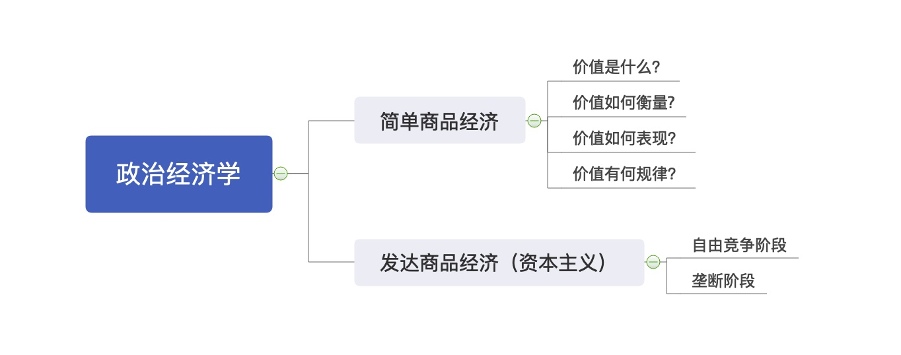

# 第五章 资本主义的本质及规律

## 第一节 商品经济和价值规律

[TOC]

### 一、资本主义生产关系的产出和生产方式的形成

##### 1. 资本主义产生的途径有两个：

- 一是从小商品经济分化出来；
- 二是从商人和高利贷者转化而来。

##### 2. 资本原始积累主要通过两个途径进行：

- 一是用暴力手段剥夺农民土地（准备了工人）；
- 二是用暴力手段掠夺货币财富（准备了钱）。

> 经过**资本主义革命**和**产业革命**，最终建立起资本主义生产方式。

### 二、商品经济

#### （一）商品经济是什么

是以交换为目的而进行生产的经济形势。

#### （二）商品经济产生的历史条件

1. 一是社会分工的出现；
2. 二是生产资料和劳动产品属于不同的所有者。

### 三、商品的二因素 —— 使用价值和价值

商品具有 **使用价值** 和 **价值** 两个因素。

#### （一）使用价值

**使用价值**是指商品能满足人们某种需要的属性，即商品的有用性，反映人与自然之间的物质关系。

是**商品的自然属性**，是一切劳动产品共有的属性。

使用价值构成社会财富的物质内容。

#### （二）价值

**价值**是凝结在商品中的无差别的一般人类劳动，即人类脑力和体力的耗费。

价值是商品特有的**社会属性**，在本质上体现了生产者之间的一定社会关系。

> 价值就是劳动。
>
> 如果一个东西没有经过劳动，它就存在了，那它一定没有价值。

#### （三）交换价值

**交换价值** 首先表现为一种使用价值同另一种使用价值交换的量的关系或比例。

决定商品交换比例的，不是商品的使用价值，而是价值。

> 价值是交换价值的基础，交换价值是价值的表现形式。

#### （四）商品的价值和使用价值之间的关系 —— 对立统一

- 对立性：二者**不可兼得**
- 统一性：二者**缺一不可**

> 你自己做个包子，自己把它吃掉了，那这个包子就不是商品了，就没有价值。

### 四、劳动的二重性

为什么商品是二因素呢？

马克思从生产商品的劳动去寻找答案，原来是因为生产商品的劳动具有二重性。

#### （一）具体劳动

**具体劳动**是指生产一定使用价值的具体形式的劳动，即有用劳动。

#### （二）抽象劳动

**抽象劳动**是指撇开一切具体形式的、无差别的一般人类劳动，即人的体力和脑力的消耗。

> **具体劳动**形成商品的**使用价值**；
>
> **抽象劳动**形成商品的**价值实体**。

**价值就是抽象劳动。**

#### （三）具体劳动和抽象劳动的关系 —— 对立统一

- 一方面，具体劳动和抽象劳动在时间上和空间上是统一的，是商品生产者同一劳动过程的两个方面；
- 另一方面，
  - 具体劳动所反映的是人与自然的关系，它是劳动的自然属性；
  - 抽象劳动所反映的是生产者之间的社会关系，它是劳动的社会属性。

### 五、价值如何衡量

#### （一）社会必要劳动时间

决定商品价值量的，不是生产商品的个别劳动时间，而是**社会必要劳动时间**。

**社会必要劳动时间**是指在现有的社会正常生产条件下，在社会平均的劳动熟练程度和劳动强度下制造某种使用价值所需要的劳动时间。

#### （二）劳动生产率

##### 1. 劳动生产率

商品的价值量与生产商品所耗费的劳动时间成正比，与劳动生产率成反比。

> 劳动生产率：生产劳动的效率。
>
> 效率越过，时间越短，价值越低。

|                            | 单位商品的价值量 | 相同时间生产商品数量 | 商品价值总量 |
| -------------------------- | ---------------- | -------------------- | ------------ |
| 社会（部门）劳动生产率增加 | 减少             | 增多                 | 不变         |
| 个别劳动生产率增加         | 不变             | 增多                 | 增多         |

> 商品价值总量  = 单位商品的价值量 x 相同时间生产商品数量

##### 2. 影响劳动生产率的因素

- 劳动者的平均熟练程度（正比）
- 科学技术的发展程度及其在生产中的应用（正比）
- 生产过程的社会结合（正比）
- 生产资料的规模和效能以及自然条件（正比）

#### （三）简单劳动和复杂劳动

**商品价值量是以简单劳动为尺度计量的**，复杂劳动等于自乘的或多倍的简单劳动。

复杂劳动转化为简单劳动，是在商品交换过程中自发实现的。

### 六、价值如何表现

> 价值通过交换来表现。

#### （一）商品的价值形式发展的四个阶段

- **简单的或偶然的价值形式**
  - 1只绵羊 = 2把石斧
  - 初级表现形式
- 总和的或扩大的价值形式
- 一般的价值形式
- **货币形式**
  - 1只绵羊 = 1两黄金 = 2把石斧
  - 终极完备表现形式

> “金银天然不是货币，但货币天然是金银。” —— 马克思

#### （二）货币

##### 1. 货币

货币是在长期交换过程中形成的固定地充当一般等价物的商品。

##### 2. 货币的五大职能

- **价值尺度**：指货币衡量和表现一切商品价值大小的作用。
  - 原因：因为货币也是商品，也有价值，可以衡量其他商品的价值；
  - 特点：观念上的货币（不一定是真金白银，可以是想象的）。
- **流通手段**：货币作为商品交换的媒介。
  - 必须是现实的货币（无形的货币也是现实的货币）；
  - 可以不足值。
    - 劣币驱逐良币。
    - 由此衍生出纸币（纸币 = 0价值）。纸币不能行使价值尺度的功能。
- **储藏手段**：货币退出流通领域作为社会财富的一般代表被保存起来的职能。
- **支付手段**：货币被用来清偿债务或支付赋税、租金、工资的功能。
- **世界货币**：在国际商品流通中发挥一般等价物作用。

> 流通手段，伴随现货交易。
>
> 支付手段，往往没有现货交易。

##### 3. 货币的产生使整个商品世界分化为两极

- 一极是各种各样的具体商品，它们分别代表不同的使用价值；
- 一极是货币，它只代表商品的价值。

这样，商品内在的**使用价值和价值的矛盾**就发展成为外在的**商品与货币的矛盾**。

### 七、价值有何规律

#### （一）价值规律的内容

- 商品的价值量由生产商品的社会必要劳动时间决定；
- 商品交换以价值量为基础，按照等价交换的原则进行。

#### （二）价值规律的表现形式

**商品的价格围绕价值自发波动**。

> 因为价格的形成是多因素综合作用的结果，如：
>
> - 供求（供大于求，价格降低）
> - 币值（我的钱越值钱，商品的价格就会越低）
> - 商品本身的价值（决定性因素）

#### （三）价值规律的作用

- 积极作用
  - 第一，自发地调节生产资料和劳动力在社会各生产部门之间的分配比例；
  - 第二，自发地刺激社会生产力的发展；
  - 第三，自发地调节社会收入分配。
- 消极作用
  - 第一，可能导致垄断的发生，阻碍技术进步；
  - 第二，可能引起商品生产者的两极分化；
  - 第三，价值规律自发调节社会资源在社会生产各个部门的配置，可能出现比例失调状况，造成社会资源浪费。

### 八、私有制基础上商品经济的基本矛盾

#### （一）私人劳动和社会劳动的矛盾

**私人劳动和社会劳动的矛盾**构成私有制商品经济的基本矛盾。

> 从私有制的角度来看，你的劳动是私人劳动。
>
> 从社会分工的角度来看，我的劳动是社会劳动。

**私人劳动和社会劳动之间的矛盾**在资本主义制度下，进一步发展成资本主义的基本矛盾，即**生产资料的资本主义私人占有和生产社会化之间的矛盾**，正是这一矛盾不断运动，才使资本主义制度最终被社会主义制度所代替具有了客观必然性。

### 九、马克思劳动价值论的意义

#### （一）理解政治经济学的枢纽 —— 劳动二重性理论

马克思在继承**古典政治经济学劳动创造价值理论**的同时，创立了**劳动二重性理论**。

**劳动二重性理论**成为理解政治经济学的枢纽。

#### （二）深化对马克思劳动价值论的认识

- 第一，深化对创造价值的劳动的认识，对**生产性劳动**做出新的界定；
- 第二，深化对**科技人员、经营管理人员**在社会生产和价值创造中所起的作用的认识；
- 第三，深化对**科技、知识、信息**等新的生产要素在财富和价值创造中的作用的认识；
- 第四，深化对**价值创造与价值分配关系**的认识。

