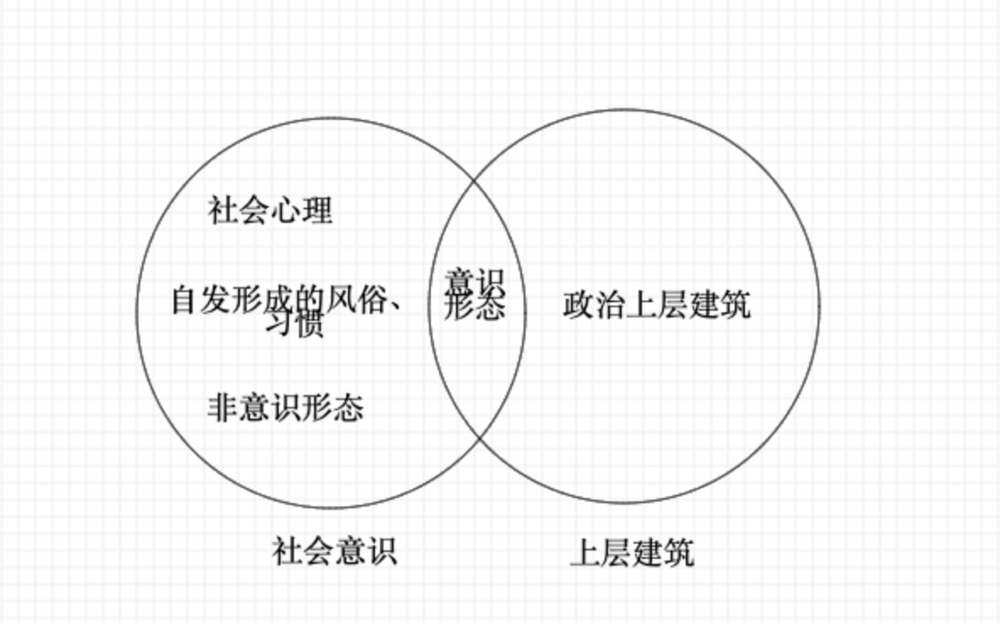

# 第四章 人类社会及其发展规律

## 第一节 社会基本矛盾及其发展规律

[TOC]

### 一、社会存在与社会意识

#### （一）唯物史观和唯心史观的对立

##### 唯心史观的缺陷

- 只看到了历史发展背后的**精神力量**，而没有看到精神力量背后的**物质动因**。
- 只看了历史发展中少数英雄人物的力量，而没有看到**人民群众**的作用。

##### 唯物史观探讨的问题

- 社会发展的物质动因
- 人民群众创造历史

#### （二）社会存在和社会意识及其辩证关系

> 物质和意识（唯物论）
>
> 实践和认识（认识论）
>
> 社会存在和社会意识（唯物史观）

##### 社会存在和社会意识

##### 二者的辩证关系

- **社会存在决定社会意识**
  - 社会存在是社会意识内容的**客观来源**，社会意识是社会物质生活过程及其条件的**主观反映**。
  - 社会意识是人们进行社会物质交往的产物。
  - 随着社会存在的发展，社会意识也相应地**或迟或早**的发生变化和发展。（不是同步的）
- **社会意识反作用社会存在，又具有相对独立性**
  - 社会意识与社会存在发展的**不平衡性**。
  - 社会意识内部各形式之间的相互影响及各自具有的历史继承性。
  - 社会意识对社会存在的**能动的反作用**，并且这种反作用是**双向**的。
    - 先进的社会意识就会推动社会存在的发展；
    - 落后腐朽的社会意识就会阻碍社会存在的发展。

> 社会存在的变化会立刻在社会意识中反映出来。（×）

### 二、生产力与生产关系的矛盾运动及其规律

#### （一）生产力的概念

##### 生产力

> 生产力是人们解决社会同自然矛盾的实际能力，是人类改造自然使其适应社会需要的**物质力量**。
>
> 它表示人和自然的关系。

##### 生产力包括

- **劳动资料**（劳动手段）
  - 其中，最重要的生产工具，它是生产力发展水平的客观尺度，是区分**社会经济时代**（石器时代、青铜器时代、互联网时代等）的客观依据。
- **劳动对象**
  - 劳动资料 + 劳动对象 = 生产资料
- **劳动者**
  - 劳动者是生产力中最活跃的因素

> 生产资料 = 劳动资料 + 劳动对象
>
> 生产力 = 劳动资料 + 劳动对象 + 劳动者
>
> 生产力 = 生产资料 + 劳动者

##### 科学技术

> - 科技不是生产力中的独立要素。
>   - 生产力中包含了科技。（√）
>   - 科技是生产力中独立的要素。（×）
> - 科技能够应用于生产过程，与生产力中的劳动资料、劳动对象和劳动者等因素相结合而转化为实际生产能力。
> - 科学技术日益成为生产发展的决定性因素。
>   - 科技在生产劳动中起决定性因素。（√）
>   - 科技在社会历史中发挥着决定性作用。（×）

#### （二）生产关系的概念

##### 生产关系

生产关系是人们在物质生产过程中形成的不以人的意志为转移的经济关系。

生产关系是人与人的关系，但它是在物质生产过程中形成的，不以人的意志为转移的经济关系。

##### 生产关系包括

- 生产资料所有制关系（最基本的、决定性的）
  - 在生产关系中，生产资料所有制是最基本的、决定性的。
  - 它构成全部生产关系的基础，是区分不同生产方式、判定社会**经济结构性质**（原始社会、奴隶社会、封建社会、社会主义社会等）的客观依据。
- 生产中人与人的关系
- 产品分配关系

> **生产工具**是区分**社会经济时代**的客观依据。（石器时代、青铜器时代、互联网时代等）
>
> **生产资料所有制**是判定**社会经济结构性质**的客观依据。（原始社会、奴隶社会、社会主义社会等）

#### （三）生产力与生产关系矛盾运动的规律

> 生产力和生产关系是社会生产不可分割的两个方面。
>
> 在社会生产中，**生产力**是生产的**物质内容**，**生产关系**是生产的**社会形式**，二者的有机结合和统一，构成社会的生产方式。

- 第一，生产力决定生产关系。
- 第二，生产关系反作用于生产力。（双向）

社会发展第一规律：生产关系一定要适应生产力发展状况的规律。

### 三、经济基础与上层建筑的矛盾运动及其规律

#### （一）经济基础的概念

**经济基础**是指由社会一定发展阶段的生产力所决定的**生产关系**的总和。

> 经济基础就是一种生产关系。它们在本质上、级别上是相等的。
>
> 生产力可以决定生产关系。（√）
>
> 生产力可以决定经济基础。（√）

#### （二）上层建筑的概念

上层建筑是指建立在一定的经济基础之上的意识形态以及相应的制度、组织和设施。

- 意识形态（**观念上层建筑**）
  - 包括：政治法律思想、道德、艺术、宗教、哲学等思想观点。
- 政治法律制度及设施和政治组织（**政治上层建筑**）
  - 包括：国家政治制度、立法司法制度和行政制度；
  - 国家政权机构、政党、军队、警察、法庭、监狱等政治组织形态和设施。

上层建筑中，政治上层建筑居主导地位，国家政权是核心。

> 意识形态属于社会意识形式，属于社会意识。
>
> 意识形态也属于上层建筑。

> 意识形态的标志定义：属于上层建筑的社会意识，就是社会意识形态。（√）

#### （三）经济基础与上层建筑矛盾运动的规律

- 首先，**经济基础决定上层建筑**；
- 其次，上层建筑对经济基础具有反作用。
  - 这种反作用集中表现在为自己的经济基础服务。
  - 上层建筑的反作用是巨大的，但不是无限的。它可以影响社会性质和历史进程，但不能决定历史发展的总趋势。

社会发展第二规律：上层建筑一定要适应经济基础发展状况的规律。

- 我们如何去判断一种生产关系是否先进？

> 就看它能不能适应生产力的发展，如果能适应生产力的发展，我们就说它先进，如果不适应，我们就说它落后。

- 我们如何去判断一种上层建筑是否先进？

> 看它能否适应经济基础的发展。（×）
>
> 而是看它所服务的经济基础，能不能适应生产力的发展。（√）
>
> 如果这个经济基础它能适应生产力，那它是先进的经济基础，而我在为先进的经济基础服务，那我是先进的上层建筑。

上层建筑反作用的性质，取决于它所服务的经济基础的性质，归根到底取决于它是否有利于生产力的发展。

### 四、社会形态更替的一般规律及特殊形式

#### （一）社会形态的内涵

社会形态是关于社会运动的具体形式、发展阶段和不同质态的范畴，是同生产力发展一定阶段相适应的**经济基础与上层建筑的统一体**。

社会形态包括社会的**经济形态**、**政治形态**和**意识形态**。

> 社会形态 = 经济基础 + 上层建筑

#### （二）社会形态的特点

马克思主义的社会形态范畴深刻揭示了人类社会的本质结构及其发展的客观规律。

- 首先，社会形态的内容是全面的，既包括经济基础，又包括上层建筑，两者缺一不可，犹如 **“骨骼”** 和 **“血肉”**。
  - 经济基础是社会的 “骨骼系统”
  - 上层建筑是社会的 “血肉系统”
  - 上层建筑不过是经济基础的政治和思想的表现形态。
- 其次，社会形态是具体的，不是抽象的。
- 最后，社会形态是历史的，有它产生、发展和灭亡的过程。

#### （三）社会形态更替的特点

- 社会形态更替的**统一性和多样性**
  - 从纵向看，表现为社会形态的统一性和多样性。
  - 从横向看，社会发展过程的统一性和多样性表现为同类社会形态既有共同的本质，又有各自的特点。
- 社会形态更替的**必然性与人们的历史选择性**
  - 一个民族之所以做出这种或那种选择，有其特定的原因：
    - 一是，取决于民族利益
    - 二是，取决于交往
    - 三是，取决于对历史必然性以及本民族特点的把握程度
- 社会形态更替的**前进性与曲折性**
  - 社会发展过程中的决定性、统一性表明社会发展的总趋势是前进的；
  - 社会发展过程中的选择性、多样性表明社会发展的具体道路不是直线的，而是曲折的。