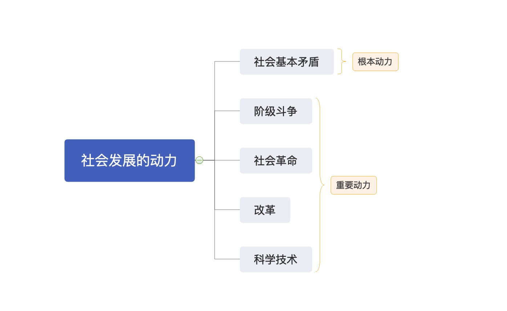

# 第四章 人类社会及其发展规律

## 第二节 社会历史发展的动力

[TOC]

### 一、社会基本矛盾是社会发展的根本动力

>  社会基本矛盾
>
> 1. 生产力和生产关系的矛盾
> 2. 经济基础和上层建筑的矛盾

- 首先，生产力是社会基本运动中最基本的动力因素，是人类社会发展和进步的最终决定力量；
- 其次，社会基本矛盾特别是生产力和生产关系的矛盾，是 “一切历史冲突的根源”，决定着社会中其他矛盾的存在和发展。
- 最后，社会基本矛盾具有不同的表现形式和解决方式，并从根本上影响和促进社会形态的变化和发展。

### 二、阶级斗争在阶级社会发展中的作用

阶级斗争是社会基本矛盾在阶级社会中的直接表现，是阶级社会发展的**直接动力**（重要动力）。

### 三、社会革命在阶级社会发展中的作用

革命是实现社会形态更替的**重要手段**（重要动力）。

### 四、改革的性质及其在社会发展中的作用

改革是推动社会发展的又一重要动力。

### 五、科学技术在社会发展中的作用

科学技术革命是社会动力体系中的一种重要动力。

- 首先，现代科技革命推动生产方式的变革。
- 其次，现代科技革命推动生活方式的变革。
- 最后，现代科技革命推动思维方式的变革。