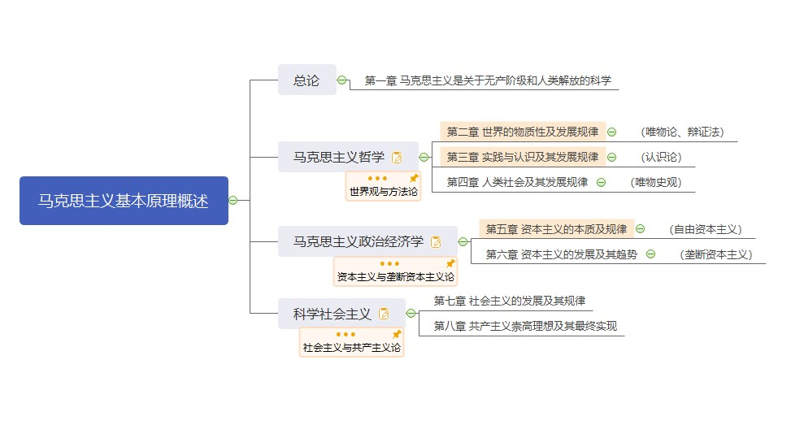

# 马克思主义基本原理概论

## 课程综述

> 马克思主义基本原理概论是一门系统讲授马克思主义基本理论的课程。
>
> - 按照大纲要求约占**24分**
> - 内容涵盖三个部分
>   - **马克思主义哲学**
>   - **马克思主义政治经济学**
>   - **科学社会主义**

## 框架体系

## 复习建议

（......）

## 章节目录

- 总论
  - [第一章 马克思主义是关于无产阶级和人类解放的科学]()
- 马克思主义哲学
  - [第二章 世界的物质性及发展规律]()
  - [第三章 实践与认识及其发展规律]()
  - [第四章 人类社会及其发展规律]()
- 马克思主义政治经济学
  - [第五章 资本主义的本质及规律]()
  - [第六章 资本主义的发展及趋势]()
- 科学社会主义
  - [第七章 社会主义及其发展规律]()
  - [第八章 共产主义崇高理想及其最终实现]()

